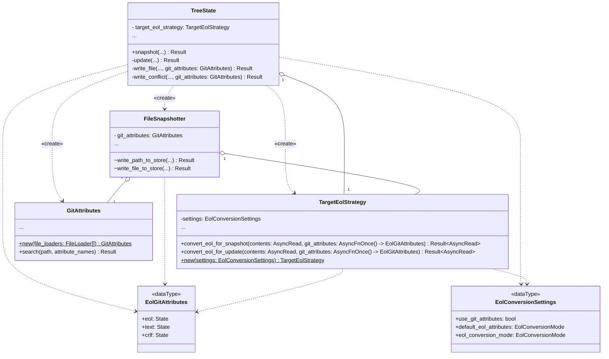
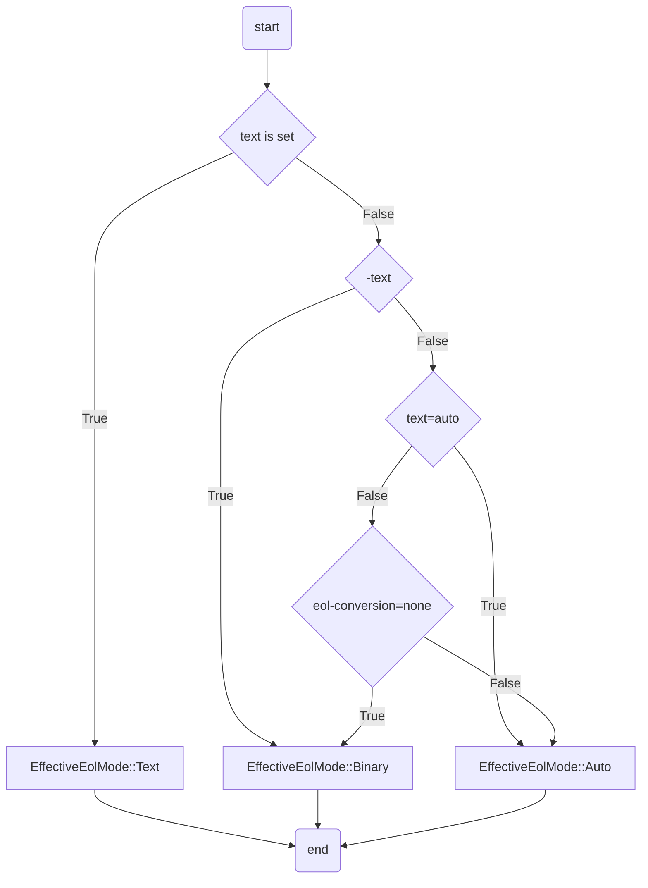
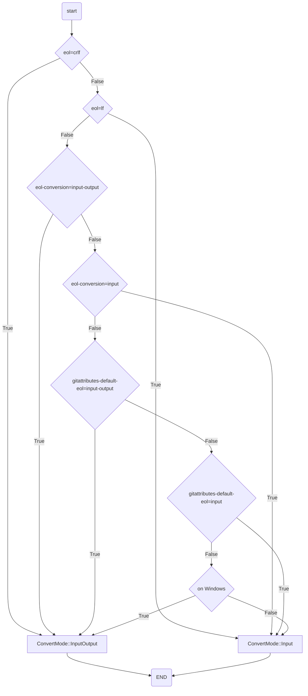

# Supporting the `text` and `eol` Git Attributes in Jujutsu

**Authors**: [Kaiyi Li](mailto:kaiyili@google.com)

**Summary**: This design proposes integrating the `text` and `eol`
`gitattributes` into jj's local working copy logic to enable fine-grained,
per-file control over End-of-Line (EOL) conversion. It details the resolution
algorithm for determining line endings based on these attributes and introduces
new configuration settings to manage this compatibility feature.

## Context and Scope

When the user uses jj with EOL enabled, they face the following problems:

- For cross platform projects, the bash scripts should always use the LF EOL on
  Windows, even though the rest of the source code should convert the EOL based
  on platforms. [Link][gitattr-eol-feat-request].
- The heuristic binary detection algorithm can't be perfect. The user may want
  EOL conversion not to apply on specify files. This can be especially true for
  many postscript files which contain only ASCII characters.
- Git supports such features, we probably should also add for compatibility to
  reach more users.

[gitattr-eol-feat-request]:
  https://github.com/jj-vcs/jj/issues/53#issuecomment-3394555659

This design details how we could use the infrastructure described in the
[Supporting Git Attributes in Jujutsu](gitattributes.md) design, and the
existing EOL conversion code to support the [`text`][git-attr-text-doc] and
[`eol`][git-attr-eol-doc] git attributes.

[git-attr-text-doc]: https://git-scm.com/docs/gitattributes#_text
[git-attr-eol-doc]: https://git-scm.com/docs/gitattributes#_eol

### Terminology

In this design, we use the same terminology as the [git attributes
document][git-attr-desc]. Some regularly used definitions include state, and
`gitattributes` file.

[git-attr-desc]: https://git-scm.com/docs/gitattributes#_description

Below are some important definitions used in this design directly copied from
the git attributes document.

#### `gitattributes` file

A `gitattributes` file is a simple text file that gives attributes to pathnames.

Each line in `gitattributes` file is of form:

```gitattributes
pattern attr1 attr2 ...
```

That is, a pattern followed by an attributes list, separated by whitespaces.

#### State

Each attribute can be in one of these states for a given path:

- Set

  The path has the attribute with special value "true"; this is specified by
  listing only the name of the attribute in the attribute list.

- Unset

  The path has the attribute with special value "false"; this is specified by
  listing the name of the attribute prefixed with a dash - in the attribute
  list.

- Set to a value

  The path has the attribute with specified string value; this is specified by
  listing the name of the attribute followed by an equal sign = and its value in
  the attribute list.

- Unspecified

  No pattern matches the path, and nothing says if the path has or does not have
  the attribute, the attribute for the path is said to be Unspecified.

### Non-goals

- Merge and diff, essentially anything outside of the working copy is out of
  scope, e.g., `jj file show` will just display the same contents in the store,
  and this design won't change the behavior. In `git`, the `text` and `eol`
  `gitattributes` barely influences the output of diff commands(`git diff`,
  `git show`) and the behavior of merge commands(`git cherry-pick`,
  `git rebase`, `git merge`). They will be discussed in a separate design. As of
  now, `jj`'s internal diff tool, external diff tools, external merge tools and
  merge algorithm work on contents directly from the store without any
  conversion. This design won't change that behavior. For details, please take a
  look [here][jj-git-attr-design-diff-conflicts-and-merge].
- How conflicts should be converted. `jj` currently applies EOL conversion based
  on materialized conflicts contents, i.e. conversion is applied to contents
  with conflict markers in one pass. We know it can be improved, but the
  improvement should be discussed in a separate issue/design instead of this
  design. For details, please take a look
  [here][jj-git-attr-design-diff-conflicts-and-merge].
- Support for features similar to `git add --renormalize`. e.g., if
  `gitattributes` files are changed to opt-in a new file, `a.txt` to EOL
  conversion in a working copy, and `a.txt` is not modified in the working copy,
  EOL conversion still won't apply to `a.txt` in the store until `a.txt` is
  touched, and won't apply to `a.txt` on the disk until `a.txt` is checked out
  again. The behavior is the same when the EOL config is changed: the new
  setting is only applied to files modified in the current working copy and/or
  on the next update(checkout). However, such limitation will be well documented
  and a new issue will be opened to discuss whether `jj` need the
  `--renormalize` feature.
- How to obtain the state of the `text` `gitattributes` and the `eol`
  `gitattributes` associated to a file. This is discussed in a
  [separate doc](gitattributes.md).
- Git [`core.safecrlf`][git-attr-safecrlf-doc] config.
- Reading and respecting the git `core.eol` and `core.autocrlf` configs. We
  don't discuss this in this design for simplicity. `jj` should develop a
  consistent method to pull in git configs, and that's tracked in other issues:
  https://github.com/jj-vcs/jj/issues/4048, and
  https://github.com/jj-vcs/jj/issues/7455. Nonetheless, we do discuss `jj`'s
  equivalent user settings of the 2 git configs.

[jj-git-attr-design-diff-conflicts-and-merge]:
  gitattributes.md#diff-conflicts-and-merge
[git-attr-safecrlf-doc]:
  https://git-scm.com/docs/git-config#Documentation/git-config.txt-coresafecrlf

### Goals/Requirements

- Most changes should only happen in the `local_working_copy` module, and the
  `eol` module.
- Introduce a boolean `working-copy.eol-conversion-use-gitattributes` setting as
  a killer switch on whether EOL conversion should read gitattributes. When the
  value is `false`, the implementation shouldn't read any `gitattributes` files
  so that the user that doesn't need this feature pay little cost if not zero.
  It also prevents unexpected influence on `google3` repo, where there are many
  `gitattributes` files, but we don't expect it to have any effects. The default
  value is `false`.
- No conditional compile flags to reduce the code complexity. And with the
  `working-copy.eol-conversion-use-gitattributes` setting, we can disable this
  feature at runtime.
- Add a new `working-copy.gitattributes-default-eol` setting, as the equivalent
  of the git [`core.eol`][git-config-core-eol] config. It has the same 3 valid
  values as `working-copy.eol-conversion`: `input`, `input-output`, `none`. When
  the `working-copy.eol-conversion` setting is not `none`, this setting is
  ignored. Note that:
  - The naming is different from the actual `eol` `gitattributes`, so it can be
    confusing, but we will do our best to document this divergence.
  - We don't have a equivalent for `native` in `core.eol`, because we don't
    think it's necessary: the user should always specify `input` or
    `input-output` explicitly, and the `jj` configs are not supposed to be
    shared across multiple machines.
- Support all `text` `gitattributes` features, which decides whether EOL
  conversion should be applied.
  - Set. The EOL conversion is applied to the file on snapshot and
    update(checkout).
  - Unset. No EOL conversion is applied.
  - Set to string value `auto`. `jj` uses the internal heuristic to decide
    whether the file is binary and whether EOL conversion should be applied.
  - Unspecified. `working-copy.eol-conversion` decides whether the file should
    be converted.
  - All other cases. Act as if `text` is in the unspecified state.
- Support all `eol` `gitattributes` features, which decides how EOL conversion
  should be applied.
  - Set to string value `crlf`. Convert the file EOL to CRLF on
    update(checkout). Convert the file EOL to LF on snapshot. The same effect as
    the `input-output` `working-copy.eol-conversion` setting.
  - Set to string value `lf`. Do not convert the file EOL on update(checkout).
    Convert the file EOL to LF on snapshot. The same effect as the `input`
    `working-copy.eol-conversion` setting.
  - Unspecified. How EOL conversion should be applied is decided by the
    `working-copy.eol-conversion` setting and the
    `working-copy.gitattributes-default-eol` setting.
  - All other cases. Act as if `eol` is in the unspecified state.
  - Specifying `eol` automatically sets `text` if `text` was left unspecified.
- Support the [`crlf` `gitattributes`][git-attr-crlf-compat]:
  - Set. The same as `text` is set.
  - Unset. The same as `text` is unset.
  - Set to string value `input`. The same as `eol` is set to `lf`.
- How the [`GitAttributes`] type introduced in the
  [basic `gitattributes` design](gitattributes.md) should be initialized and
  used.
- If no EOL should be applied to the file, the file should not be read when
  calling the EOL convert functions(`convert_eol_for_snapshot` and
  `convert_eol_for_update`).

[git-config-core-eol]:
  https://git-scm.com/docs/git-config#Documentation/git-config.txt-coreeol
[git-attr-crlf-compat]:
  https://git-scm.com/docs/gitattributes#_backwards_compatibility_with_crlf_attribute

## State of the Feature as of v0.35.0

- We have [a design doc](gitattributes.md) on how to read the `gitattributes`
  associated with a file.
- We have implemented a feature similar to the git `core.autocrlf` config in
  [this PR][jj-pr-6728], which implements the EOL conversion itself.

[jj-pr-6728]: https://github.com/jj-vcs/jj/pull/6728

## Prior work

- In git, it's [`crlf_to_git`][git-code-crlf-to-git] and
  [`crlf_to_worktree`][git-code-crlf-to-worktree].
- In gitoxide, it's [`gix_filter::eol::convert_to_git`][gix-eol-convert-to-git]
  and
  [`gix_filter::eol::convert_to_worktree::convert_to_worktree`][gix-eol-convert-to-worktree].
- In mercurial, the [`hgeol`][hg-eol-extension] extension is used. Unlike git,
  where a repo can have multiple `gitattributes` files in different
  subdirectory, `hg` only allows one single `.hgeol` file at the root of the
  repo. [This][monetdb-hgeol-example] is an example of the contents.[^fig]

[git-code-crlf-to-git]:
  https://github.com/git/git/blob/9a2fb147f2c61d0cab52c883e7e26f5b7948e3ed/convert.c#L503-L590
[git-code-crlf-to-worktree]:
  https://github.com/git/git/blob/9a2fb147f2c61d0cab52c883e7e26f5b7948e3ed/convert.c#L592-L627
[gix-eol-convert-to-git]:
  https://docs.rs/gix-filter/0.21.0/gix_filter/eol/fn.convert_to_git.html
[gix-eol-convert-to-worktree]:
  https://docs.rs/gix-filter/0.21.0/gix_filter/eol/convert_to_worktree/fn.convert_to_worktree.html
[hg-eol-extension]: https://wiki.mercurial-scm.org/EolExtension
[monetdb-hgeol-example]:
  https://github.com/MonetDB/MonetDB/blob/2bded273ab192a022e967bc2fa4db41bbc369ca9/.hgeol

[^fig]:
    The `fig` VCS Google uses internally shares the same behavior as mercurial
    in EOL conversion. `fig`'s `hgeol` implementation has severe issues on
    Windows, where if both 2 changes modify a file, and you rebase one change on
    top of another, causing a merge, `fig` can't handle the EOL conversion
    correctly, and always introduces unexpected EOL changes.

## Overview

- A new `get_git_attributes` parameter will be added to both of the
  `TargetEolStrategy::convert_eol_for_snapshot` method, and the
  `TargetEolStrategy::convert_eol_for_update` method. `get_git_attributes` is a
  function, and `gitattributes` will only be queried if `get_git_attributes` is
  called. This design allows `TargetEolStrategy` to control whether the query
  happens.
- `TargetEolStrategy::convert_eol_for_*` resolves the settings and the
  `gitattributes` to the target EOL and apply the conversion. The implementation
  guarantees that we only read the contents when necessary, e.g. if the `text`
  `gitattributes` is unset, the contents won't be read.
- 2 new user settings are introduced to control the behavior:
  - `working-copy.gitattributes-default-eol`: similar to the git `core.eol`
    config, provide default values to the `eol` attributes if unspecified.
  - `working-copy.eol-conversion-use-gitattributes`: disable the feature to read
    `gitattributes` files for EOL conversion.
- `GitAttributes` is initialized when `TreeState::snapshot` or
  `TreeState::update` is called. And is passed all the way to the following
  `TargetEolStrategy::convert_eol_for_*` call site:
  - `FileSnapshotter::write_path_to_store`: handle the conflict snapshot case
  - `FileSnapshotter::write_file_to_store`: handle the non conflict snapshot
    case
  - `TreeState::write_file`: handle the non conflict update case
  - `TreeState::write_conflict`: handle the conflict update case



## Design

### Change to the EOL conversion functions

In this section, we will describe the change to
`TargetEolStrategy::convert_eol_for_snapshot` and
`TargetEolStrategy::convert_eol_for_update`, and how to resolve the final EOL
conversion from settings, gitattributes, and the file contents. All the
described changes are only related to the `eol` module, and can be unit tested
separately.

#### Change to the interfaces

We introduce a new `EolGitAttributes` type, that describes the state of relevant
`gitattributes`, namely `eol`, `text`, and `crlf`. The definition is

```rust
struct EolGitAttributes {
    pub eol: State,
    pub text: State,
    pub crlf: State,
}
```

We make use of the `State` type defined in the
[basic `gitattributes` design doc](gitattributes.md#the-gitattributessearch-api-from-the-caller-side).

A new `get_git_attributes` parameter of
`impl AsyncFnOnce() -> Result<EolGitAttributes, Box<dyn Error + Send + Sync>>`
type will be added to both of the `TargetEolStrategy::convert_eol_for_snapshot`
method, and the `TargetEolStrategy::convert_eol_for_update` method to retrieve
the states of the related `gitattributes` of the file.

The definitions of the modified interfaces are following.

```rust
type BoxError = Box<dyn Error + Send + Sync>;

impl TargetEolStrategy {
    pub(crate) async fn convert_eol_for_snapshot<'a, F>(
        &self,
        mut contents: impl AsyncRead + Send + Unpin + 'a,
        get_git_attributes: F,
    ) -> Result<Box<dyn AsyncRead + Send + Unpin + 'a>, std::io::Error>
    where
        F: (AsyncFnOnce() -> Result<EolGitAttributes, BoxError>)
            + Send
            + Unpin
            + 'a,
    {
        ...
    }

    pub(crate) async fn convert_eol_for_update<'a, F>(
        &self,
        mut contents: impl AsyncRead + Send + Unpin + 'a,
        get_git_attributes: F,
    ) -> Result<Box<dyn AsyncRead + Send + Unpin + 'a>, std::io::Error>
    where
        F: (AsyncFnOnce() -> Result<EolGitAttributes, BoxError>)
            + Send
            + Unpin
            + 'a,
    {
        ...
    }
}
```

The new `get_git_attributes` parameter is a function type that returns
`EolGitAttributes`. It's not just the `EolGitAttributes` type, so that
`TargetEolStrategy` controls whether we need to query the `gitattributes`,
providing better cohesion and easier testing on the logic whether
`gitattributes` needs to query. The new parameters are not `GitAttributes`, and
`path`, because this could decouple `TargetEolStrategy` with `GitAttributes`,
which gives an easier way to mock the `gitattributes` values for testing. We use
`AsyncFnOnce`, because `GitAttributes::search()` is an async function, and
`AsyncFnOnce` is the only dyn-compatible trait among `AsyncFn`, `AsyncFnMut`,
and `AsyncFnOnce`, which provides the best compatibility(e.g. if the caller
wants to use a `Box<dyn AsyncFnOnce>` and pass it around, `AsyncFnOnce` is the
only trait that works).

#### Resolve the EOL conversion decision

The final decision on whether and how the EOL conversion should be applied is
modeled via the existing type `TargetEol`:

```rust
enum TargetEol {
    Lf,
    Crlf,
    PassThrough,
}
```

This means `TargetEolStrategy` methods need to resolve a `TargetEol` from the
following facters:

- the user settings, `EolConversionSettings`
  - `working-copy.eol-conversion-use-gitattributes`: `true` or `false`.
  - `working-copy.gitattributes-default-eol`: `input-output`, `input`, or
    `none`.
  - `working-copy.eol-conversion`: `input-output`, `input`, or `none`.
- the `gitattributes`, `EolGitAttributes`
  - `eol`: `"lf"`, `"crlf"`, or other cases.
  - `text`: set, unset, `"auto"`, or other cases.
  - `crlf`: set, unset, `"input"`, or other cases.
- the file contents, in case the internal heuristics should be used to detect
  whether the file is text or binary

In addition, we need to also make sure:

- We shouldn't read `gitattributes` if
  `working-copy.eol-conversion-use-gitattributes` is `false`. This is trivial
  via the following code:

  ```rust
  let git_attributes = if self.settings.use_git_attributes {
      get_git_attributes().await?
  } else {
      EolGitAttributes {
          eol: State::Unspecified,
          text: State::Unspecified,
          crlf: State::Unspecified,
      }
  };
  ```

- We shouldn't read the file if not necessary, i.e., we should only read the
  file contents only when the internal heuristics is used to determine whether
  the file is text or binary, or we decide to perform an actual EOL conversion.

The total number of combinations of various conditions is 1,728[^cond_calc], so
we can't use a straight forward way to design the resolution algorithm. We first
introduce a new type `EffectiveEolMode` resolved only from
`EolConversionSettings`, and `EolGitAttributes`:

```rust
enum ConvertMode {
    /// Apply EOL conversion on both snapshot and update. Equivalent to eol=crlf.
    InputOutput,
    /// Apply EOL conversion only on snapshot. Equivalent to eol=lf.
    Input,
}

enum EffectiveEolMode {
    /// The file is a text file, and may apply EOL conversion. Equivalent to set text.
    Text(ConvertMode),
    /// Use heuristics to detect if EOL conversion should be applied. Equivalent to text=auto.
    Auto(ConvertMode),
    /// The file is a binary file, and should not apply EOL conversion. Equivalent to -text.
    Binary,
}
```

[^cond_calc]:
    The task has 2 options: snapshot or update. The
    `working-copy.eol-conversion` and `working-copy.gitattributes-default-eol`
    settings have 3 different options, `input`, `input-output`, `none`
    respectively. The `text` attribute has 4 states: set, set to `auto`, unset,
    and unspecified. The `eol` attribute has 3 states: set to `lf`, set to
    `crlf`, and other cases. The `crlf` attribute has 4 states: set, unset, set
    to `input`, and unspecified. The heuristics that probe the input contents
    can have 2 results: text or binary. Therefore, the total number of
    combinations are the product of 2, 3, 3, 4, 3, 4, and 2, which is 1,728.

Before we start to resolve `EffectiveEolMode`, we need to adjust
`EolGitAttributes` to satisfy the following 2 requirements:

- Specify `eol` automatically sets text if `text` was left unspecified([git doc
  link][git-attr-eol]):
  - If `EolGitAttributes::text` is `State::Unspecified` or
    `State::Value(value) if value != b"auto"`, and `EolGitAttributes::eol` is
    `State::Value(b"crlf")` or `State::Value(b"lf")`, `EolGitAttributes::text`
    will be changed to `State::Set`.
- Backward compatibility for `crlf`([git doc link][git-attr-crlf-compat]). If
  `EolGitAttributes::text` is `State::Unspecified` or
  `State::Value(value) if value != b"auto"` and `eol` is not
  `State::Value(b"crlf")` or `State::Value(b"lf")`:
  - If `EolGitAttributes::crlf` is `State::Set`, change `EolGitAttributes::text`
    to `State::Set`.
  - If `EolGitAttributes::crlf` is `State::Unset`, change
    `EolGitAttributes::text` to `State::Unset`.
  - If `EolGitAttributes::crlf` is `State::Value(b"input")`, change
    `EolGitAttributes::text` to `State::Set`, and `EolGitAttributes::eol` to
    `State::Value(b"lf")`.

The first layer of `EffectiveEolMode` is decided by the state of the `text`
`gitattributes` and the `working-copy.eol-conversion` setting, if the `text`
`gitattributes` is unspecified. Note that if `text` is unspecified and
`working-copy.eol-conversion` is `"none"`, we end up with
`EffectiveEolMode::Binary`, because no EOL conversion will be applied.



`ConvertMode` is decided by the `eol` `gitattributes`, the
`working-copy.eol-conversion` setting, the
`working-copy.gitattributes-default-eol` setting, and the
platform(`ConvertMode::InputOutput` for Windows, and `ConvertMode::Input`
otherwise) in the given order of priority.



Note that if all of the `eol` `gitattributes`, the `working-copy.eol-conversion`
setting, and the `working-copy.gitattributes-default-eol` setting are
unspecified or `none`, `ConvertMode` is resolved based on the platform,
`ConvertMode::InputOutput` on Windows, `ConvertMode::Input` otherwise. This
follows the following [`gitattributes` document][git-attr-unspecified]:

> If the `eol` attribute is unspecified for a file, its line endings in the
> working directory are determined by the `core.autocrlf` or `core.eol`
> configuration variable (see the definitions of those options in
> [git-config[1]][git-config-doc]). If `text` is set but neither of those
> variables is, the default is `eol=crlf` on Windows and `eol=lf` on all other
> platforms.

While the document says, "if `text` is set", we unconditionally apply this rule
because:

- If `text` is set, we apply the platform default `eol` rule correctly.
- If `text` is unspecified(or set to a string other than `"auto"`), and this
  rule is triggered, it means `working-copy.eol-conversion` is `none`, which
  means `EffectiveEolMode` is resolved to `EffectiveEolMode::Binary`, and we
  won't try to create `ConvertMode` at all.
- If `text` is unset, `EffectiveEolMode` is resolved to
  `EffectiveEolMode::Binary`, and we won't try to create `ConvertMode` at all.
- If `text` is set to `"auto"`, according to the `git` source code, this rule
  should also be applied:
  - [`git_path_check_crlf`][git-code-path-check-crlf] and
    [`convert_attrs`][git-code-convert-attrs] resolve `crlf_action` to
    `CRLF_AUTO`, if `text=auto`, `core.autocrlf` is not set, and `core.eol` is
    not set.
  - [`output_eol`][git-code-output-eol] put `CRLF_TEXT` and `CRLF_AUTO` under
    the same bucket, and [`text_eol_is_crlf`][git-code-text-eol-is-crlf] uses
    the platform default `eol` logic to [decide][git-code-decide-eol] the `eol`.

Now that we only have 5 different conditions modeled by `EffectiveEolMode` to
consider, we can simply list whether we probe the contents to decide whether
it's text or binary, and what `TargetEol` should be passed to `convert_eol`
under different circumstances:

- Snapshot, i.e., save the file from the disk to the store,
  `convert_eol_for_snapshot`
  - `EffectiveEolMode::Binary`: won't probe the contents;
    `TargetEol::PassThrough`.
  - `EffectiveEolMode::Text(_)`: won't probe the contents; `TargetEol::Lf`.
  - `EffectiveEolMode::Auto(_)`: probe the contents; if the probe result is
    binary, `TargetEol::PassThrough`, otherwise `TargetEol::Lf`
- Update, i.e., checkout the file from the store to the disk,
  `convert_eol_for_update`
  - `EffectiveEolMode::Binary`, `EffectiveEolMode::Text(ConvertMode::Input)`,
    `EffectiveEolMode::Auto(ConvertMode::Input)`: won't probe the contents;
    `TargetEol::PassThrough`.
  - `EffectiveEolMode::Text(ConvertMode::InputOutput)`: won't probe the
    contents; `TargetEol::Crlf`.
  - `EffectiveEolMode::Auto(ConvertMode::InputOutput)`: probe the contents; if
    the probe result is binary, `Target::PassThrough`, otherwise
    `TargetEol::Crlf`.

[git-attr-eol]: https://git-scm.com/docs/gitattributes#_eol
[git-attr-unspecified]:
  https://git-scm.com/docs/gitattributes#Documentation/gitattributes.txt-Unspecified-1-1
[git-config-doc]: https://git-scm.com/docs/git-config
[git-code-path-check-crlf]:
  https://github.com/git/git/blob/fd372d9b1a69a01a676398882bbe3840bf51fe72/convert.c#L1267-L1282
[git-code-convert-attrs]:
  https://github.com/git/git/blob/fd372d9b1a69a01a676398882bbe3840bf51fe72/convert.c#L1334-L1361
[git-code-output-eol]:
  https://github.com/git/git/blob/fd372d9b1a69a01a676398882bbe3840bf51fe72/convert.c#L188-L192
[git-code-text-eol-is-crlf]:
  https://github.com/git/git/blob/fd372d9b1a69a01a676398882bbe3840bf51fe72/convert.c#L169-L171
[git-code-decide-eol]:
  https://github.com/git/git/blob/fd372d9b1a69a01a676398882bbe3840bf51fe72/convert.c#L191

### Read the new EOL user settings

We introduce 2 new user settings:

- `working-copy.eol-conversion-use-gitattributes`: a killer switch to disable
  `gitattributes` read. If the user doesn't want `jj` to read `gitattributes`
  files, set this setting to `false`. Default to `false`.
- `working-copy.gitattributes-default-eol`: an equivalent to `core.eol`, but the
  value is renamed, and `native` is not supported. Default to `none`. See
  details at the [Goals/Requirements section](#goalsrequirements).

Along with the existing `working-copy.eol-conversion` setting, we combine those
3 fields into a new `EolConversionSettings` type, where we implement the
function to read all EOL conversion related user settings.

```rust
pub struct EolConversionSettings {
    pub use_git_attributes: bool,
    pub default_eol_attributes: EolConversionMode,
    pub eol_conversion_mode: EolConversionMode,
}
```

We will introduce a new `EolConversionSettings::try_from_settings` function to
replace the existing `EolConversionMode::try_from_settings` function to read all
the EOL related settings:

```rust
impl EolConversionSettings {
    pub fn try_from_settings(user_settings: &UserSettings) -> Result<Self, ConfigGetError> {
        ...
    }
}
```

We use the generic `UserSettings::get` method to retrieve the
`default_eol_attributes` field and the `eol_conversion_mode` field. And we use
the `UserSettings::get_bool` method to retrieve the `use_git_attributes` field.
Bail if reading any of the settings results in an error.

`EolConversionSettings` will be the sole parameter passed to the
`TargetEolStrategy` constructor, and `TargetEolStrategy` will just store the
`EolConversionSettings`, so that whenever `convert_eol_for_*` is called, we can
retrieve the relevant settings.

### Integration with `GitAttributes` and `local_working_copy`

#### Initialize and pass `GitAttributes`

This is the first project to use `GitAttributes` defined in the
[basic `gitattributes` design doc](gitattributes.md#the-gitattributessearch-api-from-the-caller-side),
so we describe in details on where and how `GitAttributes` should be initialized
and pass all the way to the place where we use it.

We initialize `GitAttributes` when `TreeState::update` or `TreeState::snapshot`
is called. We perform the initialization unconditionally for simplicity, because
the initialization of `GitAttributes` has little cost, and only when
`GitAttributes::search` is called, we pay the extra cost.

In `TreeState::update`, we initialize `GitAttributes` with
`TreeFileLoader::new(new_tree)` and `TreeFileLoader::new(old_tree)` in the
aforementioned order. `new_tree` takes the priority. Note that this means that
if a `gitattributes` file exists on the disk, but it's ignored(e.g. included in
a `gitignore` file), that file won't take effect. This should result in more
consistent contents across different machines.

In `TreeState::snapshot`, we initialize `GitAttributes` with
`DiskFileLoader::new(self.working_copy_path.clone())` and
`TreeFileLoader::new(self.tree.clone())` in the aforementioned order.
`gitattributes` files on the disk takes the priority. In this case, we won't
ignore the ignored `gitattributes` files, because we don't have a `MergedTree`
of the new contents, i.e., we won't know what file is ignored until snapshot
completes. We also handle the sparse case correctly: if the `gitattributes` file
is missing on the disk, we just read it from the store.

The priority orders are decided so to conform with the [following
`gitattributes` document][git-attr-description]:

> When the `.gitattributes` file is missing from the work tree, the path in the
> index is used as a fall-back. During checkout process, `.gitattributes` in the
> index is used and then the file in the working tree is used as a fall-back.

To use `GitAttributes` in `FileSnapshotter`, we introduce a new
`FileSnapshotter::git_attributes` field of the `&GitAttributes` type, which is
initialized directly in `TreeState::snapshot`. `GitAttributes` is `Sync`, and
`GitAttributes::search` only requires `&self`, so we don't need `Mutex`.
Actually, `GitAttributes` is designed to work well in parallel. In this way, we
can use `GitAttributes` in `FileSnapshotter::write_path_to_store` and
`FileSnapshotter::write_file_to_store` where we currently call
`TargetEolStrategy::convert_eol_for_snapshot`.

To use `GitAttributes` in the update(checkout) path, we add a
`git_attributes: &GitAttributes` parameter to the `TreeState::write_file`
function and the `TreeState::write_conflict` function. Then we can use
`git_attributes` in `TreeState::write_file` and `TreeState::write_conflict`
where we currently call `TargetEolStrategy::convert_eol_for_update`.

[git-attr-description]: https://git-scm.com/docs/gitattributes#_description

#### Integrate with `GitAttributes`

Now that we have access to `GitAttributes` in the call site of
`TargetEolStrategy::convert_eol_for_snapshot`, and
`TargetEolStrategy::convert_eol_for_update`, it's trivial to create the newly
added `get_git_attributes` parameter as a lambda. In the lambda, we call
`GitAttributes::search` to obtain the states of relevant `gitattributes` and
convert that to `EolGitAttributes`.

To call `GitAttributes::search`, we should prepare the correct parameters:

- The `path` parameter is the `RepoPath` of the file:
  - In `FileSnapshotter::write_file_to_store`, we can use the `path` parameter.
  - In `write_path_to_store`, we can use the `repo_path` parameter.
  - For `TreeState::write_file`, we need to add a `repo_path` parameter, and
    `TreeState::update` can pass the value of the `path` variable in the `while`
    loop to `TreeState::write_file`, which we can directly use.
  - For `TreeState::write_conflict`, we need to add a new parameter similar to
    `TreeState::write_file`.
- The `attributes_names` parameter is just `["text", "eol", "crlf"]`.

In the lambda, we call `GitAttributes::search`, and bail if an error occurs. To
construct the `EolGitAttributes` type from the returned `HashMap`, we use
`HashMap::get` with `"text"`, `"eol"`, and `"crlf"` to initialize the
correspondent fields of `EolGitAttributes` respectively.
`unwrap_or(State::Unspecified)` will be used to avoid using `unwrap()` which
indicates panic, despite that `GitAttributes::search` guarantees that all the
`gitattributes` in `attributes_names` should appear in the result `HashMap`.

## Tests

For tests, we intridce 2 types of tests:

- Unit tests local to the existing `eol` module without having to create actual
  files and repos which should cover all the new code added to the `eol` module.
- Integration tests that create actual files and repos, and cover the changes in
  the `local_working_copy` module.

### Unit tests

The methods to test are `TargetEolStrategy::convert_eol_for_snapshot` and
`TargetEolStrategy::convert_eol_for_update`. It's very easy to fake/mock
different factors that influence whether and how EOL conversion should be
applied:

- To change the contents subject to the possible EOL conversion, we can simply
  pass a `&[u8]` to the `contents` parameter.
- To change the `gitattributes`, we can pass an async lambda that returns a
  customized `EolGitAttributes` to the `get_git_attributes`. If we don't expect
  `gitattributes` query to happen, we can simply panic in the lambda.
- To change the settings, we can customize the `EolConversionSettings` object
  used to initialize `TargetEolStrategy`.

We then read the return value of `TargetEolStrategy::convert_eol_for_snapshot`
and `TargetEolStrategy::convert_eol_for_update` to verify whether the EOL
conversion is applied in a way that we expect.

#### Test the `working-copy.eol-conversion-use-gitattributes` setting

We add a new test suite to make sure that if the
`working-copy.eol-conversion-use-gitattributes` setting is `false`, the
`gitattributes` files won't be queried. In this test suite,

- `EolConversionSettings::use_git_attributes` is set to `false`
- all other fields of `EolConversionSettings` are set to cover all the possible
  valid combinations
- contents are `b"\0"`, `b"a\r\n"`, and `b"a\n"` which cover binary data, CRLF
  line ending text data, and LF line ending text data
- `get_git_attributes` is an async function that panics

`TargetEolStrategy::convert_eol_for_snapshot` and
`TargetEolStrategy::convert_eol_for_update` are called, and we assert that no
errors and panics occur.

The existing EOL conversion tests need change due to the `convert_eol_for_*`
interface changes. The new `get_git_attributes` parameter for those old tests
will be simply `async || unreachable!()`. Those old tests can make sure that
when the `working-copy.eol-conversion-use-gitattributes` setting is `false`, the
EOL conversion behavior is still correct.

Tests described in this section cover all the cases where
`EolConversionSettings::use_git_attributes` is set to `false`. Therefore, all
the following tests suites set `EolConversionSettings::use_git_attributes` to
`true` if not mentioned explicitly.

#### EOL converted on snapshot

In this test suite, we test the `TargetEolStrategy::convert_eol_for_snapshot`
function and always expect the EOL conversion applied(i.e., CRLF lines are
converted to LF lines). Every test case listed below will be expanded to
multiple test cases based on the Cartesian product of the `EolGitAttributes` and
`EolConversionSettings` fields values that follow. To implement, we will
leverage the `test_matrix` attribute macro.

1. `text` is set.
  - `EolGitAttributes::text` is set.
  - `EolGitAttributes::eol` can be set, unset, unspecified, set to
    `wrong_value`, set to `lf`, set to `crlf`.
  - `EolGitAttributes::crlf` can be set, unset, unspecified, set to
    `wrong_value`, set to `input`.
  - `EolConversionSettings::default_eol_attributes` can be `input-output`,
    `input`, or `none`.
  - `EolConversionSettings::eol_conversion_mode` can be `input-output`, `input`,
    or `none`.
  - The input contents are `b"\0a\r\n"` and `b"a\r\n"`, and we expect the output
    to be `b"\0a\n"` and `b"a\n"` respectively. We add a `\0` in the contents to
    make sure that even the internal heuristics detects the content as binary,
    the EOL conversion is still applied.

1. `text=auto`, the contents are detected as texts.
  - `EolGitAttributes::text` is set to `auto`.
  - `EolGitAttributes::eol` can be set, unset, unspecified, set to
    `wrong_value`, set to `lf`, set to `crlf`.
  - `EolGitAttributes::crlf` can be set, unset, unspecified, set to
    `wrong_value`, set to `input`.
  - `EolConversionSettings::default_eol_attributes` can be `input-output`,
    `input`, or `none`.
  - `EolConversionSettings::eol_conversion_mode` can be `input-output`, `input`,
    or `none`.
  - The input contents are `b"a\r\n"`, and we expect the output to be `b"a\n"`.

1. `text` is unspecified, `eol` is set to `lf` or `crlf`.
  - `EolGitAttributes::text` is unspecified, or is set to `wrong_value`.
  - `EolGitAttributes::eol` can be set to `lf`, or set to `crlf`.
  - `EolGitAttributes::crlf` can be set, unset, unspecified, set to
    `wrong_value`, set to `input`.
  - `EolConversionSettings::default_eol_attributes` can be `input-output`,
    `input`, or `none`.
  - `EolConversionSettings::eol_conversion_mode` can be `input-output`, `input`,
    or `none`.
  - The input contents are `b"\0a\r\n"` and `b"a\r\n"`, and we expect the output
    to be `b"\0a\n"` and `b"a\n"` respectively.

1. `text` and `eol` are unspecified, `crlf` is set or set to `input`.
  - `EolGitAttributes::text` is unspecified, or is set to `wrong_value`.
  - `EolGitAttributes::eol` can be set, unset, unspecified, or set to
    `wrong_value`.
  - `EolGitAttributes::crlf` can be set, or set to `input`.
  - `EolConversionSettings::default_eol_attributes` can be `input-output`,
    `input`, or `none`.
  - `EolConversionSettings::eol_conversion_mode` can be `input-output`, `input`,
    or `none`.
  - The input contents are `b"\0a\r\n"` and `b"a\r\n"`, and we expect the output
    to be `b"\0a\n"` and `b"a\n"` respectively.

1. `text`, `eol`, and `crlf` are unspecified, the `eol-conversion` setting is
   not `none`, and the contents are detected as texts.
  - `EolGitAttributes::text` is unspecified, or is set to `wrong_value`.
  - `EolGitAttributes::eol` can be set, unset, unspecified, or set to
    `wrong_value`.
  - `EolGitAttributes::crlf` can be unspecified, or set to `wrong_value`.
  - `EolConversionSettings::default_eol_attributes` can be `input-output`,
    `input`, or `none`.
  - `EolConversionSettings::eol_conversion_mode` can be `input-output`, or
    `input`.
  - The input contents are `b"a\r\n"`, and we expect the output to be `b"a\n"`.

#### EOL not converted on snapshot

In this test suite, we test the `TargetEolStrategy::convert_eol_for_snapshot`
function and always expect the output contents are the same as the input.

1. `text=auto` and the heuristics detects the contents as binary
  - `EolGitAttributes::text` is set to `auto`.
  - `EolGitAttributes::eol` can be set, unset, unspecified, set to
    `wrong_value`, set to `lf`, set to `crlf`.
  - `EolGitAttributes::crlf` can be set, unset, unspecified, set to
    `wrong_value`, set to `input`.
  - `EolConversionSettings::default_eol_attributes` can be `input-output`,
    `input`, or `none`.
  - `EolConversionSettings::eol_conversion_mode` can be `input-output`, `input`,
    or `none`.
  - The input contents are `b"\0a\r\n"`.

1. `text`, `eol`, and `crlf` are unspecified, the `eol-conversion` setting is
   not `none`, and the contents are detected as binary.
  - `EolGitAttributes::text` is unspecified, or is set to `wrong_value`.
  - `EolGitAttributes::eol` can be set, unset, unspecified, or set to
    `wrong_value`.
  - `EolGitAttributes::crlf` can be unspecified, or set to `wrong_value`.
  - `EolConversionSettings::default_eol_attributes` can be `input-output`,
    `input`, or `none`.
  - `EolConversionSettings::eol_conversion_mode` can be `input-output`, or
    `input`.
  - The input contents can be `b"\0a\r\n"`.

1. `text`, and `eol` are unspecified, `crlf` is unset.
  - `EolGitAttributes::text` is unspecified, or is set to `wrong_value`.
  - `EolGitAttributes::eol` can be set, unset, unspecified, or set to
    `wrong_value`.
  - `EolGitAttributes::crlf` is unset.
  - `EolConversionSettings::default_eol_attributes` can be `input-output`,
    `input`, or `none`.
  - `EolConversionSettings::eol_conversion_mode` can be `input-output`, `input`,
    or `none`.
  - The input contents can be `b"a\r\n"`, or `b"\0a\r\n"`.

1. `text` is unset.
  - `EolGitAttributes::text` is set to `auto`.
  - `EolGitAttributes::eol` can be set, unset, unspecified, set to
    `wrong_value`, set to `lf`, set to `crlf`.
  - `EolGitAttributes::crlf` can be set, unset, unspecified, set to
    `wrong_value`, set to `input`.
  - `EolConversionSettings::default_eol_attributes` can be `input-output`,
    `input`, or `none`.
  - `EolConversionSettings::eol_conversion_mode` can be `input-output`, `input`,
    or `none`.
  - The input contents can be `b"a\r\n"`, or `b"\0a\r\n"`.

1. `text`, `eol`, and `crlf` are unspecified, the `eol-conversion` setting is
   set to `none`.
  - `EolGitAttributes::text` is unspecified, or is set to `wrong_value`.
  - `EolGitAttributes::eol` can be set, unset, unspecified, or set to
    `wrong_value`.
  - `EolGitAttributes::crlf` can be unspecified, or set to `wrong_value`.
  - `EolConversionSettings::default_eol_attributes` can be `input-output`,
    `input`, or `none`.
  - `EolConversionSettings::eol_conversion_mode` is `none`.
  - The input contents can be `b"a\r\n"`, or `b"\0a\r\n"`.

#### EOL converted on update

In this test suite, we test the `TargetEolStrategy::convert_eol_for_update`
function and always expect the EOL conversion applied to the output contents,
i.e., LF ended lines are converted to CRLF ended.

1. `text` is set, and `eol` is set to `crlf`. Note that this case also includes
   the `text` unspecified case, because if `eol` is set to `lf` or `crlf` and
   `text` is unspecified, `text` will be automatically set per [the
   `gitattributes` document][git-attr-eol].
  - `EolGitAttributes::text` can be set, unspecified, or set to
    `wrong_value`.
  - `EolGitAttributes::eol` is set to `crlf`.
  - `EolGitAttributes::crlf` can be set, unset, unspecified, set to
    `wrong_value`, set to `input`.
  - `EolConversionSettings::default_eol_attributes` can be `input-output`,
    `input`, or `none`.
  - `EolConversionSettings::eol_conversion_mode` can be `input-output`, `input`,
    or `none`.
  - The input contents can be `b"a\n"`, or `b"\0a\n"`. The expected output
    contents are `b"a\r\n"` and `b"\0a\r\n"` respectively.

1. `working-copy.gitattributes-default-eol` is `input-output`, `text` is set,
   and `eol` is not specified.
  - `EolGitAttributes::text` is set.
  - `EolGitAttributes::eol` can be set, unset, unspecified, or set to
    `wrong_value`.
  - `EolGitAttributes::crlf` can be set, unset, unspecified, set to
    `wrong_value`, set to `input`.
  - `EolConversionSettings::default_eol_attributes` is `input-output`.
  - `EolConversionSettings::eol_conversion_mode` is `none`.
  - The input contents can be `b"a\n"`, or `b"\0a\n"`. The expected output
    contents are `b"a\r\n"` and `b"\0a\r\n"` respectively.

1. `working-copy.eol-conversion` is `input-output`, `text` is set, and `eol` is
   not specified.
  - `EolGitAttributes::text` is set.
  - `EolGitAttributes::eol` can be set, unset, unspecified, or set to
    `wrong_value`.
  - `EolGitAttributes::crlf` can be set, unset, unspecified, set to
    `wrong_value`, set to `input`.
  - `EolConversionSettings::default_eol_attributes` can be `input-output`,
    `input`, or `none`.
  - `EolConversionSettings::eol_conversion_mode` is `input-output`.
  - The input contents can be `b"a\n"`, or `b"\0a\n"`. The expected output
    contents are `b"a\r\n"` and `b"\0a\r\n"` respectively.

1. `text` is set to `auto`, `eol` is set to `crlf`, and the contents are
   detected as texts.
  - `EolGitAttributes::text` is set to `auto`.
  - `EolGitAttributes::eol` is set to `crlf`.
  - `EolGitAttributes::crlf` can be set, unset, unspecified, set to
    `wrong_value`, set to `input`.
  - `EolConversionSettings::default_eol_attributes` can be `input-output`,
    `input`, or `none`.
  - `EolConversionSettings::eol_conversion_mode` can be `input-output`, `input`,
    or `none`.
  - The input contents are `b"a\n"`. The expected output contents are
    `b"a\r\n"`.

1. `text` is set to `auto`, `working-copy.gitattributes-default-eol` is
   `input-output`, and the contents are detected as texts.
  - `EolGitAttributes::text` is set to `auto`.
  - `EolGitAttributes::eol` can be set, unset, unspecified, or set to
    `wrong_value`. `eol` is not set to `lf` or `crlf` so that
    `working-copy.gitattributes-default-eol` can take effect.
  - `EolGitAttributes::crlf` can be set, unset, unspecified, set to
    `wrong_value`, set to `input`.
  - `EolConversionSettings::default_eol_attributes` is `input-output`.
  - `EolConversionSettings::eol_conversion_mode` is `none`, so that
    `working-copy.gitattributes-default-eol` can take effect.
  - The input contents are `b"a\n"`. The expected output contents are
    `b"a\r\n"`.

1. `text` is set to `auto`, `working-copy.eol-conversion` is `input-output`, and
   the contents are detected as texts.
  - `EolGitAttributes::text` is set to `auto`.
  - `EolGitAttributes::eol` can be set, unset, unspecified, or set to
    `wrong_value`. `eol` is not set to `lf` or `crlf` so that
    `working-copy.eol-conversion` can take effect.
  - `EolGitAttributes::crlf` can be set, unset, unspecified, set to
    `wrong_value`, set to `input`.
  - `EolConversionSettings::default_eol_attributes` can be `input-output`,
    `input`, or `none`.
  - `EolConversionSettings::eol_conversion_mode` is `input-output`.
  - The input contents are `b"a\n"`. The expected output contents are
    `b"a\r\n"`.

1. `crlf` is set, `working-copy.gitattributes-default-eol` is `input-output`.
  - `EolGitAttributes::text` is unspecified, or set to `wrong_value`.
  - `EolGitAttributes::eol` can be set, unset, unspecified, or set to
    `wrong_value`. `eol` is not set to `lf` or `crlf` so that the `crlf`
    `gitattributes` can take effect.
  - `EolGitAttributes::crlf` is set.
  - `EolConversionSettings::default_eol_attributes` can be `input-output`.
  - `EolConversionSettings::eol_conversion_mode` is `none`, so that the
    `working-copy.gitattributes-default-eol` can take effect.
  - The input contents can be `b"a\n"`, or `b"\0a\n"`. The expected output
    contents are `b"a\r\n"` and `b"\0a\r\n"` respectively.

1. `crlf` is set, `working-copy.eol-conversion` is `input-output`.
  - `EolGitAttributes::text` is unspecified, or set to `wrong_value`.
  - `EolGitAttributes::eol` can be set, unset, unspecified, or set to
    `wrong_value`. `eol` is not set to `lf` or `crlf` so that the `crlf`
    `gitattributes` can take effect.
  - `EolGitAttributes::crlf` is set.
  - `EolConversionSettings::default_eol_attributes` can be `input-output`,
    `input`, or `none`.
  - `EolConversionSettings::eol_conversion_mode` is `input-output`.
  - The input contents can be `b"a\n"`, or `b"\0a\n"`. The expected output
    contents are `b"a\r\n"` and `b"\0a\r\n"` respectively.

1. `text`, `eol`, and `crlf` are unspecified. `working-copy.eol-conversion` is
   `input-output`, and the contents are detected as texts.
  - `EolGitAttributes::text` is unspecified, or set to `wrong_value`.
  - `EolGitAttributes::eol` can be set, unset, unspecified, or set to
    `wrong_value`. `eol` is not set to `lf` or `crlf` so that the `crlf`
    `gitattributes` can take effect.
  - `EolGitAttributes::crlf` can be unspecified, or set to `wrong_value`.
  - `EolConversionSettings::default_eol_attributes` can be `input-output`,
    `input`, or `none`.
  - `EolConversionSettings::eol_conversion_mode` is `input-output`.
  - The input contents are `b"a\n"`. The expected output contents are
    `b"a\r\n"`.

#### EOL not converted on update

In this test suite, we test the `TargetEolStrategy::convert_eol_for_update`
function and always expect the output contents the same as the input contents.

1. `text` is not unset(i.e., set, set to a value, or unspecified), `eol=lf`.
  - `EolGitAttributes::text` is set, unspecified, set to `auto`, or set to
    `wrong_value`.
  - `EolGitAttributes::eol` is set to `lf`.
  - `EolGitAttributes::crlf` can be set, unset, unspecified, set to
    `wrong_value`, set to `input`.
  - `EolConversionSettings::default_eol_attributes` can be `input-output`,
    `input`, or `none`.
  - `EolConversionSettings::eol_conversion_mode` can be `input-output`, `input`,
    or `none`.
  - The input contents can be `b"a\n"`, or `b"\0a\n"`.

1. `text` is set or set to `auto`, `working-copy.gitattributes-default-eol` is
   `input`.
  - `EolGitAttributes::text` is set, or set to `auto`.
  - `EolGitAttributes::eol` can be set, unset, unspecified, or set to
    `wrong_value`. `eol` is not set to `lf` or `crlf` so that
    `working-copy.gitattributes-default-eol` can take effect.
  - `EolGitAttributes::crlf` can be set, unset, unspecified, set to
    `wrong_value`, set to `input`.
  - `EolConversionSettings::default_eol_attributes` is `input`.
  - `EolConversionSettings::eol_conversion_mode` is `none`.
  - The input contents can be `b"a\n"`, or `b"\0a\n"`.

1. `text` is set or set to `auto`, `working-copy.eol-conversion` is `input`.
  - `EolGitAttributes::text` is set, or set to `auto`.
  - `EolGitAttributes::eol` can be set, unset, unspecified, or set to
    `wrong_value`. `eol` is not set to `lf` or `crlf` so that
    `working-copy.eol-conversion` can take effect.
  - `EolGitAttributes::crlf` can be set, unset, unspecified, set to
    `wrong_value`, set to `input`.
  - `EolConversionSettings::default_eol_attributes` can be `input-output`,
    `input`, or `none`.
  - `EolConversionSettings::eol_conversion_mode` is `input`.
  - The input contents can be `b"a\n"`, or `b"\0a\n"`.

1. `text` is unset.
  - `EolGitAttributes::text` is unset.
  - `EolGitAttributes::eol` can be set, unset, unspecified, set to
    `wrong_value`, set to `lf`, or set to `crlf`.
  - `EolGitAttributes::crlf` can be set, unset, unspecified, set to
    `wrong_value`, set to `input`.
  - `EolConversionSettings::default_eol_attributes` can be `input-output`,
    `input`, or `none`.
  - `EolConversionSettings::eol_conversion_mode` can be `input-output`, `input`,
    or `none`.
  - The input contents can be `b"a\n"`, or `b"\0a\n"`.

1. `crlf` is unset or set to `input`.
  - `EolGitAttributes::text` is unspecified, or set to `wrong_value`, so that
    the `crlf` `gitattributes` can take effect.
  - `EolGitAttributes::eol` can be set, unset, unspecified, or set to
    `wrong_value`, so that the `crlf` `gitattributes` can take effect.
  - `EolGitAttributes::crlf` is unset or set to `input`.
  - `EolConversionSettings::default_eol_attributes` can be `input-output`,
    `input`, or `none`.
  - `EolConversionSettings::eol_conversion_mode` can be `input-output`, `input`,
    or `none`.
  - The input contents can be `b"a\n"`, or `b"\0a\n"`.

1. `working-copy.eol-conversion` is `none` or `input`.
  - `EolGitAttributes::text` is unspecified, or set to `wrong_value`, so that
    the `working-copy.eol-conversion` setting can take effect.
  - `EolGitAttributes::eol` can be set, unset, unspecified, or set to
    `wrong_value`, so that the `working-copy.eol-conversion` setting can take
    effect.
  - `EolGitAttributes::crlf` can be unspecified, or set to `wrong_value`, so
    that the `working-copy.eol-conversion` setting can take effect.
  - `EolConversionSettings::default_eol_attributes` can be `input-output`,
    `input`, or `none`.
  - `EolConversionSettings::eol_conversion_mode` can be `input`, or `none`.
  - The input contents can be `b"a\n"`, or `b"\0a\n"`.

1. `text=auto`, `eol=crlf`, and the contents are detected as binary.
  - `EolGitAttributes::text` is set to `auto`.
  - `EolGitAttributes::eol` is set to `crlf`.
  - `EolGitAttributes::crlf` can be set, unset, unspecified, set to
    `wrong_value`, set to `input`.
  - `EolConversionSettings::default_eol_attributes` can be `input-output`,
    `input`, or `none`.
  - `EolConversionSettings::eol_conversion_mode` can be `input-output`, `input`,
    or `none`.
  - The input contents are `b"\0a\n"`.

1. `text=auto`, `working-copy.gitattributes-default-eol` is `none` or
   `input-output`, and the contents are detected as binary.
  - `EolGitAttributes::text` is set to `auto`.
  - `EolGitAttributes::eol` can be set, unset, unspecified, or set to
    `wrong_value`. `eol` is not set to `lf` or `crlf` so that
    `working-copy.gitattributes-default-eol` can take effect.
  - `EolGitAttributes::crlf` can be set, unset, unspecified, set to
    `wrong_value`, set to `input`.
  - `EolConversionSettings::default_eol_attributes` can be `input-output`, or
    `none`.
  - `EolConversionSettings::eol_conversion_mode` is `none`, so that
    `working-copy.gitattributes-default-eol` can take effect.
  - The input contents are `b"\0a\n"`.

1. `text=auto`, `working-copy.eol-conversion` is set to `input-output`, and the
   contents are detected as binary.
  - `EolGitAttributes::text` is set to `auto`.
  - `EolGitAttributes::eol` can be set, unset, unspecified, or set to
    `wrong_value`. `eol` is not set to `lf` or `crlf` so that
    `working-copy.eol-conversion` can take effect.
  - `EolGitAttributes::crlf` can be set, unset, unspecified, set to
    `wrong_value`, set to `input`.
  - `EolConversionSettings::default_eol_attributes` can be `input-output`,
    `input`, or `none`.
  - `EolConversionSettings::eol_conversion_mode` is `input-output`.
  - The input contents are `b"\0a\n"`.

1. `text`, `eol`, and `crlf` `gitattributes` are unspecified,
   `working-copy.eol-conversion` is set to `input-output`, and the contents are
   detected as binary.
  - `EolGitAttributes::text` is set to `wrong_value` or unspecified.
  - `EolGitAttributes::eol` can be set, unset, unspecified, or set to
    `wrong_value`. `eol` is not set to `lf` or `crlf` so that
    `working-copy.eol-conversion` can take effect.
  - `EolGitAttributes::crlf` can be unspecified, or set to `wrong_value`.
  - `EolConversionSettings::default_eol_attributes` can be `input-output`,
    `input`, or `none`.
  - `EolConversionSettings::eol_conversion_mode` is `input-output`.
  - The input contents are `b"\0a\n"`.

1. `crlf` is set, `working-copy.gitattributes-default-eol` is `input`.
  - `EolGitAttributes::text` is unspecified, or set to `wrong_value`.
  - `EolGitAttributes::eol` can be set, unset, unspecified, or set to
    `wrong_value`. `eol` is not set to `lf` or `crlf` so that the `crlf`
    `gitattributes` can take effect.
  - `EolGitAttributes::crlf` is set.
  - `EolConversionSettings::default_eol_attributes` can be `input`.
  - `EolConversionSettings::eol_conversion_mode` is `none`, so that the
    `working-copy.gitattributes-default-eol` can take effect.
  - The input contents can be `b"a\n"`, or `b"\0a\n"`.

1. `crlf` is set, `working-copy.eol-conversion` is `input`.
  - `EolGitAttributes::text` is unspecified, or set to `wrong_value`.
  - `EolGitAttributes::eol` can be set, unset, unspecified, or set to
    `wrong_value`. `eol` is not set to `lf` or `crlf` so that the `crlf`
    `gitattributes` can take effect.
  - `EolGitAttributes::crlf` is set.
  - `EolConversionSettings::default_eol_attributes` can be `input-output`,
    `input`, or `none`.
  - `EolConversionSettings::eol_conversion_mode` is `input`.
  - The input contents can be `b"a\n"`, or `b"\0a\n"`.

#### Platform specific behavior on update

When `eol` is unspecified, `working-copy.gitattributes-default-eol`, and
`working-copy.gitattributes-default-eol` are `none`, EOL conversion will only
happen on Windows.

1. `text=auto`
  - `EolGitAttributes::text` is set to `auto`.
  - `EolGitAttributes::eol` can be set, unset, unspecified, or set to
    `wrong_value`.
  - `EolGitAttributes::crlf` can be set, unset, unspecified, set to
    `wrong_value`, or set to `input`.
  - `EolConversionSettings::default_eol_attributes` is `none`.
  - `EolConversionSettings::eol_conversion_mode` is `none`.
  - The input contents are `b"a\n"`. The expected output contents are `b"a\r\n"`
    on Windows, `b"a\n"` otherwise.

1. `text` is set.
  - `EolGitAttributes::text` is set.
  - `EolGitAttributes::eol` can be set, unset, unspecified, or set to
    `wrong_value`.
  - `EolGitAttributes::crlf` can be set, unset, unspecified, set to
    `wrong_value`, or set to `input`.
  - `EolConversionSettings::default_eol_attributes` is `none`.
  - `EolConversionSettings::eol_conversion_mode` is `none`.
  - The input contents are `b"a\n"` or `b"\0a\n"`. The expected output contents
    are `b"a\r\n"` and `b"\0a\r\n"` on Windows respectively. On other platforms,
    the expected output contents are `b"a\n"` and `b"\0a\n"` respectively.

1. `crlf` is set
  - `EolGitAttributes::text` can be unspecified, or set to `wrong_value`.
  - `EolGitAttributes::eol` can be set, unset, unspecified, or set to
    `wrong_value`.
  - `EolGitAttributes::crlf` is set.
  - `EolConversionSettings::default_eol_attributes` is `none`.
  - `EolConversionSettings::eol_conversion_mode` is `none`.
  - The input contents are `b"a\n"` or `b"\0a\n"`. The expected output contents
    are `b"a\r\n"` and `b"\0a\r\n"` on Windows respectively. On other platforms,
    the expected output contents are `b"a\n"` and `b"\0a\n"` respectively.

1. If the platform is not Windows, and `text` is set, `convert_eol_for_update`
   should not read the contents.
  - `EolGitAttributes::text` is set.
  - `EolGitAttributes::eol` can be set, unset, unspecified, or set to
    `wrong_value`.
  - `EolGitAttributes::crlf` can be set, unset, unspecified, set to
    `wrong_value`, or set to `input`.
  - `EolConversionSettings::default_eol_attributes` is `none`.
  - `EolConversionSettings::eol_conversion_mode` is `none`.
  - Trying to read from the `contents` parameter will end up with a panic.

1. If the platform is not Windows, and `crlf` is set, `convert_eol_for_update`
   should not read the contents.
  - `EolGitAttributes::text` can be unspecified, or set to `wrong_value`.
  - `EolGitAttributes::eol` can be set, unset, unspecified, or set to
    `wrong_value`.
  - `EolGitAttributes::crlf` is set.
  - `EolConversionSettings::default_eol_attributes` is `none`.
  - `EolConversionSettings::eol_conversion_mode` is `none`.
  - Trying to read from the `contents` parameter will end up with a panic.

#### Contents should not be read by `convert_eol_for_*`

This test suite verify that, if the attributes and the setting make it clear
that we don't need to apply the EOL conversion, the contents is not read. These
tests are implemented to provide a special `AsyncRead` implementation as the
`contents` parameter of the `TargetEolStrategy::convert_eol_for_*` functions,
where calling `AsyncRead::poll_read` will end up with a panic.

1. `-text`. If the `text` `gitattributes` is unset, both snapshot and update
   shouldn't read the file contents.
  - `EolGitAttributes::text` is unset.
  - `EolGitAttributes::eol` can be set, unset, unspecified, set to
    `wrong_value`, set to `lf`, set to `crlf`.
  - `EolGitAttributes::crlf` can be set, unset, unspecified, set to
    `wrong_value`, set to `input`.
  - `EolConversionSettings::default_eol_attributes` can be `input-output`,
    `input`, or `none`.
  - `EolConversionSettings::eol_conversion_mode` can be `input-output`, `input`,
    or `none`.

1. `-crlf`. If the `crlf` `gitattributes` takes effect and it's unset, snapshot
   shouldn't read the file contents.
  - `EolGitAttributes::text` is set to `wrong_value` or is unspecified.
  - `EolGitAttributes::eol` can be set, unset, unspecified, or set to
    `wrong_value`.
  - `EolGitAttributes::crlf` is unset.
  - `EolConversionSettings::default_eol_attributes` can be `input-output`,
    `input`, or `none`.
  - `EolConversionSettings::eol_conversion_mode` can be `input-output`, `input`,
    or `none`.

1. `working-copy.eol-coversion` is `none`. If `working-copy.eol-coversion` takes
   effect, and is `none`, snapshot shouldn't read the file contents.
  - `EolGitAttributes::text` is set to `wrong_value` or is unspecified.
  - `EolGitAttributes::eol` can be set, unset, unspecified, or set to
    `wrong_value`.
  - `EolGitAttributes::crlf` is set to `wrong_value` or is unspecified.
  - `EolConversionSettings::default_eol_attributes` can be `input-output`,
    `input`, or `none`.
  - `EolConversionSettings::eol_conversion_mode` is `none`.

1. `eol=lf`, `text` is unspecified, set or set to `auto`, update shouldn't read
   the file contents.
  - `EolGitAttributes::text` is set to `wrong_value`, unspecified, set or set to
    `auto`.
  - `EolGitAttributes::eol` is set to `lf`.
  - `EolGitAttributes::crlf` can be set, unset, unspecified, set to
    `wrong_value`, set to `input`.
  - `EolConversionSettings::default_eol_attributes` can be `input-output`,
    `input`, or `none`.
  - `EolConversionSettings::eol_conversion_mode` can be `input-output`, `input`,
    or `none`.

1. `working-copy.gitattributes-default-eol` takes effect and is `input`, `text`
   is set or set to `auto`, update shouldn't read the file contents.
  - `EolGitAttributes::text` is set, or set to `auto`.
  - `EolGitAttributes::eol` can be set, unset, unspecified, or set to
    `wrong_value`.
  - `EolGitAttributes::crlf` can be set, unset, unspecified, set to
    `wrong_value`, set to `input`.
  - `EolConversionSettings::default_eol_attributes` is `input`.
  - `EolConversionSettings::eol_conversion_mode` is `none`.

1. `working-copy.eol-conversion` takes effect and is `input`, `text` is set or
   set to `auto`, update shouldn't read the file contents.
  - `EolGitAttributes::text` is set, or set to `auto`.
  - `EolGitAttributes::eol` can be set, unset, unspecified, or set to
    `wrong_value`.
  - `EolGitAttributes::crlf` can be set, unset, unspecified, set to
    `wrong_value`, set to `input`.
  - `EolConversionSettings::default_eol_attributes` can be `input-output`,
    `input`, or `none`.
  - `EolConversionSettings::eol_conversion_mode` is `input`.

1. `-crlf` or `crlf=input`. If the `crlf` `gitattributes` takes effect and it's
   unset or set to `input`, update shouldn't read the file contents.
  - `EolGitAttributes::text` is set to `wrong_value` or is unspecified.
  - `EolGitAttributes::eol` can be set, unset, unspecified, or set to
    `wrong_value`.
  - `EolGitAttributes::crlf` is unset or set to `input`.
  - `EolConversionSettings::default_eol_attributes` can be `input-output`,
    `input`, or `none`.
  - `EolConversionSettings::eol_conversion_mode` can be `input-output`, `input`,
    or `none`.

1. `working-copy.eol-conversion` takes effect and is `input` or `none`. `text`,
   `eol`, and `crlf` `gitattributes` are unspecified, update shouldn't read the
   file contents.
  - `EolGitAttributes::text` is set to `wrong_value` or is unspecified.
  - `EolGitAttributes::eol` can be set, unset, unspecified, or set to
    `wrong_value`.
  - `EolGitAttributes::crlf` is set to `wrong_value` or is unspecified.
  - `EolConversionSettings::default_eol_attributes` can be `input-output`,
    `input`, or `none`.
  - `EolConversionSettings::eol_conversion_mode` is `none` or `input`.

1. `crlf` is set, `working-copy.gitattributes-default-eol` is `input`.
  - `EolGitAttributes::text` is unspecified, or set to `wrong_value`.
  - `EolGitAttributes::eol` can be set, unset, unspecified, or set to
    `wrong_value`. `eol` is not set to `lf` or `crlf` so that the `crlf`
    `gitattributes` can take effect.
  - `EolGitAttributes::crlf` is set.
  - `EolConversionSettings::default_eol_attributes` can be `input`.
  - `EolConversionSettings::eol_conversion_mode` is `none`, so that the
    `working-copy.gitattributes-default-eol` can take effect.

1. `crlf` is set, `working-copy.eol-conversion` is `input`.
  - `EolGitAttributes::text` is unspecified, or set to `wrong_value`.
  - `EolGitAttributes::eol` can be set, unset, unspecified, or set to
    `wrong_value`. `eol` is not set to `lf` or `crlf` so that the `crlf`
    `gitattributes` can take effect.
  - `EolGitAttributes::crlf` is set.
  - `EolConversionSettings::default_eol_attributes` can be `input-output`,
    `input`, or `none`.
  - `EolConversionSettings::eol_conversion_mode` is `input`.

### Integration tests

We follow the existing tests in the `test_eol` module, which utilizes
`testutils` and creates an actual working copy for testing. These tests make
sure that:

- We correctly generate the `EolGitAttributes` value from the `.gitattributes`
  file wherever `TargetEolStrategy::convert_eol_for_*` is called. Particularly,
  files with and without conflicts should all be handled correctly.
- We initialize `GitAttributes` correctly so that `.gitattributes` files from
  different sources, i.e., from disk or from the store, in the correct order.

All tests share the same `.gitattributes` file, and settings:

- If a `.gitattributes` file is mentioned, then the `.gitattributes` file is at
  the root of the repo, with the `a.txt text eol=crlf` content.
- Both the `working-copy.eol-conversion` and the
  `working-copy.gitattributes-default-eol` settings are `none`.
- The `working-copy.eol-conversion-use-gitattributes` setting is `true`.
- When we mention a `a.txt` file, it's at the root of the repo. If that file
  doesn't have conflicts, it's contents are `"a\r\n"` in the disk, and `a\n` in
  the store. If that file has conflicts, it's contents on the disk are the merge
  of `"0\r\na\r\n"` and `"0\r\nb\r\n"`, where `0\r\n` is the shared base
  contents, and the `\r\n` will be replced by `\n` if the file is in the store.

The test cases will be all possible combinations of the following factors, which
results 8 test cases:

- Whether the `.gitattributes` file exists in the old tree or in the new tree.
  The old tree is the tree state before snapshot or update happens. The new tree
  is the tree state after snapshot or update happens.
- Whether the new `a.txt` file has conflicts.
- The jj operation is snapshot or update. For snapshot, we assert the contents
  of the `a.txt` file in the store. For update we assert the contents on the
  disk.

## Future Possibilities

- From matts1, change the default value of the
  `working-copy.eol-conversion-use-gitattributes` setting to `true`. It should
  provide a much better out-of-the-box experience with `jj`. JJ users should be
  able to expect that `jj git clone` is equivalent to `git clone` and shouldn't
  need to touch this setting to have it "just work". We can keep the default
  value to be `false` initially, until we verify that the feature works properly
  without any unintended side effects. We may also want to also set the value
  default to `true` if the git backend is used, and `false` otherwise. This is
  out of the scope of this doc, and will be discussed in a separate
  issue/design.

- Apply EOL conversion in external diff tool and merge tool.

- When handling the conflicts, apply the EOL conversion on every side instead of
  convert the entire contents with the conflicts marker as a whole.

- Support for features similar to `git add --renormalize`. `jj fix` with
  `fix.tool.normalize`(from PhilipMetzger's idea) can be a good candidate to
  implement this feature.
