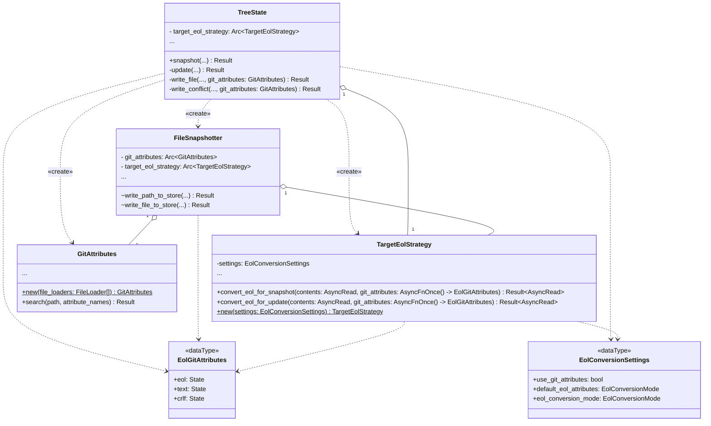

# Supporting the `text` and `eol` Git Attributes in Jujutsu

**Authors**: [Kaiyi Li](mailto:kaiyili@google.com)

**Summary**: TODO

## Context and Scope

When the user uses jj with EOL enabled, they faces the following problems:

* For cross platform projects, the bash scripts should always use the LF EOL on Windows, even though the rest of the source code should convert the EOL based on platforms. [Link](https://github.com/jj-vcs/jj/issues/53#issuecomment-3394555659).
* The heuristic binary detection algorithm can't be perfect. The user may want EOL conversion not to apply on specify files. This can be especially true for many postscript files which contain only ASCII characters.
* Git supports such features, we probably should also add for compatibility to reach out more users.

This design detailed how we could use the infrastructure described in the [Supporting Git Attributes in Jujutsu](gitattributes.md) design, and the existing EOL conversion code to support the [`text`](https://git-scm.com/docs/gitattributes#_text) and [`eol`](https://git-scm.com/docs/gitattributes#_eol) git attributes.

### Terminology

In this design, we use the same terminology as the [git attributes document](https://git-scm.com/docs/gitattributes#_description). Some regularly used definitions include state, and `gitattributes` file.

Below are some important definitions used in this design directly copied from the git attributes document.

#### `gitattributes` file

A `gitattributes` file is a simple text file that gives attributes to pathnames.

Each line in `gitattributes` file is of form:

```gitattributes
pattern attr1 attr2 ...
```

That is, a pattern followed by an attributes list, separated by whitespaces.

#### State

Each attribute can be in one of these states for a given path:

* Set

    The path has the attribute with special value "true"; this is specified by listing only the name of the attribute in the attribute list.

* Unset

    The path has the attribute with special value "false"; this is specified by listing the name of the attribute prefixed with a dash - in the attribute list.

* Set to a value

    The path has the attribute with specified string value; this is specified by listing the name of the attribute followed by an equal sign = and its value in the attribute list.

* Unspecified

    No pattern matches the path, and nothing says if the path has or does not have the attribute, the attribute for the path is said to be Unspecified.

### Non-goals

* Merge and diff. In `git`, the `text` and `eol` `gitattributes` barely influences the output of diff commands(`git diff`, `git show`) and the behavior of merge commands(`git cherry-pick`, `git rebase`, `git merge`). They will be discussed in a separate design. As of now, `jj`'s internal diff tool, external diff tools, external merge tools and merge algorithm work on contents directly from the store without any conversion. This design won't change that behavior. For details, please take a look [here](gitattributes.md#diff-conflicts-and-merge).
* How conflicts should be converted. `jj` currently applies EOL conversion based on materialized conflicts contents, i.e. conversion is applied to contents with conflict markers in one pass. We know it can be improved, but the improvement should be discussed in a separate issue/design instead of this design. For details, please take a look [here](gitattributes.md#diff-conflicts-and-merge).
* Support for features similar to `git add --renormalize`. e.g., if `gitattributes` files are changed to opt-in a new file, `a.txt` for EOL conversion in a working copy, and `a.txt` is not modified in the working copy, EOL conversion still won't apply to `a.txt` in the store until `a.txt` is touched, and won't apply to `a.txt` on the disk until `a.txt` is checked out again. The behavior is the same when the EOL config is changed: the new setting is only applied to files modified in the current working copy and/or on the next update(checkout). However, such limitation will be well documented and a new issue will be opened to discuss whether `jj` need the `--renormalize` feature.
* How to obtain the state of the `text` `gitattributes` and the `eol` `gitattributes` associated to a file. This is discussed in a [separate doc](gitattributes.md).
* Git [`core.safecrlf`](https://git-scm.com/docs/git-config#Documentation/git-config.txt-coresafecrlf) config.
* Reading and respecting the git `core.eol` and `core.autocrlf` configs. We don't discuss this in this design for simplicity. (TODO(06393993): find the github issue talking about import git configs as jj settings).

### Goals/Requirements

* Most changes should only happen in the `local_working_copy` module, and the `eol` module.
* Introduce a boolean `working-copy.eol-conversion-use-gitattributes` setting as a killer switch on whether EOL conversion should read gitattributes. When the value is `false`, the implementation shouldn't read any `gitattributes` files so that the user that doesn't need this feature pay little cost if not zero. It also prevents unexpected influence on `google3` repo, where there are many `gitattributes` files, but we don't expect it to have any effects. The default value is `false`.
* No conditonal compile flags to reduce the code complexity. And with the `working-copy.eol-conversion-use-gitattributes` setting, we can disable this feature at runtime.
* Add a new `working-copy.gitattributes-default-eol` setting, as the equivalent of the git [`core.eol`](https://git-scm.com/docs/git-config#Documentation/git-config.txt-coreeol) config. It has the same 3 valid values as `working-copy.eol-conversion`: `input`, `input-output`, `none`. When the `working-copy.eol-conversion` setting is not `none`, this setting is ignored. Note that the naming is different from the actual `eol` `gitattributes`, so it can be confusing, but we will do our best to document this divergence.
* Support all `text` `gitattributes` features, which decides whether EOL conversion should be applied.
    * Set. The EOL conversion is applied to the file on snapshot and update(checkout).
    * Unset. No EOL conversion is applied.
    * Set to string value `auto`. `jj` uses the internal heuristic to decide whether the file is binary and whether EOL conversion should be applied.
    * Unspecified. `working-copy.eol-conversion` decides whether the file should be converted.
    * All other cases. Act as if `text` is in the unspecified state.
* Support all `eol` `gitattributes` features, which decides how EOL conversion should be applied.
    * Set to string value `crlf`. Convert the file EOL to CRLF on update(checkout). Convert the file EOL to LF on snapshot. The same effect as the `input-output` `working-copy.eol-conversion` setting.
    * Set to string value `lf`. Do not convert the file EOL on update(checkout). Convert the file EOL to LF on snapshot. The same effect as the `input` `working-copy.eol-conversion` setting.
    * Unspecified. How EOL conversion should be applied is decided by the `working-copy.eol-conversion` setting and the `working-copy.gitattributes-default-eol` setting.
    * All other cases. Act as if `eol` is in the unspecified state.
* Support the [`crlf` `gitattributes`](https://git-scm.com/docs/gitattributes#_backwards_compatibility_with_crlf_attribute):
    * Set. The same as `text` is set.
    * Unset. The same as `text` is unset.
    * Set to string value `input`. The same as `eol` is set to `lf`.
* How the [`GitAttributes`] type introduced in the [basic `gitattributes` design](gitattributes.md) should be initialized and used.
* If no EOL should be applied to the file, the file should not be read when calling the EOL convert functions(`convert_eol_for_snapshot` and `convert_eol_for_update`).

## State of the Feature as of v0.35.0

* We have [a design doc](gitattributes.md) on how to read the `gitattributes` associated with a file.
* We have implemented a feature similar to the git `core.autocrlf` config in [this PR](https://github.com/jj-vcs/jj/pull/6728), which implements the EOL conversion itself.

## Prior work

TODO

## Overview

* `GitAttributes` is initialized when `TreeState::snapshot` or `TreeState::update` is called. And is passed all the way to `FileSnapshotter::write_path_to_store`(handle the conflict snapshot case), `FileSnapshotter::write_file_to_store`(handle the non conflict snapshot case), `TreeState::write_file`(handle the non conflict update case), and `TreeState::write_conflict`(handle the conflict update case).
* A new `EolGitAttributes` type is introduced, which describes the state of EOL related `gitattributes` associated with a file:
    ```rust
    struct EolGitAttributes {
        pub eol: State,
        pub text: State,
        pub crlf: State,
    }
    ```
    The `State` type is defined in the [basic `gitattributes` design doc](gitattributes.md#the-gitattributessearch-api-from-the-caller-side).
* A new `get_git_attributes` parameter of `impl AsyncFnOnce() -> EolGitAttributes` type will be added to both of the `TargetEolStrategy::convert_eol_for_snapshot` method, and the `TargetEolStrategy::convert_eol_for_update` method.
* The `get_git_attributes` will only be called if the `working-copy.eol-conversion-use-gitattributes` setting is `true`, and the return value of `get_git_attributes` will be used together with `TargetEolStrategy::eol_conversion_mode` to decide whether and how EOL conversion should be applied to the file.


```mermaid
classDiagram
    class EolConversionSettings {
        <<dataType>>
        +use_git_attributes: bool
        +default_eol_attributes: EolConversionMode
        +eol_conversion_mode: EolConversionMode
    }

    class EolGitAttributes {
        <<dataType>>
        +eol: State
        +text: State
        +crlf: State
    }

    class TargetEolStrategy {
        -settings: EolConversionSettings
        +convert_eol_for_snapshot(contents: AsyncRead, git_attributes: AsyncFnOnce() -> EolGitAttributes) Result~AsyncRead~
        +convert_eol_for_update(contents: AsyncRead, git_attributes: AsyncFnOnce() -> EolGitAttributes) Result~AsyncRead~
        +new(settings: EolConversionSettings) TargetEolStrategy$
        ...
    }

    class GitAttributes {
        +new(file_loaders: FileLoader[]) GitAttributes$
        +search(path, attribute_names) Result
        ...
    }

    class FileSnapshotter {
        - git_attributes: Arc~GitAttributes~
        - target_eol_strategy: Arc~TargetEolStrategy~
        ~write_path_to_store(...) Result
        ~write_file_to_store(...) Result
        ...
    }

    class TreeState {
        - target_eol_strategy: Arc~TargetEolStrategy~

        +snapshot(...) Result
        -update(...) Result

        -write_file(..., git_attributes: GitAttributes) Result
        -write_conflict(..., git_attributes: GitAttributes) Result
        ...
    }

    TreeState ..> FileSnapshotter : «create»
    TreeState ..> GitAttributes : «create»
    TreeState ..> TargetEolStrategy : «create»
    TreeState "1" o-- "1" TargetEolStrategy
    TreeState ..> EolConversionSettings
    TreeState ..> EolGitAttributes
    FileSnapshotter "1" o-- "1" GitAttributes
    FileSnapshotter "1" o-- "1" TargetEolStrategy
    FileSnapshotter ..> EolGitAttributes
    TargetEolStrategy ..> EolGitAttributes
    TargetEolStrategy ..> EolConversionSettings
```

TODO: make the overview summary more concise

## Design

### Change to the EOL conversion functions

In this section, we will descirbe the change to `TargetEolStrategy::convert_eol_for_snapshot` and `TargetEolStrategy::convert_eol_for_update`, and how to resolve the final EOL conversion from settings, gitattributes, and the file contents. All the described changes are only related to the `eol` module, and can be unit tested separately.

#### Change to the interfaces

We introduce a new `EolGitAttributes` type, that describes the state of relevant `gitattributes`, namely `eol`, `text`, and `crlf`. The definition is

```rust
struct EolGitAttributes {
    pub eol: State,
    pub text: State,
    pub crlf: State,
}
```

We make use of the `State` type defined in the [basic `gitattributes` design doc](gitattributes.md#the-gitattributessearch-api-from-the-caller-side).

A new `get_git_attributes` parameter of `impl AsyncFnOnce() -> Result<EolGitAttributes, Box<dyn Error + Send + Sync>>` type will be added to both of the `TargetEolStrategy::convert_eol_for_snapshot` method, and the `TargetEolStrategy::convert_eol_for_update` method to retrieve the states of the related `gitattributes` of the file.

The definitions of the modified interfaces are following.

```rust
type BoxError = Box<dyn Error + Send + Sync>;

impl TargetEolStrategy {
    pub(crate) async fn convert_eol_for_snapshot<'a, F>(
        &self,
        mut contents: impl AsyncRead + Send + Unpin + 'a,
        // TODO(06393993): make sure the lifetime works.
        get_git_attributes: F,
    ) -> Result<Box<dyn AsyncRead + Send + Unpin + 'a>, std::io::Error>
    where
        F: (AsyncFnOnce() -> Result<EolGitAttributes, BoxError>)
            + Send
            + Unpin
            + 'a,
    {
        ...
    }

    pub(crate) async fn convert_eol_for_update<'a, F>(
        &self,
        mut contents: impl AsyncRead + Send + Unpin + 'a,
        // TODO(06393993): make sure the lifetime works.
        get_git_attributes: F,
    ) -> Result<Box<dyn AsyncRead + Send + Unpin + 'a>, std::io::Error>
    where
        F: (AsyncFnOnce() -> Result<EolGitAttributes, BoxError>)
            + Send
            + Unpin
            + 'a,
    {
        ...
    }
}
```

The new `get_git_attributes` parameter is a function type that returns `EolGitAttributes`. It's not just the `EolGitAttributes` type, so that `TargetEolStrategy` controls whether we need to query the `gitattributes`, providing better cohesion and easier testing on the logic whether `gitattributes` needs to query. The new parameters are not `GitAttributes`, and `path`, because this could decouple `TargetEolStrategy` with `GitAttributes`, which gives an easier way to mock the `gitattributes` values for testing. We use `AsyncFnOnce`, because `GitAttributes::search()` is an async function, and `AsyncFnOnce` is the only dyn-compatible trait among `AsyncFn`, `AsyncFnMut`, and `AsyncFnOnce`, which provides the best compatibility(e.g. if the caller wants to use a `Box<dyn AsyncFnOnce>` and pass it around, `AsyncFnOnce` is the only trait that works).

#### Resolve the EOL conversion decision

The final decision on whether and how the EOL conversion should be applied is modeled via the existing type `TargetEol`:

```rust
enum TargetEol {
    Lf,
    Crlf,
    PassThrough,
}
```

This means `TargetEolStrategy` methods need to resolve a `TargetEol` from the following facters:

* the user settings, `EolConversionSettings`
* the `gitattributes`, `EolGitAttributes`
* the file contents, in case the internal heuristics should be used to detect whether the file is text or binary

In addition, we need to also make sure:

* We shouldn't read `gitattributes` if `working-copy.eol-conversion-use-gitattributes` is `false`. This is trivial via the following code:

    ```rust
    let git_attributes = if self.settings.use_git_attributes {
        get_git_attributes
    } else {
        EolGitAttributes {
            eol: State::Unspecified,
            text: State::Unspecified,
            crlf: State::Unspecified,
        }
    };
    ```

* We shouldn't read the file if not necessary, i.e., we should only read the file contents only when the internal heuristics is used to determine whether the file is text or binary, or we decide to perform an actual EOL conversion.

The following table describe the different combination of the condition, and the operation the implementation should take.

* The task column has 2 valid values: snapshot and update, representing `TreeState::snapshot` or `TreeState::update`.
* The default eol column denotes the value of the `working-copy.gitattributes-default-eol` setting.
* The eol setting column denotes the value of the ``working-copy.eol-conversion`` setting.
* The `text`, `eol`, and `crlf` columns are the states of the `gitattributes` associated to the file respectively.
* The heuristics column denotes the result of the internal heuristics on whether the file is text or binary. If the cell is `-`, it means, under such condition, heuristics won't be used.
* The read file column denotes whether file will be read.
* The `TargetEol` column denotes the result of the resolution.
* `*` in a cell means all possible values combined, and should only appear in the first 7 columns.

| task | default eol | eol setting | `text` | `eol` | `crlf` | Heuristics | Read file | `TargetEol` |
| --- | --- | --- | --- | --- | --- | --- | --- | --- |
| snapshot | * |

TODO

### Read the new EOL user settings

TODO

### Integration with `GitAttributes` and `local_working_copy`

TODO

## Tests

TODO

## Future Possibilities

TODO
