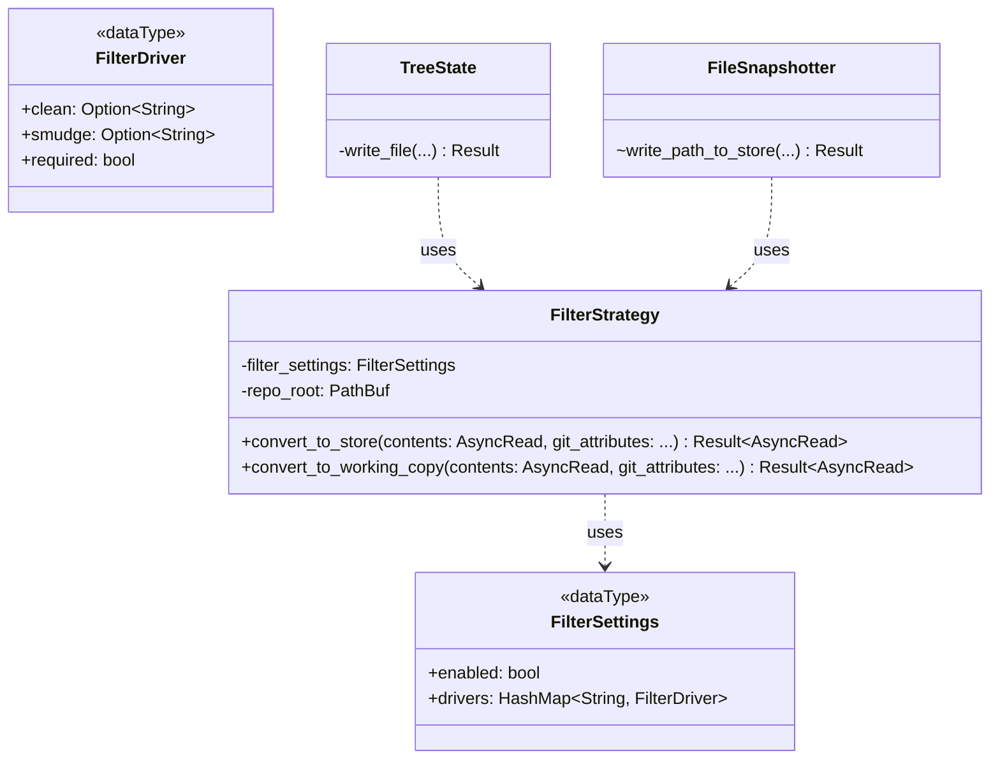

# Supporting the `filter` Git Attribute in Jujutsu

**Authors**: [Kaiyi Li](mailto:kaiyili@google.com)

**Summary**: This design proposes integrating the `filter` `gitattributes` into jj's local working copy logic to enable arbitrary content conversion during snapshot (clean) and update (smudge). It introduces new configuration settings to define these filters, enabling features like `git-lfs` and `git-crypt` support.

## Context and Scope

The `filter` attribute in git allows users to specify a driver that processes file content.
* **Clean**: Run when adding files to the index (in `jj`, when snapshotting to the store). It typically converts a worktree file to a version suitable for the store (e.g., `git-lfs` converts large file content to a pointer file).
* **Smudge**: Run when checking out files to the worktree (in `jj`, when updating the working copy). It converts the content from the store back to a usable worktree file (e.g., `git-lfs` converts a pointer file to the actual large file content).

Supporting this feature is essential for compatibility with tools like [`git-lfs`](https://git-lfs.com/) (see [user request](https://github.com/jj-vcs/jj/issues/80)) and [`git-crypt`](https://github.com/AGWA/git-crypt) (see [user request](https://github.com/jj-vcs/jj/issues/53#issuecomment-1206624208)).

This design focuses on the integration of the `filter` attribute within `jj`'s `local_working_copy` module. We will also introduce a new dedicated `filter` module and types to handle filter functions.

### Terminology

#### Filter Related

We use the same terminology as the [git attributes document](https://git-scm.com/docs/gitattributes#_filter).

* **Filter Driver**: A command defined in the configuration that handles the smudge and clean operations.
* **Clean**: The operation to convert working copy content to content to be stored in the `Store`.
* **Smudge**: The operation to convert content from the `Store` to working copy content.

We also hold the same assumption for the `clean` and `smudge` operations as [`git`](https://git-scm.com/docs/gitattributes#_filter).

> For best results, `clean` should not alter its output further if it is run twice ("clean→clean" should be equivalent to "clean"), and multiple `smudge` commands should not alter `clean`'s output ("smudge→smudge→clean" should be equivalent to "clean").

#### Jujutsu

* **Store**: The actual storage in the VCS, e.g. a git tree.

#### `gitattributes` file

A `gitattributes` file is a simple text file that gives attributes to pathnames.

Each line in `gitattributes` file is of form:

```gitattributes
pattern attr1 attr2 ...
```

That is, a pattern followed by an attributes list, separated by whitespaces.

#### State

Each attribute can be in one of these states for a given path:

* Set

    The path has the attribute with special value "true"; this is specified by listing only the name of the attribute in the attribute list.

* Unset

    The path has the attribute with special value "false"; this is specified by listing the name of the attribute prefixed with a dash - in the attribute list.

* Set to a value

    The path has the attribute with specified string value; this is specified by listing the name of the attribute followed by an equal sign = and its value in the attribute list.

* Unspecified

    No pattern matches the path, and nothing says if the path has or does not have the attribute, the attribute for the path is said to be Unspecified.

!!! note

    `.gitattribute` files can use the `!` prefix to set an attribute to the Unspecified state:

    > Sometimes you would need to override a setting of an attribute for a path to `Unspecified` state. This can be done by listing the name of the attribute prefixed with an exclamation point `!`.

### Non-goals

* **Merge and diff**: Similar to the [EOL design](gitattributes-eol.md), we do not consider how filters affect merge, or diff in this design. `jj show`, `jj file show`, and `jj diff` will show and calculate the diff from the contents from the store. `jj new` and `jj rebase` will still resolve the conflicts based on the contents from the store.
* **Conflict handling**: We apply the filter conversion at the same place as the EOL conversion for conflicts: after the conflicts are materialized, i.e., we call the filter driver with conflict markers. We make such decision for simplicity. And if we want to improve, and apply the EOL and filter conversion on each side of the conflict, it will be a separate issue/design.
* **`git add --renormalize`**: We do not support re-normalizing files that are not changed in the working copy if the filter configuration changes. e.g., if `gitattributes` files are changed to opt-in a new file, `a.txt` to a filter in a working copy, and `a.txt` is not modified in the working copy, the clean filter still won't apply to `a.txt` in the store until `a.txt` is touched, and the smudge filter won't apply to `a.txt` on the disk until `a.txt` is checked out again. The behavior is the same when the filter config is changed: the new setting is only applied to files modified in the current working copy and/or on the next update(checkout). This behavior is consistent with `git` and `jj`'s existing EOL settings. However, such limitation will be well documented and a new issue will be opened to discuss whether `jj` need the `--renormalize` feature.
* **Long Running Filter Process**: We do not support the [long-running filter process protocol](https://git-scm.com/docs/gitattributes#_long_running_filter_process) in this design. We will spawn a new process for each file. This is deferred to future work.
* **Robust Process Management**: We do not implement robust process management features, i.e., the `filter.<name>.process` git config:

  * Kill the child process if the parent `jj` process is terminated.
  * Set a timeout for the filter process.
  * Retry if the filter process fails.

  However, we **will** ensure that `jj` waits for the child process to complete to avoid resource leak, even if the filter process fails.
* **Reading gitattributes**: The mechanism for reading `gitattributes` files is covered in the [gitattributes design](gitattributes.md).
* **Reading and respecting the git filter configs**: We don't discuss using the existing git filter configs in this design, e.g. `filter.<name>.clean`, `filter.<name>.smudge`, and `filter.<name>.required`, for simplicity. `jj` should develop a consistent method to pull in git configs, and that's tracked in other issues: https://github.com/jj-vcs/jj/issues/4048, and https://github.com/jj-vcs/jj/issues/7455. Nonetheless, we do discuss `jj`'s equivalent user settings of those git configs.

### Goals/Requirements

* Introduce a boolean `working-copy.filter.enabled` setting as a killer switch on whether `filter` gitattributes conversion should happen. When the value is `false`, the implementation shouldn't read any `gitattributes` files and won't conduct any filter conversion so that the user that doesn't need this feature pay little cost if not zero. It also prevents unexpected influence on `google3` repo, where there are many `gitattributes` files, but we don't expect it to have any effects. In addition, it's a "safe mode", in case a required filter driver doesn't work properly, e.g., always fails, which can prevent any `jj` commands from executing. The default value is `false`.
* Introduce `working-copy.filter.drivers.<name>.clean`, `working-copy.filter.drivers.<name>.smudge`, and `working-copy.filter.drivers.<name>.required` settings to define filter drivers.
* Support interpolate the relative file path in the command, like `%f` in the `filter.<name>.clean` git config.
* Support the `filter` attribute in `gitattributes`.
  * If `filter` is set to a string value, look up the corresponding driver in the settings.
  * If the driver is found, apply the `clean` command on snapshot and the `smudge` command on update.
* Ensure the order of conversion matches git:
  * **Snapshot**: The working copy file is first converted with the filter driver (if specified and corresponding driver defined), and then finally with EOL conversion (if specified and applicable).
  * **Update**: The content from the store is first converted with EOL conversion (if specified and applicable), and then fed to the filter driver (if specified and corresponding driver defined).
* Execute filter commands using `std::process::Command`, piping content via stdin/stdout.
* Ensure to clean up the resource: always wait for the child process to exit.
* Handle command failure:
  * **Snapshot**: If a required filter fails, the operation, e.g., `jj log`, fails, and the current change in the store won't be updated. This is catastrophic, so we must ensure the error message is clear on what happens. If the filter is not required, failure results in a no-op (passthru) with a warning message on every failure command just like `jj fix`.
  * **Update**: If a required filter fails, the operation fails, and the exit code of the `jj` command will be non-zero. A clear error message will indicate the user that it's a filter failure, and `jj` will leave the working copy [stale](../working-copy.md#stale-working-copy). If the filter is not required, failure results in a no-op (passthru) with a warning mesage on every failure command just like `jj fix`.
* If no filter is applicable to the file, the file content should not be read when calling the filter conversion functions.
* Async runtime agnostic, especially the function shouldn't panic if it's called within the tokio async runtime or without the tokio async runtime.
* Won't block the async runtime worker thread, i.e., the `Future::poll` will properly return when it's waiting for the child process to complete.
* Almost 100% test coverage. We strive for a very high test coverage, but it's difficult to test certain failures, e.g., we fail to create a worker thread.

## Overview

* The `FileSnapshotter` and `TreeState` will use `GitAttributes` to query the `filter` attribute.
* If a filter is specified and configured, the new `FilterStrategy::convert_to_store` and `FilterStrategy::convert_to_working_copy` will invoke the filter command.
* The filter command execution will be handled by a helper function that manages the subprocess and pipes.
* TODO(06393993): if snapshot fails, figure out a good way to report the error to the user. The key logic is in `try_handle_command_result`, but we still need to understand how to bubble the correct error up to that level. In `WorkspaceCommandHelper::snapshot_working_copy`, if `locked_ws.locked_wc().snapshot(&options)` fails, the function bails out, and won't call `set_tree`, preserving the old state of the change.
* TODO(06393993): figure out if update fails, how the error bubbles up and make sure the working copy is left in a stale state.



## Open questions

1. Should we move `CommandNameAndArgs` to the `lib` crate, so that it's simpler and more consistent for the filter to parse the `smudge` and `clean` settings?
2. If a not required filter fails, should `jj` shows a warning message?
3. Do we prefer the method names to be `convert_for_snapshot`, `convert_for_update` or `convert_to_store`, `convert_to_working_copy`? If latter, do we want to change the naming in the `eol` module?
4. If the filter child process exits with 0 status code before we complete writing to stdin, should we treat as if this invocation fails, i.e., if it's a required filter, the jj command fails; if it's not a required filter, the filter is treated as a no-op (passthru)?

## Design

### Configuration

We introduce a new `working-copy.filter.enabled` settings as a killer switch for filter conversion. If it's set to `false`, filter conversion won't read the gitattributes, and won't read the file.

We introduce a new `working-copy.filter.drivers` setting to define filter drivers. It's a new toml table. This acts the same as the git `filter.drivers.<driver>.clean`, `filter.drivers.<driver>.smudge`, and `filter.drivers.<driver>.required` configs.

```toml
working-copy.filter.enabled = true

[working-copy.filter.drivers.lfs]
clean = ["git-lfs", "clean", "--", "$path"]
smudge = ["git-lfs", "smudge", "--", "$path"]
required = true
```

* `$path` will be replaced with the repo-relative path of the file being converted. The `git-lfs` filter driver needs this parameter.

We will introduce a `FilterSettings` struct to parse and store these configurations.

```rust
#[derive(Debug, PartialEq, Eq, Copy, Clone, serde::Deserialize)]
#[serde(rename_all(deserialize = "kebab-case"))]
pub struct FilterDriver {
    #[serde(default)]
    pub clean: Vec<String>,
    #[serde(default)]
    pub smudge: Vec<String>,
    #[serde(default)]
    pub required: bool,
}

pub struct FilterSettings {
    pub enabled: bool,
    pub drivers: HashMap<BString, FilterDriver>,
}

impl FilterSettings {
    pub fn try_from_settings(user_settings: &UserSettings) -> Result<Self, ConfigGetError> {
        ...
    }
}
```

We implement `try_from_settings` in a way very similar to [`get_tools_config`](https://github.com/jj-vcs/jj/blob/19527a06167a17801b48ceca33a7646b8ec4e2f3/cli/src/commands/fix.rs#L378-L420):

1. Retrieve `enabled` using `user_settings.get_bool("working-copy.filter.enabled")`.
2. Retrieve `drivers`:
  1. Use `user_settings.table_keys("working-copy.filter.drivers")` to obtain the names of drivers.
  2. For each name, create the path `working-copy.filter.drivers.<name>`.
  3. Call `user_settings.get::<FilterDriver>(path)` to retrieve the driver configuration.
  4. Collect the drivers into the `drivers` hash map with the names.

The `serde(default)` attributes will guarantee that `required` is default to `false`, and `clean` and `smudge` are default to empty vectors - we treat empty arrays the same as if the keys are missing.

We can't use [`CommandNameAndArgs`](https://github.com/jj-vcs/jj/blob/main/cli/src/config.rs#L806C10-L813) here for `clean` and `smudge`, because `CommandNameAndArgs` is defined in the `cli` crate.

### The `FilterStrategy` interfaces

We will introduce a new `filter` module and a `FilterStrategy` type to handle filter conversions, similar to `TargetEolStrategy`, but separate from it.

```rust
pub struct FilterStrategy {
    settings: FilterSettings,
}

impl FilterStrategy {
    pub fn new(settings: FilterSettings) -> Self {
        Self { settings }
    }

    pub async fn convert_to_store<'a, F>(
        &self,
        contents: impl AsyncRead + Send + Unpin + 'a,
        path: &RepoPath,
        get_git_attributes: F,
    ) -> Result<Box<dyn AsyncRead + Send + Unpin + 'a>, FilterError>
    where
        F: (AsyncFnOnce() -> Result<State, Box<dyn Error + Send + Sync>>) + Send + Unpin + 'a;

    pub async fn convert_to_working_copy<'a, F>(
        &self,
        contents: impl AsyncRead + Send + Unpin + 'a,
        path: &RepoPath,
        get_git_attributes: F,
    ) -> Result<Box<dyn AsyncRead + Send + Unpin + 'a>, FilterError>
    where
        F: (AsyncFnOnce() -> Result<State, Box<dyn Error + Send + Sync>>) + Send + Unpin + 'a;
}
```

* `contents`: The input content stream. It can be the original contents of a file, or the contents after EOL conversion, e.g., on update. We use `AsyncRead` because `TargetEolStrategy` accepts and returns `AsyncRead`, so it's easier to chain the filter conversion and the EOL conversion with the `AsyncRead` type.
* `path`: The path of the file, used for `$path` substitution in the filter command.
* `get_git_attributes`: An async function that returns the `filter` attribute state for the file. It is only called if `FilterSettings::enabled` is true. We use `AsyncFnOnce`, because `GitAttributes::search()` is an async function, and `AsyncFnOnce` is the only dyn-compatible trait among `AsyncFn`, `AsyncFnMut`, and `AsyncFnOnce`, which provides the best compatibility(e.g. if the caller wants to use a `Box<dyn AsyncFnOnce>` and pass it around, `AsyncFnOnce` is the only trait that works).

**Implementation**:

Both methods follow a similar pattern:

1. Check if filters are enabled in `settings`. If not, return `contents` as is.
2. Call `get_git_attributes` to retrieve the `filter` attribute state.
3. Resolve the `FilterDriver` based on the `filter` attribute and `settings` (see [Filter Resolution](#filter-resolution)).
4. If no driver is resolved, return `contents` as is.
5. Otherwise, a driver is found:
  * For `convert_to_store`, use the `clean` command.
  * For `convert_to_working_copy`, use the `smudge` command.
6. [Construct](#command-construction) the command. If no command is constructed, it means the command is not specified, e.g., `convert_to_store` is called, but the driver has only `smudge`, but no `clean` command, and we return `contents` as is.
7. Execute the command(see [Process Execution](#process-execution)). We introduce a dedicated `run_filter_command` function for this. Essentially, we pass `contents` as stdin to the child process, and return the value read from the process stdout as the new `AsyncRead`.
8. If `run_filter_command` returns an error:
  * We leave a tracing log with the path to the file, the driver name, and the command to execute for easier debugging.
  * If the filter is required, i.e., `FilterDriver::required` is `true`, return an error.
  * If the filter is not required, i.e., `FilterDriver::required` is `false`, return `contents` as is.

Note that `FilterStrategy` does not handle EOL conversion. The caller is responsible for chaining `FilterStrategy` and `TargetEolStrategy` in the correct order (Disk -> Clean -> EOL -> Store, and Store -> EOL -> Smudge -> Disk).

### Filter Resolution

1. If the attribute state is set to a value, i.e., `Status::Value` (e.g., `filter=lfs`), look up the value from `FilterSettings::drivers` (e.g., `b"lfs"`). The type of the keys of `FilterSettings::drivers` is `BString`, because we can only obtain `&BStr` from a `Status`. Using `BString` as the key type makes looking up easier.
2. If found, the value is the `FilterDriver` to use.
3. If the attribute is `Unset`, `Unspecified`, or `Set` (boolean true), or if the driver is not found, do not apply any filter.

### Command Construction

We introduce a function dedicated to generate the executable and arguments used to spawn the child filter process.

```rust
fn create_filter_command(command: &[String], path: &RepoPath) -> Option<std::process::Command> {
    ...
}
```

We need to construct the actual `std::process::Command` used to run the filter driver process with the proper executable, and the arguments defined in the driver configuration.

The implementation is similar to how `jj fix` is implemented in [`CommandNameAndArgs::to_command_with_variables`](https://github.com/jj-vcs/jj/blob/19527a06167a17801b48ceca33a7646b8ec4e2f3/cli/src/config.rs#L859-L871) and [`run_tool`](https://github.com/jj-vcs/jj/blob/19527a06167a17801b48ceca33a7646b8ec4e2f3/cli/src/commands/fix.rs#L286-L293).

* Executable: If the command array is empty, the filter is not specified, otherwise, the first element is the path to the executable.
* Arguments: The rest of the elements are the arguments.
* Argument `$path` interpolation: The `$path` sequence in the arguments will be replaced with the path of the file being processed (relative to the repository root). The path of the file is obtained from the `path` parameter of `FilterStrategy::convert_to_*`. To perform the replace, we use [`String::replace`](https://doc.rust-lang.org/std/string/struct.String.html#method.replace). To convert the `RepoPath` to `String`, we make use of `RepoPath::as_internal_file_string`.

### Process Execution

This section describes the implementation details of the `run_filter_command` function:

```rust
impl FilterStrategy {
    async fn run_filter_command(&self, command: Command, contents: &[u8]) -> Result<Vec<u8>, FilterError> {
        ...
    }
}
```

We will use `std::process::Command` to execute the filter command, similar to how `jj fix` is implemented in [`run_tool`](https://github.com/jj-vcs/jj/blob/19527a06167a17801b48ceca33a7646b8ec4e2f3/cli/src/commands/fix.rs#L288-L313).

Before spawning the process, we apply the following set up to the `std::process::Command`:

* The executable and the arguments should have been set per the [Command Construction](#command-construction) section.
* Current working directory: The repository root, obtained from `FilterStrategy::repo_root`.
* `stdin`, `stdout`, `stderr` are all set to `Stdio::piped()`.
  * `stdin`: Send the contents to be converted.
  * `stdout`: Receive the converted contents from the filter driver command.
  * `stderr`: Receive the error messages from the filter driver command. We will log the message if the log level is tracing, so that it's easier for the filter driver developer to debug.

If we fail to spawn the process, we return an error.(TODO(06393993): make sure that when this error happens, and it's a required filter, the error message showed to the user knows it's because the filter command fails to spawn).

To send the original contents to the stdin, and read the converted contents from the stdout, we use spawn 2 threads to avoid deadlocks, and follow [this example](https://doc.rust-lang.org/std/process/index.html#handling-io). However, we change the example slightly because the current thread may be in an async context, and we want to avoid blocking:

* A stdin worker thread is spawned where we send the contents to the stdin of the filter process. If an error is encountered, we just leave a tracing log about the error. We use a separate thread, because `write_all` can be blocking. We also use a `tokio::sync::oneshot::channel` to notify the original thread after the write completes successfully.
* Another stdout worker thread is spawned to call `Child::wait_with_output` and use `tokio::sync::oneshot::Sender::send` to send back the `std::process::Output` returned by `Child::wait_with_output`. We use a separate thread, because `Child::wait_with_output` is blocking.
* The current thread uses `tokio::sync::oneshot::Receiver` to receive `Child::wait_with_output` in a non-blocking way, and awaits on `tokio::sync::oneshot::Receiver` to tell if the stdout worker thread completes write successfully.
* If the stdin worker thread doesn't complete the write successfully(i.e. panics or fails), `stdin` can be dropped[^stdin_worker_panic] before all the contents are sent. In this case, the filter process receives EOF before it receives all the contents, and can exit with 0, but the output contains the filtered results generated from only a portion of the original contents. It's also possible that the filter process close the stdin pipe before it reads everything on purpose, because it doesn't need to read all the contents. In this case, the write operation on the stdin worker thread fails legitimately. However, to be conservative, we always return `Err` in this case. To detect this case, the receiver side of the oneshot channel should end up with an error.
* If the stdout worker thread doesn't complete successfully(either panics[^stdout_worker_panic] or fails). We don't receive the stdout contents from the child filter process, we return `Err`.
* We uses [`std::thread::Builder::spawn_scoped`](https://doc.rust-lang.org/std/thread/struct.Builder.html#method.spawn_scoped) to create the 2 worker threads to handle the case where we fail to create those 2 threads. If we fail to create either thread, we kill the spawned child process.

  * If `Child::kill` returns `Ok` we wait for the process in the original thread before we return. Waiting on a killed process should almost always returns immediately, so we just block the async runtime here. If we unfortunately fail to create worker threads, and the child filter process can't exit in time[^process_hang_on_kill], let's just hang for simplicity. If a user actually hits this issue, we can try to add timeout on waiting[^wait_for_proc_timeout] for the killed process.
  * If `Child::kill` returns `Err`, this is unlikely, we leave a tracing log, and we don't bother waiting for the child process, and return `Err`.

  We will also leave comments to future maintainers that we should avoid returning, panic, and adding await points after we spawn the process and before the stdout worker thread is spawned to avoid zombie processes.
* Note that we always wait for the stdout worker thread first, then the stdin worker thread, so that when the function returns(particularly bails on error), the filter child process has exited, i.e., if the filter child process hangs, this function also hangs. For the same reason, we will leave a comment to warn future maintainers to avoid adding code between spawning the stdout worker thread, and the await on the `Child::wait_with_output` receiver on the original thread, because any panics in between can "leak" a hanging child process.
* The implementation is not strictly cancellation safe: if the returned future is dropped after the first poll, but before the filter child process completes, the filter child process won't be killed, the 2 worker threads won't be terminated, and can result in a leak if the child process hangs. However, because the first await point is after the stdout worker thread is created, the child process is properly waited on the stdout worker thread, so we also don't result in a zombie process. We will document this behavior on this function and the `FilterStrategy::convert_to_*` functions, and we won't implement killing the child process on drop for simplicity.
* The implementation must be async runtime agnostic, i.e., can run in the tokio runtime and outside tokio runtime without panic. This requirements prevent us from using `tokio::process::Command`, which [panics outside the tokio runtime](https://github.com/tokio-rs/tokio/blob/4714ca168d6bd97193625657b0381e9b65a9ceff/tokio/tests/process_change_of_runtime.rs#L25-L34).
* We drop the `JoinHandle` of the 2 worker threads and make them detached threads.
* Now that we have `std::process::Output`, we inspect the exit code, if it's not zero, we send the stderr contents to the tracing log, and return `Err`. If the exit code is zero, we return the stdout contents in an `Ok` `Vec<u8>`.

[^stdin_worker_panic]: If `jj-lib` is used in a binary crate with `panic = "unwind"`, when panic happens, the stdin handle sent to the stdin worker thread [will be dropeed](https://doc.rust-lang.org/reference/panic.html#r-panic.unwind.destruction) as a process of unwind, which results in an EOF on the reader side, i.e., the filter child process.
[^stdout_worker_panic]: If `jj-lib` is used in a binary crate with `panic = "abort"`, when the stdout worker thread panics, the process just dies, it doesn't matter if the original thread knows if the stdout thread succeeds or not. If `jj-lib` is used in a binary crate with `panic = "unwind"`, when the stdout worker thread panics, the `tokio::sync::oneshot::Sender` [will be dropped](https://doc.rust-lang.org/reference/panic.html#r-panic.unwind.destruction), and the original thread awaits on the `Receiver` will result in an error.
[^process_hang_on_kill]: While it's unlikely that a process can't exit on kill, it happens if the process is trapped somewhere in the kernel, e.g., on Linux waiting for some hardware IO which puts the process in an uninterruptible sleep state, or on Windows, a thread hangs inside a kernel driver.
[^wait_for_proc_timeout]: This can be implemented, but is not trivial. Rust `std` doesn't provide such capability. On Windows, we can use `WaitForSingleObject`. On Linux, we can poll the status of the process with `waitpid` and `WNOHANG`.

### Integration points in `local_working_copy`

TODO(06393993): Need to figure out the details on how to bubble up the warnings and errors.

*   `FileSnapshotter::write_path_to_store`: Call `FilterStrategy::convert_to_store`.
*   `TreeState::write_file`: Call `FilterStrategy::convert_to_working_copy`.

## Tests

### Unit Tests

TODO(06393993): it's doubtful whether unit tests are possible.

*   **Configuration**: Test parsing of `working-copy.filter` settings, including `required`.
*   **Filter Resolution**: Test that `filter=foo` correctly resolves to the configured command.
*   **Command Substitution**: Test `%f` substitution.

### Integration Tests

TODO(06393993): add a `_test` feature, expose the `filter` module as `pub` only if the feature is enabled. Otherwise, the `filter` module is `pub(crate)`. In `dev-dependencies`, add `jj-lib = { path = ".", features = ["_test"] }`, so that the `filter` crate is exposed to the integration test only.

We will introduce a new test helper tool `fake-filter` (or similar) that can be configured to perform simple transformations (e.g., reverse content, replace text) and fail on demand.

*   **Clean path**:
  *   Configure `fake-filter` as a clean filter.
  *   Snapshot a file.
  *   Verify the stored content is transformed.
*   **Smudge path**:
  *   Configure `fake-filter` as a smudge filter.
  *   Update (checkout) a file.
  *   Verify the working copy content is transformed.
*   **Failure handling (Required)**:
  *   Configure `fake-filter` to fail with `required = true`.
  *   Verify the operation fails gracefully and reports the error.
*   **Failure handling (Not Required)**:
  *   Configure `fake-filter` to fail with `required = false`.
  *   Verify the operation succeeds and the content is passed through unchanged.
*   **Resource safety**:
  *   Verify (if possible, or via code review) that processes are reaped.

## Future Possibilities

* **`tokio::process::Command`**: We currently use `std::process::Command` for simplicity and consistency with `jj fix`. We could switch to `tokio::process::Command` for async execution, which might improve performance when handling many files concurrently.
* **Long Running Filter Process**: Implement the persistent process protocol to avoid spawn overhead.
* **Git Config Compatibility**: Read `filter.<driver>.*` from git config files directly.
