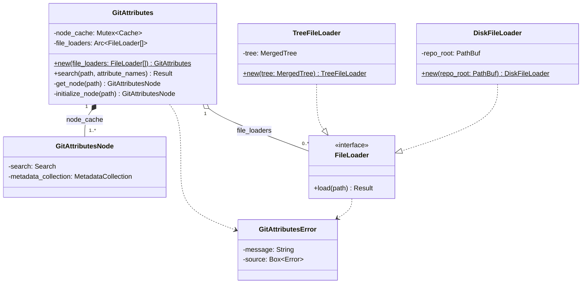

# Supporting Git Attributes in Jujutsu

**Authors**: [Kaiyi Li](mailto:kaiyili@google.com)

**Summary**: This design introduces an API internal to `jj-lib` that future git attributes related features could use to query the git attributes information associated with a file. It explains the design choice, implementation, and future usage of the basic interface. Features(EOL conversion, smudge and clean filter) built on top of that query interface are only briefly discussed because they are complicated and should deserve their own PRs ,issues or designs.

## Context and Scope

We are interested in many git attributes related features:

* Perform EOL conversion differently for different files: the [`text`](https://git-scm.com/docs/gitattributes#_text) and the [`eol`](https://git-scm.com/docs/gitattributes#_eol) git attributes.
* Control the behavior of `jj diff` on binary files or generated files: the [`diff`](https://git-scm.com/docs/gitattributes#_generating_diff_text) and the [`linguist-generated`](https://docs.github.com/en/repositories/working-with-files/managing-files/customizing-how-changed-files-appear-on-github) git attributes.
* Smudge and clean [filter](https://git-scm.com/docs/gitattributes#_filter), which paves a straight forward path for [`git-lfs` support](https://github.com/git-lfs/git-lfs/blob/main/docs/spec.md#intercepting-git), and [`git-crypt` support](https://github.com/AGWA/git-crypt?tab=readme-ov-file#using-git-crypt).

This design provides the cornerstone of all the previously mentioned features.

The EOL conversion feature and the filter feature should only interact with the `local_working_copy` module. The diff feature will use the interfaces introduced in this design in the `diff_util` module and the `merge_tools::diff_working_copies` module in the `jj-cli` crate.

### Terminology

In this design, we use the same terminology as the [git attributes document](https://git-scm.com/docs/gitattributes#_description). Some regularly used definitions include pattern, state, and `gitattributes` file.

Below are some important definitions used in this design directly copied from the git attributes document.

#### `gitattributes` file

A `gitattributes` file is a simple text file that gives attributes to pathnames.

Each line in `gitattributes` file is of form:

```gitattributes
pattern attr1 attr2 ...
```

That is, a pattern followed by an attributes list, separated by whitespaces.

#### State

Each attribute can be in one of these states for a given path:

* Set

    The path has the attribute with special value "true"; this is specified by listing only the name of the attribute in the attribute list.

* Unset

    The path has the attribute with special value "false"; this is specified by listing the name of the attribute prefixed with a dash - in the attribute list.

* Set to a value

    The path has the attribute with specified string value; this is specified by listing the name of the attribute followed by an equal sign = and its value in the attribute list.

* Unspecified

    No pattern matches the path, and nothing says if the path has or does not have the attribute, the attribute for the path is said to be Unspecified.

#### Patterns

The rules by which the pattern matches paths are the same as in `.gitignore` files (see [gitignore[5]](https://git-scm.com/docs/gitignore)), with a few exceptions:

* negative patterns are forbidden
* patterns that match a directory do not recursively match paths inside that directory (so using the trailing-slash `path/` syntax is pointless in an attributes file; use `path/**` instead)

### Non-Goals

* This design doesn't include the details on how other specific git attributes related features should be implemented. However, how other features could query the git attributes will be discussed to justify some design decisions.
* This design doesn't handle the git attributes defined in places other than `gitattributes` files in the repo. This will be deferred to a separate issue or PR which should introduce a separate setting to read those files just like [this issue](https://github.com/jj-vcs/jj/issues/4048). This means that this design won't consider the following git attribute files:
    * `$GIT_DIR/info/attributes`
    * The file specified by the `core.attributesFile` configuration option.
    * `$XDG_CONFIG_HOME/git/attributes`
    * `$HOME/.config/git/attributes`
    * `$(prefix)/etc/gitattributes`

### Goals/Requirements

* Describe a general API to query the git attributes associated with a path and the initial implementation of this API.
* The caller of the API shouldn't have to deal with the following complicated details. The implementation of the API should handle them.
    * How to parse the `gitattributes` file.
    * Which ancestor folders contain the relevant `gitattributes` file.
    * How the `gitattributes` file is loaded from the tree or from the file system.
    * When querying the attributes associated with a file, how to look up `gitattributes` in all ancestor folders.
    * [Macro](`https://git-scm.com/docs/gitattributes#_using_macro_attributes`) resolution.
* The query interface must be thread-safe, because `TreeState::snapshot` currently snapshots files in multiple threads concurrently.
* The design should make it easy to optimize the performance of the query interface without having to change the caller code too much, and the initial implementation should be reasonably fast, because any feature that makes use of `gitattributes` is likely to query the git attributes of all the changed files whenever `jj` snapshots files from the file system to the `Store` or updates files from the `Store` to the file system.
* When `gitattributes` is not used, the design should introduce negligible runtime and memory overhead, if not 0, i.e. if none of git attributes related features is enabled through the user settings.
* Support all git built-in `gitattribute` macros. Currently there is only [`binary`](https://github.com/git/git/blob/master/attr.c#L639).

## Design

We introduce the following major public types:

* `GitAttributes`: the key type used by all components that need to query the [the state](https://git-scm.com/docs/gitattributes#_description) of given attributes for an arbitrary file. The query capability is exposed through a single `GitAttributes::search` method.
* `FileLoader` a trait that encapsulates the implementation details on how to read `gitattributes` files given paths, either from the `Store` or from the disk. `TreeFileLoader` and `DiskFileLoader` are 2 implementations.
* `GitAttributesError` is the general error type.

And the following private types:

* `GitAttributesNode` is the cache entry for `gitattributes` files associated to a folder.

We make the following design decision with the following reasons:

* We only read and parse `gitattributes` files when the `gitattributes` of relevant files are queried, because we want to introduce as little overhead as possible if `gitattributes` related features are not enabled.
* We share `GitAttributes` objects across as many components as possible which is different from the existing `GitIgnoreFile` design, because
    * It saves the caller's effort from calling `chain_with_file` and visiting the potential folders on its own. While this is less of an issue for `TreeState::snapshot`, callers like `TreeState::update`(need `gitattributes` to apply the smudge filter) or `DiffRenderer` may currently only have access to a diff stream, which requires extra code to create and maintain the `gitattributes` file tree graph.
    * It allows us to introduce a cache of `gitattributes` files from the caller, so that we don't have to read the `gitattributes` file and constructs the [`Search`](https://docs.rs/gix-attributes/0.26.1/gix_attributes/struct.Search.html) object for a folder entry twice. The `Search` object contains all the `gitattributes` information in the ancestor folders.
    * `GitIgnoreFile` is designed differently to ask the caller to build and maintain the `GitIgnoreFile` tree via the `chain_with_file` interface, and parse the `gitignore` files eagerly, because it helps us to skip entire directories when traversing the file system. `gitattributes` files are different: we don't use them to skip directories, so we don't bother leave the trouble for the callers.
* `GitAttributes` must be `Sync` and `Send`. `GitAttributes::search` should be able to be called on different threads concurrently, because when snapshotting, we are [handling different file entries concurrently](https://github.com/jj-vcs/jj/blob/525e795889d3e631069da848a82748fc2d379bc9/lib/src/local_working_copy.rs#L1262-L1269). For example, for EOL conversion, we need to query the `text` and `eol` `gitattributes` concurrently.
* We introduce the `FileLoader` trait to handle the task to read the `gitattributes` files instead of just inlining the implementation in `GitAttributes`, because
    * It allows us to mock the behavior of the file system and `Store` when testing `GitAttributes`.
    * Reading `gitattributes` files itself is complicated, because it needs to handle many corner cases including the file doesn't exist or the path isn't a file; we should not follow symbolic links; the `gitattributes` file has conflicts. It would improve the readability if we move the implementation details in a separate type.



Under the hood, `GitAttributes` uses [`gix_attributes::Search`](https://docs.rs/gix-attributes/0.26.1/gix_attributes/struct.Search.html) to query the attribute. And `GitAttributes` holds a memoization cache of the `gix_attributes::Search` and the [`gix_attributes::search::MetadataCollection`](https://docs.rs/gix-attributes/0.26.1/gix_attributes/search/struct.MetadataCollection.html) for every directory. `MetadataCollection` stores the macro definitions and attributes, and the `gix_attributes::Search` type allows the client to chain `gitattributes` files, query the attribute based on the chained files, and resolve the macro definition defined by the given `MetadataCollection`. It is allowed to introduce new git attributes arbitrarily in any `gitattributes` files, so different directories can have different `MetadataCollection`s. When `GitAttributes::search` is called, we try to obtain the `Search` object and the `MetadataCollection` associated to the parent directory of the requested path from the memoization cache, e.g., if the request path is `src/lib.rs`, we find the `Search` object and the `MetadataCollection` object associated to the `src` directory, and use the [`Search::pattern_matching_relative_path`](https://docs.rs/gix-attributes/0.26.1/gix_attributes/struct.Search.html#method.pattern_matching_relative_path) method to query the result. `GitAttributes::search` will return an `HashMap<String, State>` which maps the attribute name to its state. Note that the `GitAttributes::search` method supports querying multiple attributes at the same time, which could save the caller redundant pattern comparisons compared to querying the attributes one by one. If we don't have the path(e.g., `x/y/z`) in our memoization cache, we try to obtain the associated `Search` and `MetadataCollection` objects of the parent path(e.g., `x/y`), and create the `Search` and `MetadataCollection` objects of the current path(e.g., `x/y/z`) by reading the `gitattributes` file, and calling [`Search::add_patterns_buffer`](https://docs.rs/gix-attributes/0.26.1/gix_attributes/struct.Search.html#method.add_patterns_buffer). Afterwards, we populate this result to the memoization cache. If the parent entry is also missing, we recursively apply the same approach to populate that entry until we hit the root path. In this way, if we call `GitAttributes::search` multiple times with paths under the same directory, we only read the `gitattributes` files, create the `Search` object, and create the `MetadataCollection` object once.

This is just a simplistic picture of the `GitAttributes::search` implementation, we will cover the following aspects in details:

* How to specify the priority of different `FileLoader` sources of `gitattributes` files, i.e., whether the `gitattributes` file in `Store` should take priority or the one on the disk.
* `GitAttributes::search` should be a thread-safe interface, which means `GitAttributes::search` shouldn't take `&mut self`, and `GitAttributes` should be `Sync`. However, `GitAttributes::search` could mutate the memoization cache. How should the lock be designed?
* How to handle merge conflicts in `gitattributes` files?
* Integration with future features, like EOL conversion and filter(smudge and clean).
* Tests.

### `GitAttributesError`

`GitAttributes` can encounter different errors: `std::io::Error` when reading from `AsyncRead`, `BackendError` when calling the `Store::read_file` function, and `InvalidRepoPathError` when casting `RepoPath` to `PathBuf`, so we need to come up our own error type. We don't consider to allow the caller of `GitAttributes` to distinguish between different errors, so we choose the same definition as `WorkingCopyStateError`.

```rust
#[derive(Debug, thiserror::Error)]
#[error("{message}")]
pub struct GitAttributesError {
    message: String,
    #[source]
    source: Box<dyn std::error::Error + Send + Sync>,
}
```

In the following document, the error type of `Result` is always `GitAttributesError` unless otherwise mentioned.

### The `GitAttributes::search` API from the caller side

This interface provides the key entry to query the attribute state associated to a path.

4 states of a git attributes are defined in the [git document](https://git-scm.com/docs/gitattributes#_description):

* [Set](https://git-scm.com/docs/gitattributes#Documentation/gitattributes.txt-Set)
* [Unset](https://git-scm.com/docs/gitattributes#Documentation/gitattributes.txt-Unset)
* [Set to a value](https://git-scm.com/docs/gitattributes#Documentation/gitattributes.txt-Settoavalue)
* [Unspecified](https://git-scm.com/docs/gitattributes#Documentation/gitattributes.txt-Unspecified)

Detailed definition can be found in the git document, but there is one thing worth noting for the Unspecified state. `.gitattribute` files can use the `!` prefix to set an attribute to the Unspecified state:

> Sometimes you would need to override a setting of an attribute for a path to `Unspecified` state. This can be done by listing the name of the attribute prefixed with an exclamation point `!`.

We will make use of the [`gix_attributes::State`](https://docs.rs/gix-attributes/0.26.1/gix_attributes/enum.State.html) type to model the state in our implementation, and export our own new type in the public interface by repeat the same enum definition.

The actual signature of the `GitAttributes::search` method is:

```rust
pub fn search(
    &self,
    path: &RepoPath,
    attribute_names: &[&str],
) -> Result<HashMap<String, State>>
```

The `path` parameter specifies the path, of which we want to find the matching attributes. The path is relative to the repo root. The `attributes_names` specify the git attributes that we are interested in, e.g., if `attributes_names` are `["text", "eol"]`, the states of the `filter` attribute won't appear in the returned result. The priority of different `FileLoader` source for the `gitattributes` is decided when the `GitAttributes` object is created. The difference of the priority exists, because [git](https://git-scm.com/docs/gitattributes#_description) has different fall-backs on different occasions:

> When the `.gitattributes` file is missing from the work tree, the path in the index is used as a fall-back. During checkout process, `.gitattributes` in the index is used and then the file in the working tree is used as a fall-back.

`jj` should be similar: when checkout, use `gitattributes` files from the `Store`, when snapshot, use `gitattributes` files from the disk, and fallback to another if the primary source doesn't exist.

If the passed in `path` and one of the `attributes_names` don't match any lines in the `gitattribute` files, that attribute will still show up in the result with the `State::Unspecified` value.

`GitAttributes::search` may try to read the `gitattributes` file, and if the read fails for a reason other than file not found, or `Store` fails to retrieve a tree, `GitAttributes::search` fails, i.e., returns an `Err`.

Note that we are using the `gix_attributes::State` type from the external `gix-attributes` crate in the implementation, but we will be using our own `State` type so that our `pub` interfaces don't contain foreign types. The definition of `State` is identical to ``gix_attributes::State``:

```rust
pub struct Value(gix_attributes::state::Value);

pub enum State {
    Set,
    Unset,
    Value(Value),
    Unspecified,
}
```

We need the `pub` visibility, because we will need `DiffRenderer` in the `jj-cli` crate to query the `text`, `linguist-generated`, and `diff` git attributes to tell whether a file is binary, generated or how to generate the diff texts respectively.

### Create a `GitAttributes`

To create `GitAttributes`, a list of `Arc<dyn FileLoader>`s is passed to the `GitAttributes::new` method. `FileLoader` trait is an abstraction over the operation of reading the `gitattributes` file from the `Store` or from the file. `GitAttributes` stores the list of `Arc<dyn FileLoader>`s to read the `gitattribubtes` files from the disk and/or the `Store`.

The order of `FileLoader` appears in the list decides the priority of the source, e.g., if `[DiskFileLoader, TreeFileLoader]` is used to create `GitAttributes`, when the `gitattributes` file appears both on the disk and in the tree, the one on the disk will be used; if it's `[TreeFileLoader, DiskFileLoader]`, under the same situation, the `gitattributes` file in the tree will be used.

One could argue that using different `GitAttributes` objects for different `FileLoader` priorities can result duplicate reads on `gitattributes` files, because different `GitAttributes` objects don't share their caches, especially when the file only exist in the store, but not on the disk, or vice versa. However, we don't consider saving that read in this design, and defer that for future optimization, because:

* If we hold the cache indefinitely, it adds memory footprint especially when the `gitattributes` file is large. If we employ some cache eviction policy, we complicate the design and risk cache miss.
* It's rare that the `gitattributes` file only exists only in one of the sources. This should only happen when checking out changes that introduce new `gitattributes` files or remove existing `gitattributes` files, particularly, initializing a repo, or when the user snapshots after they add or delete `gitattributes` files. But most changes shouldn't touch `gitattributes` files.
* We assume that when `GitAttributes` is busy, only one `FileLoader` order will be used, i.e. only one `GitAttributes` will be created for the most of the time. In this case, the cache of the `gitattributes` file contents won't provide benefits. See detailed design on `GitAttributesNode` for why.

Even if we need a shared cache to save the file read, we can use a proxy pattern to implement a new `FileLoader` type from existing `FileLoader` type, where we handle the cache explicitly, similar to Python's `@functools.cache` descriptor. See later for the `FileLoader` details.

We introduce another abstraction layer of `FileLoader` instead of inlining the implementation in `GitAttributes`, because

* It prevent `GitAttributes` from directly interacting with the file system and the `Store` type which are difficult to set up for testing, especially for the error case. The `FileLoader` abstraction allows easy fakes to simplify the test.
* The logic to read `gitattributes` files is not trivial. Absence, symbolic links and directory entries need special handling instead of an error. If we need to read `gitattributes` from the `Store`, we need to further consider conflicts. This interface design also allows us to handle the materialized conflicts on the disk if we want in the future.
* Another layer of abstraction that encapsulates these details from `GitAttributes`  should improve readability.

```rust
#[async_trait]
trait FileLoader: Send + Sync {
    async fn load(&self, path: &RepoPath) -> Result<Option<Box<dyn AsyncRead + Send + Unpin>>>;
}
```

`FileLoader::load` returns a future of `Result` to make the interface close to the [`Store::read_file`](https://docs.rs/jj-lib/latest/jj_lib/store/struct.Store.html#method.read_file) method as much as possible. We use `#[async_trait]` and `Box<dyn AsyncRead + Send + Unpin>` instead of `impl AsyncRead + Send + Unpin` for dyn-compatible, because `GitAttributes` needs to save `Arc<dyn FileLoader>`s and uses them later in `GitAttributes::search` when reading the `gitattributes` file, and I don't want to add generic type parameters to `GitAttributes`. If an `Ok(None)` is returned, it means the file doesn't exist. If an `Err` is returned, it means we encounter other IO errors, and `GitAttributes` shouldn't try to recover from it.  `GitAttributes` needs to distinguish between the file not found error and other errors to ignore the non-existing `gitattributes` file or provide a proper fall-back if the file still exists in an alternative `FileLoader` source.

To create a `GitAttributes`, we introduce the following method:

```rust
impl GitAttributes {
    pub fn new(file_loaders: Vec<Arc<dyn FileLoader + 'static>>) -> Self {
        ...
    }
}
```

We provide 2 implementations of `FileLoader`: one is `TreeFileLoader` which can be created from a `MergedTree`, and another is `DiskFileLoader` which can be created from a `PathBuf` which is the repo root. Passing a `TreeFileLoader` to the `GitAttributes::new` function creates the implicit connection between the created `GitAttributes` and a `MergedTree`.

#### `TreeFileLoader`

To create the `TreeFileLoader`, we introduce the `TreeFileLoader::new` function.

```rust
pub struct TreeFileLoader {
    tree: MergedTree,
}

impl TreeFileLoader {
    pub fn new(tree: MergedTree) -> Self {
        Self { tree }
    }
}
```

To implement `FileLoader::load` for `TreeFileLoader`, we use the `Store::read_file` method. The `Store` object can be obtained from `MergedTree::store`. The `path` parameter of `FileLoader::load` can be passed directly to `Store::read_file`. To obtain the `FileId` parameter of `Store::read_file`, we use the `MergedTree::path_value_async` method to find the `MergedTreeValue` at the given path. We then call `MergedTreeValue::to_file_merge`, which gives us a `Option<Merge<Option<FileId>>>`, and we may hit the following situations:

* If `Some` is returned and calling `Merge::<Option<FileId>>::resolve_trivial` on the inner value returns a `Some`, we are on the happy path: we don't hit any conflicts on the `gitattributes` file. If it's a `Some(None)`, it means the file doesn't exist, `Ok(None)` is returned to inform the caller `GitAttributes` to try the alternative or look into the parent. If it's a `Some(Some(file_id))`, we pass the `file_id` to `Store::read_file` as the `FileId` parameter.
* Otherwise, we hit a merge conflicts, and one of the conflict terms may be a tree. In this case, we use `MergedTreeValue::iter` and `Iterator::find` to find the first term that is a `TreeValue::File`. If we find that term, we can pass the `TreeValue::File::id` to `Store::read_file`. If we can't find that term, it means all the terms of the merge are not files, we can just return `Ok(None)`. It's not a perfect solution to choose the first conflict term when there are actual file conflicts in the `gitattribute` file. We choose this design for simplicity, and leave the improvement for the future.

Note that we deliberately don't follow symbolic links for `TreeFileLoader` to keep the behavior the same as [git](https://git-scm.com/docs/gitattributes#_notes):

> Git does not follow symbolic links when accessing a `.gitattributes` file in the working tree. This keeps behavior consistent when the file is accessed from the index or a tree versus from the filesystem.

Now that we have all the parameters for `Store::read_file`, we call it, and returns `Err` if we fail, and return the result by wrapping it in `Ok(Some(Box::new(...) as Box<_>))`. We are actually returning a `Box<Pin<Box<...>>>` here, and I am Ok to change `FileLoader::load` to return `Result<Option<Pin<Box<dyn AsyncRead + Send>>>>` if we prefer that.

#### `DiskFileLoader`

To create a `DiskFileLoader`, we introduce the `DiskFileLoader::new` function.

```rust
pub struct DiskFileLoader {
    repo_root: PathBuf,
}

impl DiskFileLoader {
    pub fn new(repo_root: PathBuf) -> Self {
        Self { repo_root }
    }
}
```

To implement `FileLoader::load` for `DiskFileLoader`, we make use of `RepoPath::to_fs_path` and `Self::repo_root` to obtain the path to the `gitattributes` file. If fails, an `Err` is returned. We use [`std::fs::File::open`](https://doc.rust-lang.org/std/fs/struct.File.html#method.open) to open the file and wrap `File` in `BlockingAsyncReader` to change `File` to an `AsyncRead`. If `std::fs::File::open` returns an `Err` with the `NotFound` `ErrorKind`, an `Ok(None)` is returned to inform the caller, `GitAttributes`, that the file doesn't exist. If `std::fs::File::open` returns an `Err` other than `NotFound`, an `Err` is returned. We also return `Ok(None)` if the path is not file. In particular, when the path is a symbolic link, we should ignore it to keep the behavior the same as [git](https://git-scm.com/docs/gitattributes#_notes):

> Git does not follow symbolic links when accessing a `.gitattributes` file in the working tree. This keeps behavior consistent when the file is accessed from the index or a tree versus from the filesystem.

To check whether the file is a file, we use [`std::fs::symlink_metadata`](https://doc.rust-lang.org/std/fs/fn.symlink_metadata.html) and `Metadata::is_file`. If `std::fs::symlink_metadata` fails, an `Err` is returned. We use `std::fs::symlink_metadata` instead of `std::fs::metadata` or `File::metadata` to explicitly not follow the symbolic link.

#### Implement `FileLoader` for `HashMap<RepoPathBuf, Result<String>>` in tests

This allows us to write simple unit tests for `GitAttributes` without having to create an actual repo.

To implement `FileLoader::load`, we query if the `path` parameter exists in the keys, if so, the correspondent value is cloned, mapped to `Vec<u8>`, wrapped in `Cursor` and returned. If not, `Ok(None)` is returned.

### Implement `GitAttributes::search`

The core to the implementation is the memoization cache and [`Search::pattern_matching_relative_path`](https://docs.rs/gix-attributes/0.26.1/gix_attributes/struct.Search.html#method.pattern_matching_relative_path). How the memoization cache works is deferred to a private method `GitAttributes::get_git_attributes_node` which should return a `GitAttributesNode` which contains the `gix_attributes::Search` object and the `gix_attributes::search::MetadataCollection` object associated with a path, and correctly update the memoization cache. If `get_git_attributes_node` fails, an `Err` will be returned. The implementation details for `get_git_attributes_node` is in another section. With the returned `Search` object, we call `Search::pattern_matching_relative_path` with the following arguments to obtain the result :

* `relative_path`: we create this parameter from the `path` parameter, and make use of `RepoPath::as_internal_file_string`, and `str::as_bytes` to convert `path` to a `&[u8]`, which should be compatible with the `&BStr` type.
* `case`: we choose `Case::Sensitive` which is the same as [the existing `GitIgnoreFile` code](https://docs.rs/jj-lib/latest/src/jj_lib/gitignore.rs.html#70-92), where we don't specify [`GitignoreBuilder::case_insensitive`](https://docs.rs/ignore/latest/ignore/gitignore/struct.GitignoreBuilder.html#method.case_insensitive), and leave the `GitignoreBuilder` to be case-sensitive by default. If we want to improve the behavior on case-insensitive file systems, it will be another design.
* `is_dir`: we will provide `None`. According to [the document](https://docs.rs/gix-glob/latest/gix_glob/struct.Pattern.html#method.matches_repo_relative_path), this parameter is used for optimization for directory entries, because we assume the passed in `path` should almost always point to a file. We don't bother to take the advantage for simplicity.
* `out`: we will create the [`gix_attributes::search::Outcome`](https://docs.rs/gix-attributes/0.26.1/gix_attributes/search/struct.Outcome.html) object by using the [`Outcome::initialize_with_selection`](https://docs.rs/gix-attributes/0.26.1/gix_attributes/search/struct.Outcome.html#method.initialize_with_selection) function to only search for interesting attributes. The `MetadataCollection` parameter is queried from the `GitAttributes::get_git_attributes_node` function. It should be straight forward to pass the `attribute_names` argument of `GitAttributes::search` to `Outcome::initialize_with_selection` as the `attribute_names` parameter.

After `Search::pattern_matching_relative_path` returns, to construct the return value, we call [`Outcome::iter_selected`](https://docs.rs/gix-attributes/0.26.1/gix_attributes/search/struct.Outcome.html#method.iter_selected) map [`Match`](https://docs.rs/gix-attributes/0.26.1/gix_attributes/search/struct.Match.html) to [`Assignment`](https://docs.rs/gix-attributes/0.26.1/gix_attributes/struct.Assignment.html) by calling [`Assignment::to_owned`](https://docs.rs/gix-attributes/0.26.1/gix_attributes/struct.AssignmentRef.html#method.to_owned) on the [`Match::assignment`](https://docs.rs/gix-attributes/0.26.1/gix_attributes/search/struct.Match.html#structfield.assignment) field, map it to a `String`, `State` pair, and collect into a `HashMap`. We need to go over the `HashMap` with the `attribute_names` argument to add `State::Unspecified` to the missing entry.

We don't need to take care of macro resolutions, because `gix_attributes::Search` is supposed to [take care of that](https://docs.rs/gix-attributes/0.26.1/src/gix_attributes/search/outcome.rs.html#211-220) for us.

### Load `gitattributes` files lazily

When we consider the design, we make the following assumption:

* We assume that the client will seldom call `GitAttributes::search` with different `FileLoader` source priorities concurrently. This is because when `jj` checks out or snapshots, the `FileLoader` priority is fixed when handling either task, i.e., `TreeFileLoader` is always the priority for checkout, and `DiskFileLoader` is always the priority for snapshots. While this design still supports concurrent calls with different priority by using different `GitAttributes` objects, it doesn't optimize such use case. The caches are not shared.
* We assume that the depth of the repo tree is at most 100 levels, i.e., any `RepoPath` passed to `GitAttrbutes::search` won't have more than 100 components. The Rust default [2MiB stack size](https://doc.rust-lang.org/std/thread/#stack-size) should be enough for recursive functions which call itself with the parent of a `RepoPath` all the way up to the root.

These assumptions would influence trade-offs between simplicity and performance in this design.

To be detailed, the memoization cache needs to cache `gix_attributes::Search` and `gix_attributes::search::MetadataCollection` for every directory. Therefore, we define the type for the cache entry of every directory and the memoization cache as following:

```rust
struct GitAttributesNode {
    search: gix_attributes::Search,
    metadata_collection: gix_attributes::search::MetadataCollection,
}

type CacheEntry = Arc<OnceCell<Arc<GitAttributesNode>>>>;

pub struct GitAttributes {
    ...
    node_cache: Mutex<HashMap<RepoPathBuf, CacheEntry>,
    ...
}
```

The cache entry is a complicated type, but every wrapper is necessary. We explain the necessity of every layer from the inner to the outer:

* `Arc<GitAttributesNode>`: `GitAttributesNode` is wrapped by an `Arc`, so that if `GitAttributesNode` just inherits from its parent, we can just reuse the same underlying objects without having to clone the underlying `Search` and `MetadataCollection` objects. In addition, `OnceCell<Arc<T>>` has a lower memory footprint if the `OnceCell` is not initialized compared to just `OnceCell<T>`.
* `OnceCell<Arc<...>>`: We use [`OnceCell`](https://docs.rs/tokio/latest/tokio/sync/struct.OnceCell.html) from the `tokio` crate instead of `LazyLock` from `std`, because reading the `gitattributes` files is async, and it may fail. [`OnceCell::get_or_try_init`](https://docs.rs/once_cell/latest/once_cell/sync/struct.OnceCell.html#method.get_or_try_init) handles both issues well. The entire `Arc<GitAttributesNode>` is put in a `OnceCell` instead of applying `OnceCell` field-wise, because [`Search::add_patterns_buffer`](https://docs.rs/gix-attributes/0.27.0/gix_attributes/struct.Search.html#method.add_patterns_buffer) initializes both the `Search` and the `MetadataCollection` objects at the same time.
* `Arc<OnceCell<...>>`: Every cache entry is also wrapped by another `Arc`, because when a path is accessed concurrently. This allows concurrent access to one cache entry without having to lock the mutex of the entire cache.

For `node_cache`, we use `Mutex` from `std` for `Sync` requirement and the capability to mutate the memoization cache in `&self` methods.

#### `GitAttributes` utility functions

We introduce the following `GitAttributes` utility functions to populate a new cache entry and initialize a `GitAttributesNode`:

* `async fn get_node(&self, path: &RepoPath) -> Result<Arc<GitAttributesNode>>`
* `async fn initialize_node(&self, path: &RepoPath) -> Result<Arc<GitAttributesNode>>`

`GitAttributes::get_node` is the only private method to access and maintain the `node_cache` field.  When `GitAttributes` is initialized, `node_cache` will be initialized to an empty `HashMap`.

To implement the `get_node` utility functions,

1. We hold the lock of `node_cache`. Panic if poisoned.
2. Check if the entry associated with the `path` argument exists. If not populate one with an empty `OnceCell`.
3. Clone the associated cache entry, which is an `Arc`.
4. Release the lock of `node_cache`, which minimize the critical section.
5. Call [`OnceCell::get_or_try_init`](https://docs.rs/tokio/latest/tokio/sync/struct.OnceCell.html#method.get_or_try_init) on the cache entry, which is a `Arc<OnceCell<Arc<GitAttributesNode>>>`, and return the return value after `await` on it. The initialization function, the `f` parameter of  `OnceCell::get_or_try_init` is the `initialize_node` function with the same `path parameter`. `initialize_node` contains the detailed logic to create `Search` and `MetadataCollection`.

On the happy path where the entry exists in the cache, with this design, we should just grab the lock, find the entry, clone the cache entry which is a `Arc`, release the lock, and return, which should be fast.

In `initialize_node`, first, we try to obtain the base `Search` and `MetadataCollection` objects. If `path` has parent, we obtain them by calling `get_node` on the parent of `path`. There exists recursion, because `get_node` is also the caller of `initialize_node`. The recursion shouldn't cause a stack overflow due to our assumption that the repo tree is at most 100 levels deep. If `path` has no parent(i.e. is the root path), we initialize the base `Search` and `MetadataCollection` object via `Default::default`. And call [`Search::add_patterns_buffer`](https://docs.rs/gix-attributes/0.26.1/gix_attributes/struct.Search.html#method.add_patterns_buffer) with `[attr]binary -diff -merge -text` to add the the built-in macro [the same way as `gix`](https://github.com/GitoxideLabs/gitoxide/blob/202bc6da79854d1fb6bb32b9c6bb2a6f882c77f5/gix-attributes/src/search/attributes.rs#L28-L34).

Then, we read the `gitattributes` file contents. We need to use `GitAttributes::file_loaders` and call `FileLoader::load` in the order `FileLoader`s appear in the list. The path to the expected `gitattributes` file can be obtained by joining the `path` argument and `".gitattributes"`. If `FileLoader::load` fails, we bail out, and `initialize_node` will also just bail out. If `Ok(Some(...))` is returned, we find the file from the one of the `FileLoader` source, e.g., if `file_loaders[0].load(...)` returns `Ok(None)` is returned, we try the next `FileLoader` entry, `file_loaders[1]`. If all `FileLoader::load()` returns `Ok(None)`(this implicitly covers the case where the `file_loaders` list is empty), we return the base `Search` and `MetadataCollection` objects. This means the `gitattributes` file doesn't exist for the current directory, so we just inherit the object from the parent. Using `Arc` here allows us to avoid cloning the underlying `Search` and `MetadataCollection` objects. Note that the contract of `FileLoader::load` requires the implementation to return `Ok(None)` if the path points to something other than a file, e.g., a directory or a symbolic link, instead of returning an `Err`, so an `Err` returned by `FileLoader::load` indeed means we should just bail out.

If any of the `FileLoader` sources returns some `AsyncRead`, we call [`read_to_end`](https://docs.rs/tokio/latest/tokio/io/trait.AsyncReadExt.html#method.read_to_end) to obtain the contents, and proceed to construct the new `Search` and `MetadataCollection` objects by calling [`Search::add_patterns_buffer`](https://docs.rs/gix-attributes/0.26.1/gix_attributes/struct.Search.html#method.add_patterns_buffer):

* `self` and the `collection` parameter are cloned from the base `Search` and `MetadataCollection` objects respectively.
* The `bytes` parameter is the contents of `gitattributes` file just read.
* The `source` parameter is the path to the `gitattributes` file. We can obtain the path by joining the `path` argument and `".gitattributes"`. We should have already done that before we call `FileLoader::load`. To cast it from `RepoPathBuf` to `PathBuf`, we call `RepoPath::to_fs_path` with an empty `base` parameter.
* The `root` parameter should be `Some("")` to enable local relative search mode according to [the](https://docs.rs/gix-attributes/0.26.1/gix_attributes/struct.Search.html#method.add_patterns_file) [documents](https://docs.rs/gix-glob/0.21.0/gix_glob/search/pattern/struct.List.html#method.from_bytes).
* The `allow_macros` parameter is set to `true` only for the root `gitattributes` file, i.e., `path` doesn't have a parent, because Git only allows macro definition [in limited files](https://git-scm.com/docs/gitattributes#_defining_macro_attributes):

    > Custom macro attributes can be defined only in top-level gitattributes files (`$GIT_DIR/info/attributes`, the `.gitattributes` file at the top level of the working tree, or the global or system-wide gitattributes files), not in `.gitattributes` files in working tree subdirectories.

After `Search::add_patterns_buffer` is returned, we can use the `Search` object and the `MetadataCollection` object to construct the `Arc<GitAttributesNode>`.

### Tests

We will use a combination of unit tests with mocked components and integration-style tests using `TestRepo`. The primary testing setup will involve:

* Mock `FileLoader`: For unit testing `GitAttributes` in isolation, we will use the `HashMap<RepoPathBuf, Result<String>>` implementation of `FileLoader`. This allows us to simulate the presence, absence, or erroneous loading of `gitattributes` files without touching the disk or a real `Store`.
* `TestRepo` and `TestTreeBuilder`: For testing `TreeFileLoader`, we will use `TestRepo` with the `TestRepoBackend::Test` backend. `TestTreeBuilder` will be used to construct complex tree structures, including nested directories, symbolic links, and merge conflicts in `gitattributes` files.
* Temporary Directories: For testing `DiskFileLoader`, we will use temporary directories, i.e. `TestEnvironment` in `testutils`, on the filesystem to simulate a working copy.

#### `GitAttributes::search`

These tests will focus on the core query logic using the mocked `FileLoader`.

* Happy path:

    * A simple test where a single `gitattributes` file at the root defines an attribute for a file, and search correctly retrieves the "Set" state for that attribute.
    * Similar to the previous test, but the attribute is "Set to a value" (e.g., `eol=lf`) and verify the returned value is correct.

* Attribute states:

    * Test that an attribute explicitly set to Unset (e.g., `-text`) is correctly reported.
    * Test that an attribute explicitly set to Unspecified (e.g., `!text`) is correctly reported.
    * Test that a path/attribute combination that doesn't match any pattern results in the attribute is correctly reported as "Unspecified".

* Path and pattern matching:

    * [The example](https://git-scm.com/docs/gitattributes#_examples) in the gitattributes document. We will need to modify the example because in this design, we don't support `$GIT_DIR/info/attributes`.
    * Test that patterns are matched correctly based on `gitattributes` rules (e.g., `*.txt`, `foo/`, `**/bar.rs`).
    * Test that patterns are matched in a case sensitive way by providing 2 patterns with only different cases but with different macro assignment, e.g., `foo text` and `FOO -text`.
    * Test that a pattern in a subdirectory's `gitattributes` file overrides one in a parent directory.
    * Test a file in a subdirectory that matches a pattern in a root `gitattributes` file.
    * Test that if patterns match a directory, files under the directory shouldn't match, e.g., create a file `foo/bar.txt`, and a `gitattirbutes` line `foo text`. Querying the `text` attributes for `foo/bar.txt` should result `Unspecified`.
    * Test that attributes introduced in a subdirectory are also correctly reported, e.g., we don't create the root `.gitattributes` file, we create the `foo/.gitattributes` file with a `bar.txt text` line, we create the `foo/bar.txt` file, and we query the state of the `text` attribute for the `foo/bar.txt` file.

* Test macro definitions are resolved correctly:
    * In the `gitattributes` file at the root folder, we define 2 macros:
    ```gitattr
    [attr]base_macro a
    [attr]override_macro b
    ```
    * In the `foo1` folder, we create a `bar` file, we define the macro and an attribute assignment to the `bar` file:
    ```
    # this macro definition shouldn't take effect.
    [attr]override_macro c
    # this macro definition shouldn't take effect.
    [attr]new_macro e
    bar base_macro override_macro new_macro
    ```
    * In the `foo2` folder, we create a `bar` file as well, and create a similar `.gitattributes` file:
    ```
    # this macro definition shouldn't take effect.
    [attr]override_macro d
    # this macro definition shouldn't take effect.
    [attr]new_macro e
    bar base_macro override_macro new_macro
    ```
    * Then we query the `a`, `b`, `c`, `d`, `e`, and `new_macro` attributes for the both file `foo1/bar` and `foo2/bar`. We should expect that `a`, `b`, and `new_macro` are `Set`, while `c`, `d`, and `e` are `Unspecified` for both files.

* Multiple `FileLoader`s and fallback:

    * Using the mocked `FileLoader`, simulate a `gitattributes` file present for the first `FileLoader` but not the second `FileLoader`. Search should use the version form the first `FileLoader`.
    * Using the mocked `FileLoader`, simulate a `gitattributes` file absent from the first `FileLoader` but present in the second `FileLoader`. Search should use the version form the second `FileLoader`.
    * Using the mocked `FileLoader`, simulate a `gitattributes` file present in both the first `FileLoader` and the second `FileLoader`. Search should use the version form the first `FileLoader`.
    * Using the mocked `FileLoader`, simulate a `gitattributes` file absent in both the first `FileLoader` and the second `FileLoader`. Search should result in unspecified for the attributes queried.

* Stress test: create a file path with 200 components, create a file under that path, create a `.gitattributes` file under that path, and verify that querying the attributes defined for the file works without stack overflow.

* Error Handling:

    * Test the case where a FileLoader returns an I/O error and ensure search propagates it as a GitAttributesError.

#### TreeFileLoader

These tests will validate reading `gitattributes` from a `MergedTree`.

* Happy Path: A `gitattributes` file exists at the root of a tree. `TreeFileLoader` successfully reads its content.
* File Not Found: The loader correctly returns `Ok(None)` when a `gitattributes` file does not exist at a given path.
* Path is a Directory: The path for the `gitattributes` file is actually a directory in the tree. The loader should return `Ok(None)`.
* Symbolic Links: Create a symbolic link named `.gitattributes` pointing to another file. The loader must not follow the link and should treat it as if the file doesn't exist, returning `Ok(None)`.
* Merge Conflicts:
    * Use `TestRepo` and `merge_commit_trees` to create a `MergedTree` where the `gitattributes` file has a content conflict. The loader should pick the first file content it finds.
    * Create a conflict where one side is a file and the other is a tree. The loader should successfully find and read the file term.
    * Create a conflict where all terms are non-files (e.g., trees, symlinks). The loader should return `Ok(None)`.
    * Create a conflict whose 2 only added terms contain the same `FileId`, which can be trivially resolved. The loader should return a reader that can read the file contents.
* Error Handling:
    * Simulate a `Store` failure by removing the git folder right before calling `FileLoader::load` and verify that `TreeFileLoader` correctly propagates the error.

#### `DiskFileLoader`

These tests will validate reading `gitattributes` from the file system.

* Happy Path: A `gitattributes` file is created in the temporary directory. `DiskFileLoader` successfully reads its content.
* File Not Found: The loader correctly returns `Ok(None)` when the file doesn't exist.
* Path is a Directory: The path for the `.gitattributes` file is actually a directory. The loader should return `Ok(None)`.
* Symbolic Links: Create a symbolic link named `.gitattributes`. The loader must return `Ok(None)`.
* Error Handling:
    * Change the permissions of the `.gitattributes` file so it cannot be read. The loader should return an `Err` wrapping the underlying I/O error.

### Integration with EOL conversion

We add one field: `FileSnapshotter::git_attributes: Arc<GitAttributes>`, and create the `GitAttributes` in `TreeState::snapshot`, where we create `FileSnapshotter`. We also create another `GitAttributes` object in `TreeState::update`, and pass it to `TreeState::write_file` and `TreeState::write_conflict`.

To initialize `TreeState::git_attributes`,

* In `TreeState::snapshot`, we call `GitAttributes::new` with `[DiskFileLoader, TreeFileLoader]`.
* In `TreeState::update`, we call `GitAttributes::new` with `[TreeFileLoader, DiskFileLoader]`.
* To initialize `FileSnapshotter::git_attributes`, we directly clone the `Arc` we created in `TreeState::snapshot`.

The EOL conversion needs the information about the 2 git attributes: [`text`](https://git-scm.com/docs/gitattributes#_text) and [`eol`](https://git-scm.com/docs/gitattributes#_eol).

We will introduce a new `GitAttributesAssignment` type in the `eol` module:

```rust
pub(crate) struct GitAttributesAssignment {
    pub eol: State,
    pub text: State,
}
```

and add a `get_git_attributes: impl AsyncFnOnce() -> Result<GitAttributesAssignment>` parameter to both the `TargetEolStrategy::convert_eol_for_snapshot` and `TargetEolStrategy::convert_eol_for_update` methods. The callers, `FileSnapshotter::write_path_to_store`, `FileSnapshotter::write_file_to_store`, `TreeState::write_file`, and `TreeState::write_conflict` can create the `get_git_attributes` parameter in a lambda with the `GitAttributes` passed in or `FileSnapshot::git_attributes`, and `GitAttributes::search` easily:

* The `attributes_names` parameter is an array, `["eol", "text"]`.
* We query the returned `HashMap` of `GitAttributes::search` with the `eol` key and the `text` key to initialize the `GitAttributesAssignment::eol` and `GitAttributesAssignment::text` fields respectively.

Inside `TargetEolStrategy::convert_eol_for_snapshot` and `TargetEolStrategy::convert_eol_for_update` methods, we can then call the `get_git_attributes` argument to query the git attributes associated to the file if necessary. We may introduce a user setting to disable the use of git attributes for EOL conversion to save some memory and time for non-git backends and users who don't want this feature.

### Integration with smudge and clean filter

The design is similar to the EOL conversion, but for the filter feature, we only care about the value assigned to the `filter` attributes, so we can just use a `Option<&[u8]>` to pass the needed information.

The API is also similar to the EOL conversion, we use the `get_git_attributes: impl AsyncFnOnce() -> Result<Option<Vec<u8>>>` argument to pass the capability to query the git attributes, and let the implementation to decide whether and when to call it.

We probably need to create the `get_git_attributes` parameter of the filter feature API in `FileSnapshotter::write_path_to_store`, `FileSnapshotter::write_file_to_store`, `TreeState::write_file`, and `TreeState::write_conflict`, and we can create the `get_git_attributes` parameter in a lambda with `GitAttributes` passed in, `FileSnapshot::git_attributes`, and `GitAttributes::search` easily.

* The `attributes_names` parameter is an array, `["filter"]`.
* We query the returned `HashMap` of `GitAttributes::search` with the `filter` key. If it's a `State::Value`, we use [`Value::as_ref`](https://docs.rs/gix-attributes/0.26.1/gix_attributes/state/struct.Value.html#method.as_ref), [`ValueRef::as_bstr`](https://docs.rs/gix-attributes/0.26.1/gix_attributes/state/struct.ValueRef.html#method.as_bstr), and [`BStr::to_vec`](https://docs.rs/bstr/1.12.0/bstr/struct.BStr.html#method.to_vec) and wrap the result in `Some` before returning. Otherwise, we return `None`.

### Implementation Strategy

* All the new code including tests will be put in the single `lib/src/gitattributes.rs` file.
* The new code won't be behind any cargo features, particularly, won't behind the `git` feature.
* We will introduce a new dependency, [`gix-attributes`](https://crates.io/crates/gix-attributes), and use the same version as our `gix` dependency.
* The PR to implement the design doesn't introduce actual usage of the new types, so module level attribute macros will be added to avoid unused code from being flagged by clippy. The prototype EOL conversion integration PR will be uploaded simultaneously, so that the reviewers have a general idea on how the new APIs will be used, and confidence that this design is left unused for just a short period of time.
* No user settings are introduced to enable to disable the design described in this design. The user settings should be introduced by other features that use `GitAttributes`, e.g., we can introduce a setting to allow the EOL conversion to ignore the `gitattributes` file. In the current design, if `GitAttributes` is just created, and `GitAttrbutes::search` is not called. No files are read, no `gix_attributes::Search` objects are constructed, and the memory footprint should be small, because no entries are populated in the cache. Therefore, we shouldn't need a kill switch for this design.

## Alternatives considered

### Stack the `gitattributes` files when we DFS the repo tree

With this design, we need to DFS the repo before we could query `gitattributes` entries associated to a file, but in `DiffRenderer` or `TreeState::update`, we work with a diff stream, and we don't currently have the code to visit the tree. Implementing the DFS visit in those places, will essentially result in the same code in this design.

In addition, to disable the code path, we need to use explicit code to check if relevant features are enabled and not read and parse `gitattributes` files. Unlike the current design, if we don't call `GitAttributes::query`, we don't do the extra read and parse at all.

## Related Work

### Git

[`conv_attrs`](https://github.com/git/git/blob/866e6a391f466baeeb98bc585845ea638322c04b/convert.h#L83-L89) is used to pass the attributes states related to conversion, and [`convert_attrs`](https://github.com/git/git/blob/866e6a391f466baeeb98bc585845ea638322c04b/convert.c#L1319-L1362) is used to initialize the `conv_attrs` struct, for both [checkout](https://github.com/git/git/blob/master/entry.c#L482-L593) and [commit](https://github.com/git/git/blob/866e6a391f466baeeb98bc585845ea638322c04b/convert.c#L1436).

`convert_attrs` looks up the relevant attributes through via a global cache, [`check`](https://github.com/git/git/blob/866e6a391f466baeeb98bc585845ea638322c04b/convert.c#L1317). `check` contains the `gitattributes` files stack and is updated when [`git_check_attr`](https://github.com/git/git/blob/866e6a391f466baeeb98bc585845ea638322c04b/attr.c#L1306-L1322) is called. In [`prepare_attr_stack`](https://github.com/git/git/blob/master/attr.c#L949-L1042), only the minimal number of `gitattributes` entries are popped and push, e.g., if 2 consecutive `git_check_attr` calls use `x/y/a.txt` and `x/y/b.txt` as the path parameter, and the same `attr_check`, the underlying `gitattributes` files stack doesn't won't change. This means that if one could arrange the `conv_attrs` calls in a specific order, the least overhead is introduced.

On checkout, `convert_attrs` is called when the main process [collects the checkout tasks](https://github.com/git/git/blob/master/entry.c#L589) before [dispatching the checkout tasks](https://github.com/git/git/blob/master/parallel-checkout.c#L493) to the worker processes. On commit, `convert_attrs` is called right before converting the contents to commit in [`convert_to_git`](https://github.com/git/git/blob/e0753259271b76f6e53b3b170b4bc08cca793bca/convert.c#L1429-L1461).

### Gitoxide

Gitoxide uses a [stack cache](https://github.com/GitoxideLabs/gitoxide/blob/202bc6da79854d1fb6bb32b9c6bb2a6f882c77f5/gix/src/filter.rs#L92) similar to git for both [`checkout`](https://github.com/GitoxideLabs/gitoxide/blob/202bc6da79854d1fb6bb32b9c6bb2a6f882c77f5/gix/src/filter.rs#L194-L210) and [`commit`](https://github.com/GitoxideLabs/gitoxide/blob/202bc6da79854d1fb6bb32b9c6bb2a6f882c77f5/gix/src/filter.rs#L158-L185).

When [`Stack::at_entry`](https://github.com/GitoxideLabs/gitoxide/blob/202bc6da79854d1fb6bb32b9c6bb2a6f882c77f5/gix-worktree/src/stack/mod.rs#L143-L156) or [`Stack::at_path`](https://github.com/GitoxideLabs/gitoxide/blob/202bc6da79854d1fb6bb32b9c6bb2a6f882c77f5/gix-worktree/src/stack/mod.rs#L114-L135) is called, the inner stack is updated. In [`make_relative_path_current`](https://github.com/GitoxideLabs/gitoxide/blob/202bc6da79854d1fb6bb32b9c6bb2a6f882c77f5/gix-fs/src/stack.rs#L185-L192), only the necessary stacks are popped and pushed as well.

Unlike git, both checkout and commit query the git attributes right before converting the contents according to the various settings including EOL conversion and filter.

## Future Possibilities

### Diff, conflicts and merge

The following 3 categories of git operations can be influenced by `gitattributes` assigned to a path. `jj` should also consider how similar operations should be influenced. This is out of the scope of this doc, so we won't go into details.

* Write files to the tree from the disk or vice versa(i.e., to the disk from the tree): `git add`, `git commit`, `git switch`, `git checkout`, `git archive`, `git apply`.
* Diff: `git format-patch`, `git diff`, `git show`.
* Merge algorithm: `git merge`, `git revert`, `git cherry-pick`.

#### Write files to the tree from the disk or vice versa

This is mostly related to the `text` and the `filter` `gitattributes`. The file contents can be converted during the process(e.g. EOL conversion for `text`, or `git-lfs` materializing a file via `filter`).

In git source code, `convert_to_git` and `convert_to_working_tree` are used to conduct such conversion.

It's straight forward to understand how those functions work in the `git add`, `git commit`, `git switch` and `git checkout` commands. For `jj`, it's more complicated, because conflicts are first class citizen. We have 2 options to handle conflicts: 1. parse the conflict, and convert every side before meterialize the conflict; 2. just convert the materialized conflict without handling different sides separately. While option 1(convert first) seems to be more ideal, which allows `jj` to not generate unnecessary conflict markers and not send conflict markers to the smudge/clean programs, option 2(convert after) is simpler, because we can constrain our modification within the `local_working_copy` module without having to touch the `conflicts` module(e.g. `conflicts::update_from_content` for snapshot, and `conflicts::try_materialize_file_conflict_value` for update). `jj`'s current EOL conversion implementation chooses [option](https://github.com/jj-vcs/jj/blob/da1921ead5567f97f580c958c3196b1c9228ea7e/lib/src/local_working_copy.rs#L1655-L1679) [2](https://github.com/jj-vcs/jj/blob/da1921ead5567f97f580c958c3196b1c9228ea7e/lib/src/local_working_copy.rs#L1827-L1841) for simplicity. Before we conduct a thorough analysis, understand the complete consequences between the 2 different options, and agree on this question in a separate issue, we will take the current easiest path(option 2) when implementing EOL/filter conversion.

In `git blame` and `git diff`, if files from the disk is used, `convert_to_git` is used to convert the contents to the git format, before calculating the diff. For `jj`, when generating a diff, we [always read the contents directly from the tree](https://github.com/jj-vcs/jj/blob/f7e38ab3b32fc983c6fd6cf3c3b3fcac3f5498a0/cli/src/commands/diff.rs#L225), so such conversion isn't needed. In `git diff`, `convert_to_working_tree` is used when either the [`textconv`](https://git-scm.com/docs/gitattributes#_performing_text_diffs_of_binary_files) config option is involved, or external diff tools are used. We will discuss [`textconv`] in the next section, since it's part of the `diff` `gitattributes`. `jj` supports external diff tools and external merge tools, so we may need to also apply such conversion in these cases. Currently, `jj`'s external diff tool uses the contents [from the tree without conversion](https://github.com/jj-vcs/jj/blob/f7e38ab3b32fc983c6fd6cf3c3b3fcac3f5498a0/cli/src/diff_util.rs#L1463-L1491). `jj`'s external merge tool is [the same](https://github.com/jj-vcs/jj/blob/main/cli/src/merge_tools/diff_working_copies.rs#L151-L158). It's obvious that it's more difficult to introduce conversion to external diff tools than external merge tools, because external diff tools don't use `TreeState`. To implement conversion for external merge tools, it seems that we only need to pass in correct settings to `TreeState`, and we could just share the same code for updating and snapshotting. While it is a separate question whether `jj`'s external merge/diff tools should apply the EOL/filter conversion, the initial design of EOL/filter conversion will keep the status quo: use the contents from the trees to avoid being blocked.

In `git archive` commands, `convert_to_working_tree` is used to convert the contents from the index before it generates the final archive. `jj` doesn't have equivalent commands.

In `git apply` commands, `convert_to_git` is used when reading the old contents, `convert_to_working_tree` is used after the patch is applied to the old contents in git format, and converts the contents before writing it to the disk. `jj` doesn't have equivalent commands.

#### Diff

In `git`, [the `diff` `gitattribute`](https://git-scm.com/docs/gitattributes#_generating_diff_text) decides what `git diff` shows almost independently from the `text`/`filter` `gitattributes`. `text`/`filter` `gitattributes` still plays a part when the `textconv` option is set or external diff tools are used.

The following mechanism can influence the output of `git diff`/`git show` significantly:

* When the `textconv` option is set, eol/filter conversion is applied before calling the program specified by `textconv`, before calculate and show the diff.
* When the `command` option is set, the program is called in the same way as the external diff tool. And the output of the program will show.
* When the `binary` option is set, `git diff` only shows a very simple binary file diff message, unless binary patches are requested.
* We have already discussed the external diff tool in a previous section. Eol/filter conversion is always applied in `git`. The external merge tool is similar, so it will also be included in the future discuss around the diff feature.

Apart from that, the `diff` `gitattributes` also provides the following features:

* Change the diff hunk header.
* Change the internal diff algorithm.
* Customizing word diff.

It's clear that which features should `jj` support and how they should be implemented is a big question. And before we have an answer, `jj diff` always calculates the result based the contents from the store without any conversion including the case where external diff tools are used to unblock the design and implementation for the eol/filter features. It's worth noting that `git-lfs` sets the `diff` `gitattributes` to `lfs` for files.

#### Merge algorithm

When merge happens, we always perform the merge based on the contents from the store without any conversion. The conversion is applied when the conflicts are checked out, and is discussed in a previous section.

`git` also supports a `merge` `gitattributes` to change the behavior of 3-way merge.

* Text based merge, which is the normal default merge algorithm.
* Binary. Keep the version from your branch in the work tree, but leave the path in the conflicted state for the user to sort out. `jj` certainly doesn't support "keep our version, but left the path conflicts". It will be a big question on how to support this if `jj` wants to support this.
* Union. Always take both sides.
* Customized merge driver. The user can specify a separate program to calculate the result of the merge. It's worth note that `git-lfs` sets up the `merge` `gitattributes` in this way.

Before we have an answer to all these related features, `jj` always uses the text based merge algorithm on the contents from the store without any conversion. `jj` can also support a callback on merge to do a fancy 3-way merge in with this feature.

### Improvements

* Handle merge conflicts in `gitattributes` file better.
    * We can parse the conflict `gitattributes` file on the disk.
    * We can just combine the contents from all sides of the `gitattributes` file for query.
* Case-insensitive matches support. To support case-insensitive file system, we need to modify many of existing matchers work, including fileset, gitignore, and gitattributes. And we need to think of a way to handle files that only differ in case.
* We can use a single trie to store the patterns to save the memory and probably improve the performance.
* Inherit git global git attributes file list including:
    * `$GIT_DIR/info/attributes`
    * The file specified by the `core.attributesFile` configuration option.
    * `$XDG_CONFIG_HOME/git/attributes`
    * `$HOME/.config/git/attributes`
    * `$(prefix)/etc/gitattributes`

    All files except `$GIT_DIR/info/attributes` can be easily implemented by using [`Search::new_globals`](https://docs.rs/gix-attributes/0.26.1/gix_attributes/struct.Search.html#method.new_globals) in `GitAttributes::initialize_node` when initializing the base `Search` and `MetadataCollection` objects. We can pass a subset of `UserSettings` to `GitAttributes::new` to control which paths to include. `$GIT_DIR/info/attributes` has the highest priority and can have macro definition, so we need to append the contents of that file to all the `Search` and `MetadataCollection` objects created in `GitAttributes::initialize_node`.
