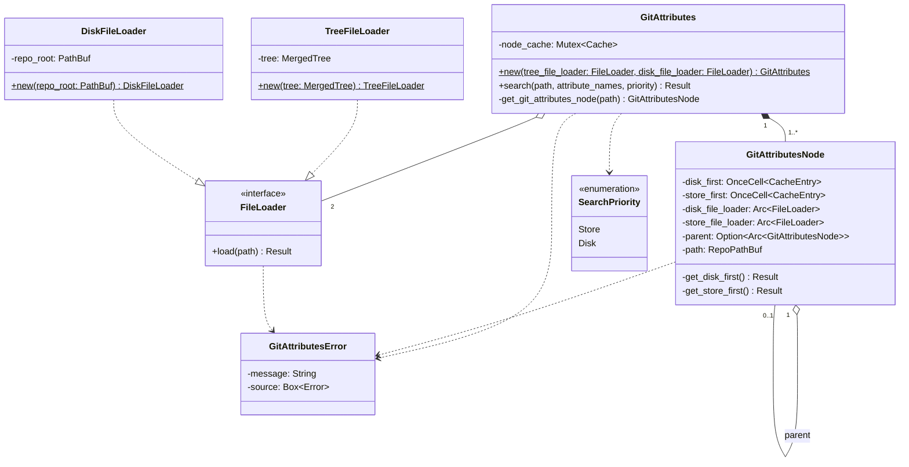

# Git attributes

**Authors**: [Kaiyi Li](mailto:kaiyili@google.com)

**Summary**: This design introduces an API internal to `jj-lib` that future git attributes related features could use to query the git attributes information associated with a file.

## Context and Scope

We are interested in many git attributes related features:

* Perform EOL conversion differently for different files: the [`text`](https://git-scm.com/docs/gitattributes#_text) and the [`eol`](https://git-scm.com/docs/gitattributes#_eol) git attributes.
* Control the behavior of `jj diff` on binary files or generated files: the [`diff`](https://git-scm.com/docs/gitattributes#_generating_diff_text) and the [`linguist-generated`](https://docs.github.com/en/repositories/working-with-files/managing-files/customizing-how-changed-files-appear-on-github) git attributes.
* Smudge and clean [filter](https://git-scm.com/docs/gitattributes#_filter), which paves a straight forward path for [`git-lfs` support](https://github.com/git-lfs/git-lfs/blob/main/docs/spec.md#intercepting-git), and [`git-crypt` support](https://github.com/AGWA/git-crypt?tab=readme-ov-file#using-git-crypt).

This design provides the cornerstone of all the previously mentioned features.

In this design, we use the same terminology as the [git attributes document](https://git-scm.com/docs/gitattributes#_description). Some regularly used definitions include pattern, state, and `gitattributes` file.

### Goals/Requirements

* Describe a general API to query the git attributes associated with a path and the initial implementation of this API.
* The caller of the API shouldn't have to deal with the following complicated details. The implementation of the API should handle them.
    * How to parse the `gitattributes` file.
    * Which ancestor folders contain the relevant `gitattributes` file.
    * How the `gitattributes` file should be loaded from the `Store` or from the file system.
    * When query the attributes associated with a file, how to look up `gitattributes` in all ancestor folders.
    * [Macro](`https://git-scm.com/docs/gitattributes#_using_macro_attributes`) resolution.
* The query interface should be thread-safe, because `TreeState::snapshot` currently snapshots files in multiple threads concurrently.
* The design should make it easy to optimize the performance of the query interface without having to change the caller code too much, and the initial implementation should be reasonably fast, because any feature that makes use of `gitattributes` is likely to query the git attributes of all the changed files whenever `jj` snapshots files from the file system to the `Store` or updates files from the `Store` to the file system.
* When `gitattributes` is not used, the design should introduce negligible runtime and memory overhead, if not 0, i.e. if none of git attributes related features is enabled through the user settings.
* Include git built-in `gitattribute` macros. Currently there is only [`binary`](https://github.com/git/git/blob/master/attr.c#L639).

### Non-Goals

* This design doesn't handle the git attributes defined in places other than `gitattributes` files in the repo. This will be deferred to another design which should introduce a separate setting to read those files just like [this issue](https://github.com/jj-vcs/jj/issues/4048). This means that this design won't consider the following git attribute files:
    * `$GIT_DIR/info/attributes`
    * The file specified by the `core.attributesFile` configuration option.
    * `$XDG_CONFIG_HOME/git/attributes`
    * `$HOME/.config/git/attributes`
    * `$(prefix)/etc/gitattributes`
* This design doesn't include the details on how other specific git attributes related features should be implemented. However, how other features could query the git attributes will be discussed to justify some design decisions.

## Design

We introduce the following major public types:

* `GitAttributes`: a singleton shared by all components that need to query the [the state](https://git-scm.com/docs/gitattributes#_description) of given attributes. The query capability is exposed through a single `GitAttributes::search` method.
* `FileLoader` a trait that encapsulate the implementation details on how to read `gitattributes` files given paths from the `Store` or the disk. `TreeFileLoader` and `DiskFileLoader` are 2 implementations.
* `GitAttributesError` is the general error type.

And the following private types:

* `GitAttributesNode` is the cache entry for `gitattributes` files associated to a folder.

We make the following design decision with the following reasons:

* We only read and parse `gitattributes` files when the `gitattributes` of relevant files are queried, because we want to introduce as little overhead as possible if `gitattributes` related features are not enabled.
* We share a single `GitAttributes` objects across as many components as possible which is different from the existing `GitIgnoreFile` design, because
    * It saves the caller's effort from calling `chain_with_file` and visiting the potential folders on its own. While this is less of an issue for `TreeState::snapshot`, callers like `TreeState::update`(need `gitattributes` to apply the smudge filter) or `DiffRenderer` may currently only have access to a diff stream, which requires extra code to create and maintain the `gitattributes` file tree graph.
    * It allows us to introduce a global cache of `gitattributes` files from the caller, so that we don't have to read the same `gitattributes` file twice.
    * `GitIgnoreFile` is designed differently to ask the caller to build and maintain the `GitIgnoreFile` tree via the `chain_with_file` interface, and parse the `gitignore` files eagerly, because it helps us to skip entire directories when traversing the file system. `gitattributes` files are different: we don't use them to skip directories, so we don't bother leave the trouble for the callers.
* `GitAttributes` should be `Sync` and `Send`. `GitAttributes::search` should be able to be called on different threads concurrently, because when snapshotting, we are [handling different file entries concurrently](https://github.com/jj-vcs/jj/blob/525e795889d3e631069da848a82748fc2d379bc9/lib/src/local_working_copy.rs#L1262-L1269). For example, for EOL conversion, we need to query the `text` and `eol` `gitattributes` concurrently.
* We introduce the `FileLoader` trait to handle the task to read the `gitattributes` files instead of just inlining the implementation in `GitAttributes`, because
    * It allows us to mock the behavior of the file system and `Store` when testing `GitAttributes`.
    * Reading `gitattributes` files itself is complicated, because it needs to handle many corner cases including the file doesn't exist or the path isn't a file; we should not follow symbolic links; the `gitattributes` file has conflicts. It would improve the readability if we move the implementation details in a separate type.


```mermaid
classDiagram
    class GitAttributes {
        -node_cache: Mutex~Cache~
        +new(tree_file_loader: FileLoader, disk_file_loader: FileLoader) GitAttributes$
        +search(path, attribute_names, priority) Result
        -get_git_attributes_node(path) GitAttributesNode
    }

    class GitAttributesNode {
        -disk_first: OnceCell~CacheEntry~
        -store_first: OnceCell~CacheEntry~
        -disk_file_loader: Arc~FileLoader~
        -store_file_loader: Arc~FileLoader~
        -parent: Option~Arc~GitAttributesNode~~
        -path: RepoPathBuf
        -get_disk_first() Result
        -get_store_first() Result
    }

    class FileLoader {
        <<interface>>
        +load(path) Result
    }

    class TreeFileLoader {
        -tree: MergedTree
        +new(tree: MergedTree) TreeFileLoader$
    }

    class DiskFileLoader {
        -repo_root: PathBuf
        +new(repo_root: PathBuf) DiskFileLoader$
    }

    class SearchPriority {
        <<enumeration>>
        Store
        Disk
    }

    class GitAttributesError {
        -message: String
        -source: Box~Error~
    }

    GitAttributes "1" *-- "1..*" GitAttributesNode
    GitAttributesNode "1" o-- "0..1" GitAttributesNode : parent
    GitAttributes "1" o-- "2" FileLoader
    TreeFileLoader ..|> FileLoader
    DiskFileLoader ..|> FileLoader
    GitAttributes ..> SearchPriority
    GitAttributes ..> GitAttributesError
    GitAttributesNode ..> GitAttributesError
    FileLoader ..> GitAttributesError

```

Under the hood, `GitAttributes` uses [`gix_attributes::Search`](https://docs.rs/gix-attributes/0.26.1/gix_attributes/struct.Search.html) to query the attribute. And `GitAttributes` holds a memoization cache of the `gix_attributes::Search` and the [`gix_attributes::search::MetadataCollection`](https://docs.rs/gix-attributes/0.26.1/gix_attributes/search/struct.MetadataCollection.html) for every directory. `MetadataCollection` stores the macro definition and attributes, and the `gix_attributes::Search` type allows the client to chain `gitattributes` files, query the attribute based on the chained files, and resolve the macro definition defined by the given `MetadataCollection`. It is allowed to introduce new git attributes arbitrarily in any `gitattributes` files, so different directories can have different `MetadataCollection`s. When `GitAttributes::search` is called, we try to obtain the `Search` object and the `MetadataCollection` associated to the parent directory of the requested path from the memoization cache, e.g., if the request path is `src/lib.rs`, we find the `Search` object and the `MetadataCollection` object associated to the `src` directory, and use the [`Search::pattern_matching_relative_path`](https://docs.rs/gix-attributes/0.26.1/gix_attributes/struct.Search.html#method.pattern_matching_relative_path) method to query the result. `GitAttributes::search` will return an `HashMap<String, gix_attributes::State>` which maps the attribute name to its state. Note that the `GitAttributes::search` method supports querying multiple attributes at the same time, which could save the caller redundant pattern comparisons compared to querying the attributes one by one. If we don't have the path(e.g., `x/y/z`) in our memoization cache, we try to obtain the associated `Search` and `MetadataCollection` objects of the parent path(e.g., `x/y`), and create the `Search` and `MetadataCollection` objects of the current path(e.g., `x/y/z`) by reading the `gitattributes` file, and calling [`Search::add_patterns_buffer`](https://docs.rs/gix-attributes/0.26.1/gix_attributes/struct.Search.html#method.add_patterns_buffer). Afterwards, we populate this result to the memoization cache. If the parent entry is also missing, we recursively apply the same approach to populate that entry until we hit the root path. In this way, if we call `GitAttributes::search` multiple times with paths under the same directory, we only read the `gitattributes` files once.

This is just a simplistic picture of the `GitAttributes::search` implementation, we will cover the following aspects in details:

* Allow the `GitAttributes::search` to specify whether the `gitattributes` file in `Store` should take priority or the one on the disk.
* `GitAttributes::search` should be a thread-safe interface, which means `GitAttributes::search` shouldn't take `&mut self`, and `GitAttributes` should be `Sync`. However, `GitAttributes::search` could mutate the memoization cache. How should the lock be designed?
* How to handle merge conflicts in `gitattributes` files?
* Integration with future features, like EOL conversion and filter(smudge and clean).
* Tests.

### `GitAttributesError`

`GitAttributes` can encounter different errors: `std::io::Error` when reading from `AsyncRead`, `BackendError` when calling the `Store::read_file` function, and `InvalidRepoPathError` when casting `RepoPath` to `PathBuf`, so we need to come up our own error type. We don't consider to allow the caller of `GitAttributes` to distinguish between different errors, so we choose the same definition as `WorkingCopyStateError`.

```rust
#[derive(Debug, thiserror::Error)]
#[error("{message}")]
pub(crate) struct GitAttributesError {
    message: String,
    #[source]
    source: Box<dyn std::error::Error + Send + Sync>,
}
```

In the following document, the error type of `Result` is always `GitAttributesError` unless otherwise mentioned.

### The `GitAttributes::search` API from the caller side

This interface provides the key entry to query the attribute state associated to a path.

4 states of a git attributes are defined in the [git document](https://git-scm.com/docs/gitattributes#_description):

* [Set](https://git-scm.com/docs/gitattributes#Documentation/gitattributes.txt-Set)
* [Unset](https://git-scm.com/docs/gitattributes#Documentation/gitattributes.txt-Unset)
* [Set to a value](https://git-scm.com/docs/gitattributes#Documentation/gitattributes.txt-Settoavalue)
* [Unspecified](https://git-scm.com/docs/gitattributes#Documentation/gitattributes.txt-Unspecified)

Detailed definition can be found in the git document, but there is one thing worth noting for the Unspecified state. `.gitattribute` files can use the `!` prefix to set an attribute to the Unspecified state:

> Sometimes you would need to override a setting of an attribute for a path to `Unspecified` state. This can be done by listing the name of the attribute prefixed with an exclamation point `!`.

We will make use of the [`gix_attributes::State`](https://docs.rs/gix-attributes/0.26.1/gix_attributes/enum.State.html) type to model the state in our implementation.

The actual signature of the `GitAttributes::search` method is:

```rust
pub fn search(
    &self,
    path: &RepoPath,
    attribute_names: impl AsRef<[&str]>,
    priority: SearchPriority,
) -> Result<HashMap<String, gix_attributes::State>>
```

The `path` parameter specifies the path, of which we want to find the matching attributes. The path is relative to the repo root. The `attributes_names` specify the git attributes that we are interested in, e.g., if `attributes_names` are `["text", "eol"]`, the states of the `filter` attribute won't appear in the returned result. `priority` means when the `gitattributes` file appears both in the `Store` and on the disk, which file should be used. This parameter exists, because [git](https://git-scm.com/docs/gitattributes#_description) has different fall-backs on different occasions:

> When the `.gitattributes` file is missing from the work tree, the path in the index is used as a fall-back. During checkout process, `.gitattributes` in the index is used and then the file in the working tree is used as a fall-back.

`jj` should be similar: when checkout, use `gitattributes` files from the `Store`, when snapshot, use `gitattributes` files from the disk, and fallback to another if the primary source doesn't exist.

The definition of the `SearchPriority` type is

```rust
enum SearchPriority {
    Store,
    Disk,
}
```

If the passed in `path` and one of the `attributes_names` don't match any lines in the `gitattribute` files, that attribute will still show up in the result with the [`gix_attributes::State::Unspecified`](https://docs.rs/gix-attributes/0.26.1/gix_attributes/enum.State.html#variant.Unspecified) value.

`GitAttributes::search` may try to read the `gitattributes` file, and if the read fails for a reason other than file not found, or `Store` fails to retrieve a tree, `GitAttributes::search` fails, i.e., returns an `Err`.

Note that we are using the `gix_attributes::State` type from the external `gix-attributes` crate in the return type, so we restrict the accessibility of the `GitAttributes::search` interface to `pub(crate)`. If we want to promote it to `pub`, we either need to define our own `gix_attributes::Assignment` type or re-export the `gix_attributes::Assignment` type. Promotion to `pub` is likely, because we will need `DiffRenderer` in the `jj-cli` crate to query the `text`, `linguist-generated`, and `diff` git attributes to tell whether a file is binary, generated or how to generate the diff texts respectively. But for this design, we still just keep it as `pub(crate)` for simplicity.

### Create a `GitAttributes`

To create `GitAttributes`, 2 `FileLoader`s are passed to the `GitAttributes::new` method. `FileLoader` trait is an abstraction over the operation of reading the `gitattributes` file from the `Store` or from the file. `GitAttributes` stores 2 `Arc<dyn FileLoader>`s to read the `gitattribubtes` files from the disk and the `Store` respectively.

We introduce another abstraction layer of `FileLoader` instead of inlining the implementation in `GitAttributes`, because

* It prevent `GitAttributes` from directly interacting with the file system and the `Store` type which are difficult to set up for testing, especially for the error case. The `FileLoader` abstraction allows easy fakes to simplify the test.
* The logic to read `gitattributes` files is not trivial. Absence, symbolic links and directory entries needs special handling instead of an error. If we need to read `gitattributes` from the `Store`, we need to further consider conflicts. This interface design also allows us to handle the materialized conflicts on the disk if we want in the future. Another layer of abstraction that encapsulate these details from `GitAttributes`  should improve readability.

```rust
#[async_trait]
trait FileLoader: Send + Sync {
    async fn load(&self, path: &RepoPath) -> Result<Option<Box<dyn AsyncRead + Send + Unpin>>>;
}
```

`FileLoader::load` returns a future of `Result` to make the interface close to the [`Store::read_file`](https://docs.rs/jj-lib/latest/jj_lib/store/struct.Store.html#method.read_file) method as much as possible. We use `#[async_trait]` and `Box<dyn AsyncRead + Send + Unpin>` instead of `impl AsyncRead + Send + Unpin` for dyn-compatible, because `GitAttributes` needs to save `Arc<dyn FileLoader>`s and uses them later in `GitAttributes::search` when reading the `gitattributes` file, and I don't want to add generic type parameters to `GitAttributes`. If an `Ok(None)` is returned, it means the file doesn't exist. If an `Err` is returned, it means we encounter other IO errors, and `GitAttributes` shouldn't try to recover from it.  `GitAttributes` needs to distinguish between the file not found error and other errors to ignore the non-existing `gitattributes` file or provide a proper fall-back if the file still exists in the alternative approach.

To create a `GitAttributes`, we introduce the following method:

```rust
impl GitAttributes {
    pub fn new(
        tree_file_loader: impl FileLoader + 'static,
        disk_file_loader: impl FileLoader + 'static,
    ) -> Self {
        ...
    }
}
```

We provide 2 implementations of `FileLoader`: one is `TreeFileLoader` which can be created from a `MergedTree`, and another is `DiskFileLoader` which can be created from a `PathBuf` which is the repo root. Passing a `TreeFileLoader` as the `tree_file_loader` parameter to the `GitAttributes::new` function creates the implicit connection between the created `GitAttributes` and a `MergedTree`.

#### `TreeFileLoader`

To create the `TreeFileLoader`, we introduce the `TreeFileLoader::new` function.

```rust
pub(crate) struct TreeFileLoader {
    tree: MergedTree,
}

impl TreeFileLoader {
    pub fn new(tree: MergedTree) -> Self {
     Self { tree }
    }
}
```

To implement `FileLoader::load` for `TreeFileLoader`, we use the `Store::read_file` method. The `Store` object can be obtained from `MergedTree::store`. The `path` parameter of `FileLoader::load` can be passed directly to `Store::read_file`. To obtain the `FileId` parameter of `Store::read_file`, we use the `MergedTree::path_value_async` method to find the `MergedTreeValue` at the given path. We then call `MergedTreeValue::to_file_merge`, which gives us a `Option<Merge<Option<FileId>>>`, and we may hit the following situations:

* If `Some` is returned and calling `Merge::<Option<FileId>>::resolve_trivial` on the inner value returns a `Some`, we are on the happy path: we don't hit any conflicts on the `gitattributes` file. If it's a `Some(None)`, it means the file doesn't exist, `Ok(None)` is returned to inform the caller `GitAttributes` to try the alternative or look into the parent. If it's a `Some(Some(file_id))`, we pass the `file_id` to `Store::read_file` as the `FileId` parameter.
* Otherwise, we hit a merge conflicts, and one of the conflict terms may be a tree. In this case, we use `MergedTreeValue::iter` and `Iterator::find` to find the first term that is a `TreeValue::File`. If we find that term, we can pass the `TreeValue::File::id` to `Store::read_file`. If we can't find that term, it means all the terms of the merge is not a file, we can just return `Ok(None)`. It's not a perfect solution to choose the first conflict term when there are actual file conflicts in the `gitattribute` file. We choose this design for simplicity, and leave the improvement for the future.

Note that we deliberately don't follow symbolic links for `TreeFileLoader` to keep the behavior the same as [git](https://git-scm.com/docs/gitattributes#_notes):

> Git does not follow symbolic links when accessing a `.gitattributes` file in the working tree. This keeps behavior consistent when the file is accessed from the index or a tree versus from the filesystem.

Now that we have all the parameters for `Store::read_file`, we call it, and returns `Err` if we fail, and return the result by wrapping it in `Ok(Some(Box::new(...) as Box<_>))`. We are actually returning a `Box<Pin<Box<...>>>` here, and I am Ok to change `FileLoader::load` to return `Result<Option<Pin<Box<dyn AsyncRead + Send>>>>` if we prefer that.

#### `DiskFileLoader`

To create a `DiskFileLoader`, we introduce the `DiskFileLoader::new` function.

```rust
pub(crate) struct DiskFileLoader {
    repo_root: PathBuf,
}

impl DiskFileLoader {
    pub fn new(repo_root: PathBuf) -> Self {
        Self { repo_root }
    }
}
```

To implement `FileLoader::load` for `DiskFileLoader`, we make use of `RepoPath::to_fs_path` and `Self::repo_root` to obtain the path to the `gitattributes` file. If fails, an `Err` is returned. We use [`std::fs::File::open`](https://doc.rust-lang.org/std/fs/struct.File.html#method.open) to open the file and wrap `File` in `BlockingAsyncReader` to change `File` to an `AsyncRead`. If `std::fs::File::open` returns an `Err` with the `NotFound` `ErrorKind`, an `Ok(None)` is returned to inform the caller, `GitAttributes`, that the file doesn't exist. If `std::fs::File::open` returns an `Err` other than `NotFound`, an `Err` is returned. We also return `Ok(None)` if the path is not file. In particular, when the path is a symbolic link, we should ignore it to keep the behavior the same as [git](https://git-scm.com/docs/gitattributes#_notes):

> Git does not follow symbolic links when accessing a `.gitattributes` file in the working tree. This keeps behavior consistent when the file is accessed from the index or a tree versus from the filesystem.

To check whether the file is a file, we use [`std::fs::symlink_metadata`](https://doc.rust-lang.org/std/fs/fn.symlink_metadata.html) and `Metadata::is_file`. If `std::fs::symlink_metadata` fails, an `Err` is returned. We use `std::fs::symlink_metadata` instead of `std::fs::metadata` or `File::metadata` to explicitly not follow the symbolic link.

#### Implement `FileLoader` for `HashMap<RepoPathBuf, Result<String>>` in tests

This allows us to write simple unit tests for `GitAttributes` without having to create an actual repo.

To implement `FileLoader::load`, we query if the `path` parameter exists in the keys, if so, the correspondent value is cloned, mapped to `Vec<u8>`, wrapped in `Cursor` and returned. If not, `Ok(None)` is returned.

### Implement `GitAttributes::search`

The core to the implementation is the memoization cache and [`Search::pattern_matching_relative_path`](https://docs.rs/gix-attributes/0.26.1/gix_attributes/struct.Search.html#method.pattern_matching_relative_path). How the memoization cache works is deferred to a private method `GitAttributes::get_git_attributes_node` which should return the `gix_attributes::Search` object and the `gix_attributes::search::MetadataCollection` object associated with a path and a `SearchPriority`, and correctly update the memoization cache. If `get_git_attributes_node` fails, an `Err` will be returned. The implementation details for `get_git_attributes_node` is in another section. With the returned `Search` object, we call `Search::pattern_matching_relative_path` with the following arguments to obtain the result :

* `relative_path`: we create this parameter from the `path` parameter, and make use of `RepoPath::as_internal_file_string`, and `str::as_bytes` to convert `path` to a `&[u8]`, which should be compatible with the `&BStr` type.
* `case`: we choose `Case::Sensitive` which is the same as [the existing `GitIgnoreFile` code](https://docs.rs/jj-lib/latest/src/jj_lib/gitignore.rs.html#70-92), where we don't specify [`GitignoreBuilder::case_insensitive`](https://docs.rs/ignore/latest/ignore/gitignore/struct.GitignoreBuilder.html#method.case_insensitive), and leave the `GitignoreBuilder` to be case-sensitive by default. If we want to improve the behavior on case-insensitive file systems, it will be another design.
* `is_dir`: we will provide `None`. According to [the document](https://docs.rs/gix-glob/latest/gix_glob/struct.Pattern.html#method.matches_repo_relative_path), this parameter is used for optimization for directory entries, because we assume the passed in `path` should almost always point to a file. We don't bother to take the advantage for simplicity.
* `out`: we will create the [`gix_attributes::search::Outcome`](https://docs.rs/gix-attributes/0.26.1/gix_attributes/search/struct.Outcome.html) object by using the [`Outcome::initialize_with_selection`](https://docs.rs/gix-attributes/0.26.1/gix_attributes/search/struct.Outcome.html#method.initialize_with_selection) function to only search for interesting attributes. The `MetadataCollection` parameter is queried from the `GitAttributes::get_git_attributes_node` function. It should be straight forward to pass the `attribute_names` argument of `GitAttributes::search` to `Outcome::initialize_with_selection` as the `attribute_names` parameter.

After `Search::pattern_matching_relative_path` returns, to construct the return value, we call [`Outcome::iter_selected`](https://docs.rs/gix-attributes/0.26.1/gix_attributes/search/struct.Outcome.html#method.iter_selected) map [`Match`](https://docs.rs/gix-attributes/0.26.1/gix_attributes/search/struct.Match.html) to [`Assignment`](https://docs.rs/gix-attributes/0.26.1/gix_attributes/struct.Assignment.html) by calling [`Assignment::to_owned`](https://docs.rs/gix-attributes/0.26.1/gix_attributes/struct.AssignmentRef.html#method.to_owned) on the [`Match::assignment`](https://docs.rs/gix-attributes/0.26.1/gix_attributes/search/struct.Match.html#structfield.assignment) field, map it to a `String`, [`gix_attributes::State`](https://docs.rs/gix-attributes/0.26.1/gix_attributes/enum.State.html) pair, and collect into a `HashMap`. We need to go over the `HashMap` with the `attribute_names` argument to add `State::Unspecified` to the missing entry.

We don't need to take care of macro resolutions, because `gix_attributes::Search` is supposed to [take care of that](https://docs.rs/gix-attributes/0.26.1/src/gix_attributes/search/outcome.rs.html#211-220) for us.

### Load `gitattributes` files lazily

When we consider the design, we make the following assumption:

* We assume that the client will seldom call `GitAttributes::search` with different `SearchPriority`s concurrently. This is because the `SearchPriority` parameter is introduced to handle different fall-backs when `jj` checks out or snapshots, but the `SearchPriority` is fixed when handling either task, i.e., `SearchPriority::Store` is always used for checkout, and `SearchPriority::Disk` is always used for snapshots. While this design still supports concurrent calls to `GitAttributes::search` with different `SearchPriority`, it doesn't optimize such use case.
* We assume that the depth of the repo tree is at most 100 levels, i.e., any `RepoPath` passed to `GitAttrbutes::search` won't have more than 100 components. The Rust default [2MiB stack size](https://doc.rust-lang.org/std/thread/#stack-size) should be enough for recursive functions which call itself with the parent of a `RepoPath` all the way up to the root.

These assumptions would influence trade-offs between simplicity and performance in this design.

To be detailed, the memoization cache needs to cache `gix_attributes::Search` and `gix_attributes::search::MetadataCollection`, and we need to cache 2 sets of the 2 objects for every directory. One set is created for the `SearchPriority::Store` priority. Another set is created for the `SearchPriority::Disk` priority. And when `GitAttributes::search` is called, we only create one set of objects needed based on the `priority` parameter. Therefore, we define the type for the cache entry of every directory and the memoization cache as following:

```rust
struct GitAttributesNode {
    disk_first: OnceCell<
        Arc<(
            gix_attributes::Search,
            gix_attributes::search::MetadataCollection,
        )>,
    >,
    store_first: OnceCell<
        Arc<(
            gix_attributes::Search,
            gix_attributes::search::MetadataCollection,
        )>,
    >,
    disk_file_loader: Arc<dyn FileLoader>,
    store_file_loader: Arc<dyn FileLoader>,
    parent: Option<Arc<GitAttributesNode>>,
    path: RepoPathBuf,
}

pub(crate) struct GitAttributes {
    ...
    node_cache: Mutex<HashMap<RepoPathBuf, Arc<GitAttributesNode>>>,
    ...
}
```

We use [`OnceCell`](https://docs.rs/tokio/latest/tokio/sync/struct.OnceCell.html) from the `tokio` crate instead of `LazyLock` from `std`, because reading the `gitattributes` files is async, and it may fail. [`OnceCell::get_or_try_init`](https://docs.rs/once_cell/latest/once_cell/sync/struct.OnceCell.html#method.get_or_try_init) handles both issues well. In `disk_first` and `store_first`, `gix_attributes::Search` and `gix_attributes::search::MetadataCollection` are put in the same `OnceCell`, because [`Search::add_patterns_buffer`](https://docs.rs/gix-attributes/0.27.0/gix_attributes/struct.Search.html#method.add_patterns_buffer) initialize both the `Search` and the `MetadataCollection` objects at the same time. They are also wrapped by an `Arc`, so that if `GitAttributesNode` just inherits from its parent, we can just reuse the same underlying objects without having to clone the underlying `Search` and `MetadataCollection` objects. In addition, `Arc` has lower memory footprint if the `OnceCell` is not initialized compared to not using `Arc`. On initialization of `GitAttributesNode`, `disk_file_loader`, `store_file_loader` can be initialized by `GitAttributes` trivially. `path` is the path of the directory this cache entry stands for. How to initialize `parent` in `GitAttributes` will be discussed later.

For `node_cache`, we use `Mutex` from `std` for `Sync` requirement and the capability to mutate the memoization cache in `&self` methods. `Arc` wraps the value type, so that we don't have to lock the mutex to access the cache entry, which allows concurrent access.

#### `GitAttributesNode` utility functions

We introduce the following `GitAttributesNode` utility functions:

* `async fn get_disk_first(&self) -> Result<Arc<(gix_attributes::Search, gix_attributes::search::MetadataCollection)>>`
* `async fn get_store_first(&self) -> Result<Arc<(gix_attributes::Search, gix_attributes::search::MetadataCollection)>>`

To implement the utility functions, we call [`OnceCell::get_or_try_init`](https://docs.rs/tokio/latest/tokio/sync/struct.OnceCell.html#method.get_or_try_init) on `GitAttributesNode::{disk,store}_first`, and return the return value after `await` on it. The initialization function, the `f` parameter of  `OnceCell::get_or_try_init` contains the detailed logic to create `Search` and `MetadataCollection`.

In the initialization function, first, we try to obtain the base `Search` and `MetadataCollection` objects. If `GitAttributesNode::parent` is `Some`, we obtain them by calling `get_{disk,store}_first` on the parent `GitAttributesNode` recursively. The recursion shouldn't cause a stack overflow, due to our assumption that the repo tree is at most 100 levels deep. If `GitAttributesNode::parent` is `None`, we initialize the base `Search` and `MetadataCollection` object via `Default::default`. And call [`Search::add_patterns_buffer`](https://docs.rs/gix-attributes/0.26.1/gix_attributes/struct.Search.html#method.add_patterns_buffer) with `[attr]binary -diff -merge -text` to add the the built-in macro [the same way as `gix`](https://github.com/GitoxideLabs/gitoxide/blob/202bc6da79854d1fb6bb32b9c6bb2a6f882c77f5/gix-attributes/src/search/attributes.rs#L28-L34).

Then, we read the `gitattributes` file contents. We need to use `GitAttributesNode::{disk,store}_file_loader` and call `FileLoader::load`. The path to the expected `gitattributes` file can be obtained by joining `GitAttributesNode::path` and `".gitattributes"`. If `FileLoader::load` fails, we bail out, and `get_{disk,store}_first` will also just bail out. If `Ok(Some(...))` is returned, we find the file from the primary source, e.g., `disk_file_loader` is the primary source for `get_disk_first`. If `Ok(None)` is returned, we try the secondary source, e.g., `store_file_loader` is the secondary source for `get_disk_first`. If it's still `Ok(None)`, we return the base `Search` and `MetadataCollection` objects. This means the `gitattributes` file doesn't exist for the current directory, so we just inherit the object from the parent. Using `Arc` here allows us to avoid cloning the underlying `Search` and `MetadataCollection` objects. Note that the contract of `FileLoader::load` requires the implementation to return `Ok(None)` if the path points to something other than file, e.g., a directory or a symbolic link, instead of returning an `Err`, so an `Err` returned by `FileLoader::load` indeed means we should just bail out.

If either the primary source or the secondary source returns some `AsyncRead`, we call [`read_to_end`](https://docs.rs/tokio/latest/tokio/io/trait.AsyncReadExt.html#method.read_to_end) to obtain the contents, and proceed to construct the new `Search` and `MetadataCollection` objects by calling [`Search::add_patterns_buffer`](https://docs.rs/gix-attributes/0.26.1/gix_attributes/struct.Search.html#method.add_patterns_buffer):

* `self` and the `collection` parameter are cloned from the base `Search` and `MetadataCollection` objects respectively. Note that we are cloning the underlying `Search` and `MetadataCollection` objects, not the `Arc` pointer.
* The `bytes` parameter is the contents of `gitattributes` file just read.
* The `source` parameter is the path to the `gitattributes` file. We can obtain the path by joining `GitAttributesNode::path` and `".gitattributes"`. We should have already done that before we call `FileLoader::load`. To cast it from `RepoPathBuf` to `PathBuf`, we call `RepoPath::to_fs_path` with an empty `base` parameter.
* The `root` parameter should be `Some("")` to enable local relative search mode according to [the](https://docs.rs/gix-attributes/0.26.1/gix_attributes/struct.Search.html#method.add_patterns_file) [documents](https://docs.rs/gix-glob/0.21.0/gix_glob/search/pattern/struct.List.html#method.from_bytes).
* The `allow_macros` parameter is set to `true` only for the root `gitattributes` file, i.e., `parent` is `None`, because Git only allows macro definition [in limited files](https://git-scm.com/docs/gitattributes#_defining_macro_attributes):

    > Custom macro attributes can be defined only in top-level gitattributes files (`$GIT_DIR/info/attributes`, the `.gitattributes` file at the top level of the working tree, or the global or system-wide gitattributes files), not in `.gitattributes` files in working tree subdirectories.

After `Search::add_patterns_buffer` is returned, we can return the `Search` object and the `MetadataCollection` object.

One could argue that calling `get_disk_first` and `get_store_first` on the same `GitAttributesNode` can result duplicate reads on `gitattributes` files, if the file only exist in the store, but not on the disk, or vice versa. However, we don't consider saving that read because:

* It will significantly complicate the code. We have to keep the contents of the `gitattributes` file in the memory after one of `disk_first` and `store_first` is initialized, and release that memory after both of `disk_first` and `store_first` are initialized. This will inevitably introduce some locks, and some extra routines to release the memory. The lock has to be designed carefully to not hurt concurrency.
* It's rare that the `gitattributes` file only exists only in one of the sources. This should only happen when checking out changes that introduce new `gitattributes` files or remove existing `gitattributes` files, particularly, initializing a repo, or when the user snapshots after they add or delete `gitattributes` files. Most changes shouldn't touch `gitattributes` files
* We assume that when `GitAttributes` is busy, only one `SearchPriorty` will be used. If only one of `store_first` or `disk_first` will be initialized, caching the `gitattributes` file contents isn't beneficial. The cache increases the memory footprint for nothing.

#### Populate the memoization cache

We provide a single private method to access and maintain the `node_cache` field: `GitAttributes::get_git_attributes_node`.

```rust
fn get_git_attributes_node(&self, path: &RepoPath) -> Arc<GitAttributesNode>
```

The `path` parameter is the path to the directory which the `GitAttributesNode` is associated with. The caller, `GitAttributes::search`, should use the `GitAttributesNode::get_{disk,store}_first` functions to access the `Search` objects needed for query.

When `GitAttributes` is initialized, `node_cache` will be initialized to an empty `HashMap`.

To implement `get_git_attributes_node`, we use recursion. First, we grab the lock of `node_cache`, panic if poisoned, and won't release it until we return. Then we defer the rest of job to a helper function `inner`, whose parameters are a mutable reference to the underlying `HashMap` of `node_cache` and `path`. In `inner`, it checks if the `path` exists in the `HashMap`. If so, the correspondent value is cloned and returned. If not, it tries to construct a new `GitAttributes` with the fields initialized as the following:

* `parent`: if the `path` argument doesn't have a parent path, `path` is the root path, and the parent of the current node should be `None`. Otherwise, we call the `inner` function recursively with the mutable reference of the `HashMap`, and the parent path of the `path` argument. The recursion must end somewhere, because the `path` argument will become the root path and hit the non-recursion path.
* `path`: the `path` argument. It will be cast to `RepoPathBuf` by calling `to_owned`.
* `disk_first` and `store_first` are initialized to empty `OnceCell`s.
* `disk_file_loader` and `store_file_loader` are initialized by cloning from `GitAttributes` fields.

Then the `HashMap` entry to the `path` key will be populated with this newly constructed object. And the object will be returned.

The lock is held all the time when we create the missing entries, however this shouldn't influence the parallelism too much if any, because creating `Arc<GitAttributes>` is cheap: we just need to create some empty `OnceCell`s, clone some `Arc`s, and clone some `RepoPathBuf`s, and the missing entries shouldn't be too many: it's less than or equal to the depth of the repo tree, which in our assumption is at most 100. For the same reason, the recursion won't cause a stack overflow.

On the happy path where the entry exists in the cache, with this design, we should just grab the lock, call into the helper function, find the entry, clone the `Arc<GitAttributes>`, release the lock, and return, which should be fast.

### Tests

We will use a combination of unit tests with mocked components and integration-style tests using `TestRepo`. The primary testing setup will involve:

* Mock `FileLoader`: For unit testing `GitAttributes` in isolation, we will use the `HashMap<RepoPathBuf, Result<String>>` implementation of `FileLoader`. This allows us to simulate the presence, absence, or erroneous loading of `gitattributes` files without touching the disk or a real `Store`.
* `TestRepo` and `TestTreeBuilder`: For testing `TreeFileLoader`, we will use `TestRepo` with the `TestRepoBackend::Test` backend. `TestTreeBuilder` will be used to construct complex tree structures, including nested directories, symbolic links, and merge conflicts in `gitattributes` files.
* Temporary Directories: For testing `DiskFileLoader`, we will use temporary directories, i.e. `TestEnvironment` in `testutils`, on the filesystem to simulate a working copy.

#### `GitAttributes::search`

These tests will focus on the core query logic using the mocked `FileLoader`.

* Happy path:

    * A simple test where a single `gitattributes` file at the root defines an attribute for a file, and search correctly retrieves the "Set" state for that attribute.
    * Similar to the previous test, but the attribute is "Set to a value" (e.g., `eol=lf`) and verify the returned value is correct.

* Attribute states:

    * Test that an attribute explicitly set to Unset (e.g., `-text`) is correctly reported.
    * Test that an attribute explicitly set to Unspecified (e.g., `!text`) is correctly reported.
    * Test that a path/attribute combination that doesn't match any pattern results in the attribute is correctly reported as "Unspecified".

* Path and pattern matching:

    * [The example](https://git-scm.com/docs/gitattributes#_examples) in the gitattributes document.
    * Test that patterns are matched correctly based on `gitattributes` rules (e.g., `*.txt`, `foo/`, `**/bar.rs`).
    * Test that patterns are matched in a case sensitive way by providing 2 patterns with only different cases but with different macro assignment, e.g., `foo text` and `FOO -text`.
    * Test that a pattern in a subdirectory's `gitattributes` file overrides one in a parent directory.
    * Test a file in a subdirectory that matches a pattern in a root `gitattributes` file.
    * Test that if patterns match a directory, files under the directory shouldn't match, e.g., create a file `foo/bar.txt`, and a `gitattirbutes` line `foo text`. Querying the `text` attributes for `foo/bar.txt` should result `Unspecified`.
    * Test that attributes introduced in a subdirectory are also correctly reported, e.g., we don't create the root `.gitattributes` file, we create the `foo/.gitattributes` file with a `bar.txt text` line, we create the `foo/bar.txt` file, and we query the state of the `text` attribute for the `foo/bar.txt` file.

* Test macro definitions are resolved correctly:
    * In the `gitattributes` file at the root folder, we define 2 macros:
    ```gitattr
    [attr]base_macro a
    [attr]override_macro b
    ```
    * In the `foo1` folder, we create a `bar` file, we define the macro and an attribute assignment to the `bar` file:
    ```
    # this macro definition shouldn't take effect.
    [attr]override_macro c
    # this macro definition shouldn't take effect.
    [attr]new_macro e
    bar base_macro override_macro new_macro
    ```
    * In the `foo2` folder, we create a `bar` file as well, and create a similar `.gitattributes` file:
    ```
    # this macro definition shouldn't take effect.
    [attr]override_macro d
    # this macro definition shouldn't take effect.
    [attr]new_macro e
    bar base_macro override_macro new_macro
    ```
    * Then we query the `a`, `b`, `c`, `d`, `e`, and `new_macro` attributes for the both file `foo1/bar` and `foo2/bar`. We should expect that `a`, `b`, and `new_macro` are `Set`, while `c`, `d`, and `e` are `Unspecified` for both files.

* `SearchPriority` and fallback:

    * `SearchPriority::Disk`: Using the mocked `FileLoader`, simulate a `gitattributes` file present for the disk loader but not the store loader. Search with `SearchPriority::Disk` should use the "disk" version. Then, test the fallback to the "store" version when the "disk" version is absent.
    * `SearchPriority::Store`: Using the mocked `FileLoader`, simulate a `gitattributes` file present for the store loader but not the disk loader. Search with `SearchPriority::Store` should use the "store" version. Then, test the fallback to the "disk" version when the "store" version is absent.

* Stress test: create a file path with 200 components, create a file under that path, create a `.gitattributes` file under that path, and verify that querying the attributes defined for the file works without stack overflow.

* Error Handling:

    * Test the case where a FileLoader returns an I/O error and ensure search propagates it as a GitAttributesError.

#### TreeFileLoader

These tests will validate reading `gitattributes` from a `MergedTree`.

* Happy Path: A `gitattributes` file exists at the root of a tree. `TreeFileLoader` successfully reads its content.
* File Not Found: The loader correctly returns `Ok(None)` when a `gitattributes` file does not exist at a given path.
* Path is a Directory: The path for the `gitattributes` file is actually a directory in the tree. The loader should return `Ok(None)`.
* Symbolic Links: Create a symbolic link named `.gitattributes` pointing to another file. The loader must not follow the link and should treat it as if the file doesn't exist, returning `Ok(None)`.
* Merge Conflicts:
    * Use `TestRepo` and `merge_commit_trees` to create a `MergedTree` where the `gitattributes` file has a content conflict. The loader should pick the first file content it finds.
    * Create a conflict where one side is a file and the other is a tree. The loader should successfully find and read the file term.
    * Create a conflict where all terms are non-files (e.g., trees, symlinks). The loader should return `Ok(None)`.
    * Create a conflict whose 2 only added terms contain the same `FileId`, which can be trivially resolved. The loader should return a reader that can read the file contents.
* Error Handling:
    * Simulate a `Store` failure by removing the git folder right before calling `FileLoader::load` and verify that `TreeFileLoader` correctly propagates the error.

#### `DiskFileLoader`

These tests will validate reading `gitattributes` from the file system.

* Happy Path: A `gitattributes` file is created in the temporary directory. `DiskFileLoader` successfully reads its content.
* File Not Found: The loader correctly returns `Ok(None)` when the file doesn't exist.
* Path is a Directory: The path for the `.gitattributes` file is actually a directory. The loader should return `Ok(None)`.
* Symbolic Links: Create a symbolic link named `.gitattributes`. The loader must return `Ok(None)`.
* Error Handling:
    * Change the permissions of the `.gitattributes` file so it cannot be read. The loader should return an `Err` wrapping the underlying I/O error.

### Integration with EOL conversion

We add 2 fields `TreeState::git_attributes: Arc<GitAttributes>` and `TreeState::git_attributes: Arc<GitAttributes>`.

To initialize `TreeState::git_attributes`,

* We create the `TreeFileLoader` from `TreeState::current_tree`
* We create `DiskFileLoader` from `TreeState::working_copy_path`.
* Then we call `GitAttributes::new` with the 2 created `FileLoader`s.

To initialize `FileSnapshotter::git_attributes`, we directly clone the `Arc` from `TreeState::git_attributes`.

The EOL conversion needs the information about the 2 git attributes: [`text`](https://git-scm.com/docs/gitattributes#_text) and [`eol`](https://git-scm.com/docs/gitattributes#_eol).

We will introduce a new `GitAttributesAssignment` type in the `eol` module:

```rust
pub(crate) struct GitAttributesAssignment {
    pub eol: gix_attributes::State,
    pub text: gix_attributes::State,
}
```

and add a `get_git_attributes: impl AsyncFnOnce() -> Result<GitAttributesAssignment>` parameter to both the `TargetEolStrategy::convert_eol_for_snapshot` and `TargetEolStrategy::convert_eol_for_update` methods. The callers, `FileSnapshotter::write_path_to_store`, `FileSnapshotter::write_file_to_store`, `TreeState::write_file`, and `TreeState::write_conflict` can create the `get_git_attributes` parameter in a lambda with `TreeState::git_attributes`, `FileSnapshot::git_attributes`, and `GitAttributes::search` easily:

* The `attributes_names` parameter is an array, `["eol", "text"]`.
* The `priority` parameter is
    * `SearchPriority::Disk` for `FileSnapshotter::write_path_to_store`, and `FileSnapshotter::write_file_to_store`.
    * `SearchPriority::Store` for `TreeState::write_file` and `TreeState::write_conflict`.
* We query the returned `HashMap` of `GitAttributes::search` with the `eol` key and the `text` key to initialize the `GitAttributesAssignment::eol` and `GitAttributesAssignment::text` fields respectively.

Inside `TargetEolStrategy::convert_eol_for_snapshot` and `TargetEolStrategy::convert_eol_for_update` methods, we can then call the `get_git_attributes` argument to query the git attributes associated to the file if necessary. We may introduce a user setting to disable the use of git attributes for EOL conversion to save some memory and time for non-git backends and users who don't want this feature.

### Integration with smudge and clean filter

The design is similar to the EOL conversion, but for the filter feature, we only care about the value assigned to the `filter` attributes, so we can just use a `Option<&[u8]>` to pass the needed information.

The API is also similar to the EOL conversion, we use the `get_git_attributes: impl AsyncFnOnce() -> Result<Option<Vec[u8]>>` argument to pass the capability to query the git attributes, and let the implementation to decide whether and when to call it.

We probably need to create the `get_git_attributes` parameter in `FileSnapshotter::write_path_to_store`, `FileSnapshotter::write_file_to_store`, `TreeState::write_file`, and `TreeState::write_conflict`, and we can create the `get_git_attributes` parameter in a lambda with `TreeState::git_attributes`, `FileSnapshot::git_attributes`, and `GitAttributes::search` easily.

* The `attributes_names` parameter is an array, `["filter"]`.
* The `priority` parameter is
    * `SearchPriority::Disk` for `FileSnapshotter::write_path_to_store`, and `FileSnapshotter::write_file_to_store`.
    * `SearchPriority::Store` for `TreeState::write_file` and `TreeState::write_conflict`.
* We query the returned `HashMap` of `GitAttributes::search` with the `filter` key. If it's a [`State::Value`](https://docs.rs/gix-attributes/0.26.1/gix_attributes/enum.State.html#variant.Value), we use [`Value::as_ref`](https://docs.rs/gix-attributes/0.26.1/gix_attributes/state/struct.Value.html#method.as_ref), [`ValueRef::as_bstr`](https://docs.rs/gix-attributes/0.26.1/gix_attributes/state/struct.ValueRef.html#method.as_bstr), and [`BStr::to_vec`](https://docs.rs/bstr/1.12.0/bstr/struct.BStr.html#method.to_vec) and wrap the result in `Some` before returning. Otherwise, we return `None`.

### Implementation Strategy

* All the new code including tests will be put in the single `lib/src/gitattributes.rs` file.
* The new code won't be behind any cargo features, particularly, won't behind the `git` feature.
* We will introduce a new dependency, [`gix-attributes`](https://crates.io/crates/gix-attributes), and use the same version as our `gix` dependency.
* The PR to implement the design doesn't introduce actual usage of the new types, so module level attribute macros will be added to avoid unused code from being flagged by the clippy. The prototype EOL conversion integration PR will be uploaded simultaneously, so that the reviewers have a general idea on how the new APIs will be used, and   confidence that this design is left unused for just a short period of time.
* No user settings are introduced to enable to disable the design described in this design. The user settings should be introduced by other features that use `GitAttributes`, e.g., we can introduce a setting to allow the EOL conversion to ignore the `gitattributes` file. In the current design, if `GitAttributes` is just created, and `GitAttrbutes::search` is not called. No files are read, no `gix_attributes::Search` objects are constructed, and the memory footprint should be small, because no entries are populated in the cache. Therefore, we shouldn't need a kill switch for this design.

## Alternatives considered

### Stack the `gitattributes` files when we DFS the repo tree

With this design, we need to DFS the repo before we could query `gitattributes` entries associated to a file, but in `DiffRenderer` or `TreeState::update`, we work with a diff stream, and we don't currently have the code to visit the tree. Implementing the DFS visit in those places, will essentially result in the same code in this design.

In addition, to disable the code path, we need to use explicit code to check if relevant features are enabled and not read and parse `gitattributes` files. Unlike the current design, if we don't call `GitAttributes::query`, we don't do the extra read and parse at all.

## Related Work

### Git

[`conv_attrs`](https://github.com/git/git/blob/866e6a391f466baeeb98bc585845ea638322c04b/convert.h#L83-L89) is used to pass the attributes states related to conversion, and [`convert_attrs`](https://github.com/git/git/blob/866e6a391f466baeeb98bc585845ea638322c04b/convert.c#L1319-L1362) is used to initialize the `conv_attrs` struct, for both [checkout](https://github.com/git/git/blob/master/entry.c#L482-L593) and [commit](https://github.com/git/git/blob/866e6a391f466baeeb98bc585845ea638322c04b/convert.c#L1436).

`convert_attrs` looks up the relevant attributes through via a global cache, [`check`](https://github.com/git/git/blob/866e6a391f466baeeb98bc585845ea638322c04b/convert.c#L1317). `check` contains the `gitattributes` files stack and is updated when [`git_check_attr`](https://github.com/git/git/blob/866e6a391f466baeeb98bc585845ea638322c04b/attr.c#L1306-L1322) is called. In [`prepare_attr_stack`](https://github.com/git/git/blob/master/attr.c#L949-L1042), only the minimal number of `gitattributes` entries are popped and push, e.g., if 2 consecutive `git_check_attr` calls use `x/y/a.txt` and `x/y/b.txt` as the path parameter, and the same `attr_check`, the underlying `gitattributes` files stack doesn't won't change. This means that if one could arrange the `conv_attrs` calls in a specific order, the least overhead is introduced.

On checkout, `convert_attrs` is called when the main process [collects the checkout tasks](https://github.com/git/git/blob/master/entry.c#L589) before [dispatching the checkout tasks](https://github.com/git/git/blob/master/parallel-checkout.c#L493) to the worker processes. On commit, `convert_attrs` is called right before converting the contents to commit in [`convert_to_git`](https://github.com/git/git/blob/e0753259271b76f6e53b3b170b4bc08cca793bca/convert.c#L1429-L1461).

### Gitoxide

Gitoxide uses a [stack cache](https://github.com/GitoxideLabs/gitoxide/blob/202bc6da79854d1fb6bb32b9c6bb2a6f882c77f5/gix/src/filter.rs#L92) similar to git for both [`checkout`](https://github.com/GitoxideLabs/gitoxide/blob/202bc6da79854d1fb6bb32b9c6bb2a6f882c77f5/gix/src/filter.rs#L194-L210) and [`commit`](https://github.com/GitoxideLabs/gitoxide/blob/202bc6da79854d1fb6bb32b9c6bb2a6f882c77f5/gix/src/filter.rs#L158-L185).

When [`Stack::at_entry`](https://github.com/GitoxideLabs/gitoxide/blob/202bc6da79854d1fb6bb32b9c6bb2a6f882c77f5/gix-worktree/src/stack/mod.rs#L143-L156) or [`Stack::at_path`](https://github.com/GitoxideLabs/gitoxide/blob/202bc6da79854d1fb6bb32b9c6bb2a6f882c77f5/gix-worktree/src/stack/mod.rs#L114-L135) is called, the inner stack is updated. In [`make_relative_path_current`](https://github.com/GitoxideLabs/gitoxide/blob/202bc6da79854d1fb6bb32b9c6bb2a6f882c77f5/gix-fs/src/stack.rs#L185-L192), only the necessary stacks are popped and pushed as well.

Unlike git, both checkout and commit query the git attributes right before converting the contents according to the various settings including EOL conversion and filter.

## Future Possibilities

* Handle merge conflicts in `gitattributes` file better.
    * We can parse the conflict `gitattributes` file on the disk.
    * We can just combine the contents from all sides of the `gitattributes` file for query.
* Case-insensitive matches support. To support case-insensitive file system, we need to modify how many of existing matchers work, including fileset, gitignore, and gitattributes. And we need to think of a way to handle files that only differ in case.
* We can use a single trie to store the patterns to save the memory and probably improve the performance.
* Allow to create `GitAttributes` with arbitrary numbers of `FileLoader`. It is possible that we only need to read the `gitattributes` file from `Store` or from the disk, e.g., if we only need to diff 2 commits, we probably don't bother checking the `gitattributes` files on the disk.
* Inherit git global git attributes file list including:
    * `$GIT_DIR/info/attributes`
    * The file specified by the `core.attributesFile` configuration option.
    * `$XDG_CONFIG_HOME/git/attributes`
    * `$HOME/.config/git/attributes`
    * `$(prefix)/etc/gitattributes`

    This can be easily implemented by using [`Search::new_globals`](https://docs.rs/gix-attributes/0.26.1/gix_attributes/struct.Search.html#method.new_globals) in `GitAttributesNode::get_*_first` when initializing the base `Search` and `MetadataCollection` objects. We can pass a subset of `UserSettings` to `GitAttributes::new` to control which paths to include.
